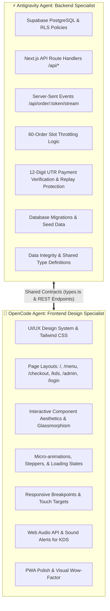

# 🤝 Multi-Agent Architecture & Interoperability Guide
## Antigravity (Backend Specialist) ⚡ OpenCode (Frontend Design Specialist)

**Project:** FoodLine — Campus Pre-Ordering & Express Pickup Ecosystem  
**Target Pilot Campus:** Sanjivani University, Kopargaon (Cafe @7)  
**Live Dev Server:** `http://localhost:3000`  
**Database:** Supabase PostgreSQL (`ylweomuodekukjjpjrgx.supabase.co`)  
**Shared Type Contracts:** `src/lib/types.ts`

---

## 🎯 Division of Responsibilities



---

## 📂 Codebase Ownership Matrix

| Directory / File | Primary Owner | Secondary Reviewer | Description |
|---|---|---|---|
| `backend/src/**` | **Antigravity** | OpenCode | Express/Node.js API Route Handlers & SSE Streams |
| `backend/database/schema.sql` | **Antigravity** | OpenCode | PostgreSQL Database DDL & Seed Data |
| `backend/src/lib/types.ts` | **Antigravity** | OpenCode | Single Source of Truth TypeScript interfaces |
| `frontend/src/app/globals.css` | **OpenCode** | Antigravity | Global CSS Variables, Themes, Glassmorphism |
| `frontend/src/app/**/page.tsx` | **OpenCode** | Antigravity | Frontend UI Pages & Presentation Components |
| `frontend/src/components/**` | **OpenCode** | Antigravity | Reusable UI Components (Navbar, Cards, Badges) |
| `frontend/src/context/CartContext.tsx` | **OpenCode** | Antigravity | Global Cart Tray & Slot Selection State |
| `frontend/src/lib/types.ts` | **Shared** | Shared | Shared Client TypeScript Interfaces |

---

## 📡 Live API Endpoints & Request/Response Contracts

All API responses follow the standard JSON:API envelope:
```json
{
  "success": true,
  "data": { ... },
  "meta": { "timestamp": "2026-08-27T22:30:00Z" }
}
```

### 1. `GET /api/menu`
* **Purpose:** Fetches all 44 Cafe @7 dishes and 8 categories.
* **Query Params:** `?categoryId=<uuid>` (optional).
* **Response Data:** `{ categories: Category[], items: MenuItem[] }`.

### 2. `GET /api/slots`
* **Purpose:** Fetches campus break pickup slots with capacity meters (60 max cap).
* **Response Data:** `PickupSlot[]` (`{ id, label, startTime, endTime, maxCapacity, currentBooked, availableSlots, isFull }`).

### 3. `POST /api/orders`
* **Purpose:** Creates order, reserves slot capacity, generates unique `order_token` (e.g. `FL-1793`) and `pickup_otp` (`6065`).
* **Request Body:**
  ```json
  {
    "slotId": "slot-uuid",
    "items": [{ "id": "dish-uuid", "name": "Vada Pav", "price": 20, "quantity": 2 }],
    "notes": "Extra spicy"
  }
  ```
* **Response Data:** `{ orderId, orderToken, totalAmount, pickupOtp, status: "PENDING_PAYMENT" }`.

### 4. `POST /api/payments/verify-utr`
* **Purpose:** Submits 12-digit UPI Bank UTR reference, prevents duplicates, updates order to `CONFIRMED`.
* **Request Body:**
  ```json
  {
    "orderToken": "FL-1793",
    "utrNumber": "928374615243",
    "amount": 50
  }
  ```
* **Response Data:** `{ orderToken, status: "CONFIRMED", utrNumber, pickupOtp, message }`.

### 5. `GET /api/order/[token]/stream`
* **Purpose:** Server-Sent Events (SSE) live real-time kitchen tracking stream for student order screen.
* **Payload Types:** `ORDER_SNAPSHOT` (initial payload), `ORDER_UPDATE` (real-time status change).

### 6. `PATCH /api/kds/orders/[id]/status`
* **Purpose:** Kitchen tablet transitions order status.
* **Request Body:** `{ "status": "PREPARING" | "READY" | "COLLECTED" }`.

### 7. `PATCH /api/kds/inventory/[dishId]`
* **Purpose:** 1-Tap stockout toggle for cafeteria staff.
* **Request Body:** `{ "isAvailable": false | true }`.

---

## 🔒 Rules of Interoperability

1. **Do Not Break Type Contracts:** OpenCode must import domain models from `@/lib/types`. Antigravity guarantees that all API responses match these definitions.
2. **Environment Variables:** Never commit `.env.local`. Both agents use `process.env.NEXT_PUBLIC_SUPABASE_URL` and `process.env.NEXT_PUBLIC_SUPABASE_PUBLISHABLE_KEY`.
3. **Running Server:** The Next.js dev server runs on `http://localhost:3000`. Both agents can test and build using `npm run build` and `npm run dev`.
4. **Git Sync:** Changes are committed to branch `main` on `https://github.com/dakrkakashi/FoodLine-Campus.git`.
