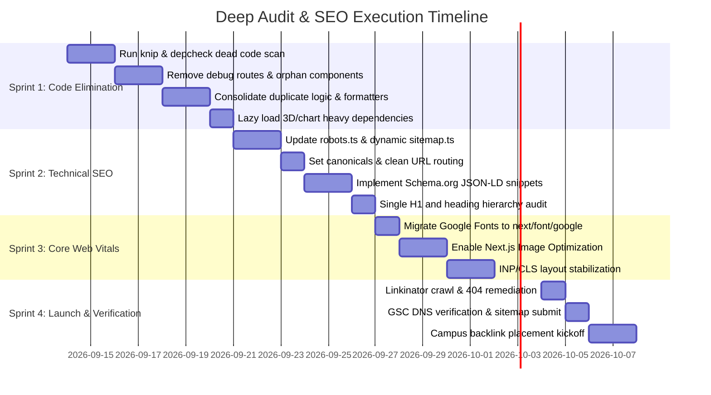

# FoodLine Campus: Deep Architectural Audit, Code Elimination & Production SEO Master Plan

> **Core Directives:**
> 1. *"Use AI to delete code, not write code."* Eliminate dead code, unused components, duplicate logic, and over-engineered abstractions.
> 2. *"Transition from vibe-coded prototype to indexable, high-ranking production platform."* Fix technical SEO leaks, eliminate accidental `noindex`, enforce strict schema, optimize Core Web Vitals, and guarantee mobile-first speed.

---

## 📑 Table of Contents
1. [Executive Summary & Current State Diagnosis](#1-executive-summary--current-state-diagnosis)
2. [Pillar 1: Codebase Audit & Elimination Engine ("Delete Mode")](#2-pillar-1-codebase-audit--elimination-engine-delete-mode)
   - [2.1 Dead Code Elimination](#21-dead-code-elimination)
   - [2.2 Unused Components & Orphan Assets](#22-unused-components--orphan-assets)
   - [2.3 Eliminating Unnecessary Complexity](#23-eliminating-unnecessary-complexity)
   - [2.4 Consolidating Duplicate Logic (DRY Architecture)](#24-consolidating-duplicate-logic-dry-architecture)
   - [2.5 Dependency Diet & Bundle Stripping](#25-dependency-diet--bundle-stripping)
3. [Pillar 2: Technical SEO, Crawlability & Indexation](#3-pillar-2-technical-seo-crawlability--indexation)
   - [3.1 Indexation & Robots Directives](#31-indexation--robots-directives)
   - [3.2 Dynamic Sitemap & Routing Architecture](#32-dynamic-sitemap--routing-architecture)
   - [3.3 Canonical Tags & URL Slug Normalization](#33-canonical-tags--url-slug-normalization)
   - [3.4 Broken Link Audit & Zero-404 Crawl Policy](#34-broken-link-audit--zero-404-crawl-policy)
4. [Pillar 3: On-Page Semantic SEO & Rich Snippets](#4-pillar-3-on-page-semantic-seo--rich-snippets)
   - [4.1 Route-by-Route Metadata Matrix](#41-route-by-route-metadata-matrix)
   - [4.2 Strict Heading Hierarchy (One H1 Rule)](#42-strict-heading-hierarchy-one-h1-rule)
   - [4.3 Schema.org JSON-LD Structured Data](#43-schemaorg-json-ld-structured-data)
   - [4.4 OpenGraph, Twitter Cards & Dynamic Share Cards](#44-opengraph-twitter-cards--dynamic-share-cards)
   - [4.5 Image Alt Attributes & Semantic Content](#45-image-alt-attributes--semantic-content)
5. [Pillar 4: Core Web Vitals (CWV) & Performance Hardening](#5-pillar-4-core-web-vitals-cwv--performance-hardening)
   - [5.1 Font Optimization (Eliminate Render-Blocking CSS)](#51-font-optimization-eliminate-render-blocking-css)
   - [5.2 Next.js Image Optimization Pipeline](#52-nextjs-image-optimization-pipeline)
   - [5.3 LCP, INP & CLS Optimization Protocols](#53-lcp-inp--cls-optimization-protocols)
6. [Pillar 5: Security, Mobile Usability & Search Console](#6-pillar-5-security-mobile-usability--search-console)
   - [6.1 Security Headers & Strict HTTPS](#61-security-headers--strict-https)
   - [6.2 Mobile Responsiveness & PWA/Capacitor Compliance](#62-mobile-responsiveness--pwacapacitor-compliance)
   - [6.3 Google Search Console (GSC) Verification & Index Submission](#63-google-search-console-gsc-verification--index-submission)
   - [6.4 Academic (.ac.in / .edu) Backlink Acquisition Plan](#64-academic-acin--edu-backlink-acquisition-plan)
7. [Automated Verification Runbook & Pre-Commit Gates](#7-automated-verification-runbook--pre-commit-gates)
8. [Phased Implementation Roadmap](#8-phased-implementation-roadmap)

---

## 1. Executive Summary & Current State Diagnosis

A targeted diagnostic of `frontend/` reveals high-value prototype velocity ("vibe coding") that now requires surgical refactoring and production hardening before campus rollout:

```
┌────────────────────────────────────────┐       ┌────────────────────────────────────────┐
│     CURRENT "VIBE CODED" STATE         │       │     PRODUCTION HARDENED TARGET         │
├────────────────────────────────────────┤       ├────────────────────────────────────────┤
│ • images: { unoptimized: true }        │       │ • Next.js AVIF/WebP Auto-Optimization  │
│ • External Google Fonts stylesheet link│  ───► │ • Zero-runtime next/font/google        │
│ • Private /orders exposed in sitemap.ts│       │ • Strict public-only dynamic sitemap   │
│ • Missing Schema.org JSON-LD snippets  │       │ • Full FoodEstablishment & Product LD  │
│ • eslint: ignoreDuringBuilds = true    │       │ • Zero-warning strict type & lint gate │
│ • Heavy 3D/Canvas libs in main bundle  │       │ • Dynamic SSR: false lazy-loading      │
└────────────────────────────────────────┘       └────────────────────────────────────────┘
```

---

## 2. Pillar 1: Codebase Audit & Elimination Engine ("Delete Mode")

> *"Perfection is achieved, not when there is nothing more to add, but when there is nothing left to take away."* — Antoine de Saint-Exupéry

### 2.1 Dead Code Elimination
- [ ] **Automate Dead Export Detection**:
  Add and configure `knip` in `frontend/package.json` to systematically find unused exports, types, files, and dependencies:
  ```bash
  # Install knip
  npm install -D knip typescript
  # Run full scan
  npx knip --directory frontend
  ```
- [ ] **Eliminate Barrel File Overhead**:
  Inspect `components/index.ts` or `lib/index.ts`. Re-exporting dozens of modules through a single barrel disables granular tree-shaking in Next.js Turbopack/Webpack. Replace barrel imports with direct path imports:
  ```typescript
  // ❌ Anti-pattern: Bundles entire icon / component registry
  import { ShoppingBag, ChevronRight } from 'lucide-react';
  
  // ✅ Production: Direct modular imports or Next.js optimizePackageImports
  // Ensure next.config.mjs includes:
  // experimental: { optimizePackageImports: ['lucide-react', 'recharts'] }
  ```
- [ ] **Remove Development Artifacts**:
  - Delete `frontend/src/app/debug/` route entirely from production builds.
  - Remove all `console.log`, `console.dir`, and temporary debug dumpers using `esbuild.drop: ['console', 'debugger']` in `next.config.mjs` for production mode.
  - Delete obsolete mock data in `frontend/src/data/` replaced by Supabase API calls.

### 2.2 Unused Components & Orphan Assets
- [ ] **Purge Component Graveyard**:
  - Audit `frontend/src/components/` against route usage.
  - Consolidate button, modal, and card variants into standard primitives powered by `class-variance-authority` (CVA).
  - Delete superseded UI iterations left over from earlier design experiments.
- [ ] **Audit `public/` Directory**:
  Run a static reference sweep to verify every image in `public/` is referenced in code:
  ```powershell
  # PowerShell script to detect orphaned public images
  Get-ChildItem -Path "frontend/public" -Recurse -File | ForEach-Object {
    $filename = $_.Name
    $found = Select-String -Path "frontend/src/**/*.{tsx,ts,css}" -Pattern $filename -SimpleMatch
    if (-not $found) {
      Write-Host "Orphan asset detected: $($_.FullName)" -ForegroundColor Yellow
    }
  }
  ```
- [ ] **CSS & Tailwind v4 De-bloat**:
  - In `frontend/src/app/globals.css` (currently ~25KB), audit custom utility classes and remove obsolete CSS keyframes, duplicate color definitions, and legacy utility classes superseded by Tailwind v4 variables.

### 2.3 Eliminating Unnecessary Complexity
- [ ] **Flatten Premature Abstractions**:
  - Replace 3-layer custom wrapper hooks (e.g., `useFetchWithRetryAndCache`) with standard Supabase client calls or native `fetch` with Next.js `next: { revalidate: X }`.
  - Simplify overly complex Context providers in `frontend/src/context/`. Remove state providers that manage static or purely server-derivable state.
- [ ] **Server vs. Client Component Boundaries**:
  - Audit every file containing `'use client'`.
  - **Rule**: If a component only displays data and does not have `useState`, `useEffect`, or event listeners (`onClick`), remove `'use client'` to make it a Server Component.
  - Push `'use client'` to the leaf nodes of the UI tree (e.g., `<AddToCartButton />` is a client component, while the `<MenuGrid />` and `<MenuItemCard />` remain Server Components).

### 2.4 Consolidating Duplicate Logic (DRY Architecture)
- [ ] **Single Source of Truth for Supabase Client**:
  Verify there are no competing Supabase initializations. Consolidate to:
  - `src/lib/supabase/client.ts` (browser client using `createBrowserClient`)
  - `src/lib/supabase/server.ts` (server client using `createServerClient` and `cookies()`)
- [ ] **Centralized Formatters & Currency**:
  Consolidate Indian Rupee formatting (`₹XX.XX`), IST timestamps, and slot formatting into a single module `src/lib/formatters.ts`:
  ```typescript
  export const formatINR = (amount: number): string =>
    new Intl.NumberFormat('en-IN', { style: 'currency', currency: 'INR', maximumFractionDigits: 0 }).format(amount);
  ```
- [ ] **Unified Order & Cart Calculations**:
  Eliminate divergent GST, platform fee, and discount calculations across frontend and backend. The frontend cart must consume the exact same pricing algorithm as `backend/src/services/order.service.ts`.

### 2.5 Dependency Diet & Bundle Stripping
- [ ] **Audit `frontend/package.json` Dependencies**:
  ```bash
  npx depcheck frontend/
  ```
- [ ] **Lazy Load Heavy 3D / Animation / Chart Libraries**:
  `three` (~600KB), `recharts` (~450KB), `animejs` (~50KB), and `canvas-confetti` should **never** be loaded in the initial viewport bundle.
  Use `next/dynamic` with `ssr: false`:
  ```typescript
  import dynamic from 'next/dynamic';
  
  const ThreeScene = dynamic(() => import('@/components/ThreeHeroVisual'), {
    ssr: false,
    loading: () => <div className="h-64 w-full bg-surface-elevated animate-pulse rounded-2xl" />,
  });
  
  const ConfettiBurst = dynamic(() => import('@/components/ConfettiBurst'), {
    ssr: false,
  });
  ```
- [ ] **Remove Redundant Build Tools**:
  Move build-only packages like `pptxgenjs` from runtime dependencies to dedicated utility scripts or remove if pitch-deck generation is handled outside the web app.

---

## 3. Pillar 2: Technical SEO, Crawlability & Indexation

### 3.1 Indexation & Robots Directives
- [ ] **Audit & Eliminate Accidental `noindex`**:
  - Ensure production HTML does not contain `<meta name="robots" content="noindex">` on public routes (`/`, `/menu`, `/canteens`, `/faq`, `/terms`, `/privacy`, `/refund-policy`).
  - Keep `noindex, nofollow` strictly on user-specific or internal operations:
    - `/admin/**`
    - `/kds/**`
    - `/checkout/**`
    - `/order/**`
    - `/orders/**`
    - `/profile/**`
    - `/api/**`
- [ ] **Refactor `frontend/src/app/robots.ts`**:
  Update to production standard:
  ```typescript
  import { MetadataRoute } from 'next';

  export default function robots(): MetadataRoute.Robots {
    const baseUrl = process.env.NEXT_PUBLIC_SITE_URL || 'https://campus.foodline.in';

    return {
      rules: [
        {
          userAgent: '*',
          allow: [
            '/',
            '/menu',
            '/canteens',
            '/canteens/*',
            '/faq',
            '/terms',
            '/privacy',
            '/refund-policy',
            '/onboarding',
          ],
          disallow: [
            '/admin',
            '/admin/*',
            '/kds',
            '/kds/*',
            '/api/*',
            '/checkout',
            '/checkout/*',
            '/order/*',
            '/orders',
            '/orders/*',
            '/profile',
            '/profile/*',
            '/debug/*',
          ],
        },
      ],
      sitemap: `${baseUrl}/sitemap.xml`,
      host: baseUrl,
    };
  }
  ```

### 3.2 Dynamic Sitemap & Routing Architecture
- [ ] **Fix `frontend/src/app/sitemap.ts` Anti-Patterns**:
  - ❌ **Remove `/orders`**: Private student order histories must never be submitted to Google.
  - ✅ **Add dynamic routes**: Fetch active campus canteens and popular menu items dynamically from Supabase at build/revalidation time.
  - ✅ **Include all legal/help pages**: `/faq`, `/privacy`, `/refund-policy`, `/canteens`.
  ```typescript
  import { MetadataRoute } from 'next';
  import { createClient } from '@supabase/supabase-js';

  export default async function sitemap(): Promise<MetadataRoute.Sitemap> {
    const baseUrl = process.env.NEXT_PUBLIC_SITE_URL || 'https://campus.foodline.in';
    const now = new Date();

    // Static high-priority public pages
    const staticRoutes: MetadataRoute.Sitemap = [
      { url: baseUrl, lastModified: now, changeFrequency: 'daily', priority: 1.0 },
      { url: `${baseUrl}/menu`, lastModified: now, changeFrequency: 'hourly', priority: 0.9 },
      { url: `${baseUrl}/canteens`, lastModified: now, changeFrequency: 'daily', priority: 0.9 },
      { url: `${baseUrl}/faq`, lastModified: now, changeFrequency: 'weekly', priority: 0.7 },
      { url: `${baseUrl}/terms`, lastModified: now, changeFrequency: 'monthly', priority: 0.3 },
      { url: `${baseUrl}/privacy`, lastModified: now, changeFrequency: 'monthly', priority: 0.3 },
      { url: `${baseUrl}/refund-policy`, lastModified: now, changeFrequency: 'monthly', priority: 0.3 },
    ];

    // Dynamic canteen routes (Sanjivani Cafe @7, etc.)
    try {
      const supabase = createClient(
        process.env.NEXT_PUBLIC_SUPABASE_URL!,
        process.env.SUPABASE_SERVICE_ROLE_KEY || process.env.NEXT_PUBLIC_SUPABASE_ANON_KEY!
      );
      const { data: canteens } = await supabase.from('canteens').select('slug, updated_at').eq('is_active', true);

      const dynamicCanteens: MetadataRoute.Sitemap = (canteens || []).map((c) => ({
        url: `${baseUrl}/canteens/${c.slug}`,
        lastModified: c.updated_at ? new Date(c.updated_at) : now,
        changeFrequency: 'hourly',
        priority: 0.8,
      }));

      return [...staticRoutes, ...dynamicCanteens];
    } catch {
      return staticRoutes;
    }
  }
  ```

### 3.3 Canonical Tags & URL Slug Normalization
- [ ] **Configure Root `metadataBase` & Self-Referencing Canonicals**:
  Set canonical tags across all layouts using relative resolution:
  ```typescript
  // in app/layout.tsx
  export const metadata: Metadata = {
    metadataBase: new URL(process.env.NEXT_PUBLIC_SITE_URL || 'https://campus.foodline.in'),
    alternates: {
      canonical: './',
    },
  };
  ```
- [ ] **Clean URL Slugs**:
  - Enforce lowercase alphanumeric hyphenated slugs (e.g., `/canteens/sanjivani-cafe-7`, `/menu/paneer-tikka-roll`).
  - Redirect uppercase or trailing slash URLs via Next.js standard middleware:
    ```typescript
    // middleware.ts
    // Ensure 301 redirect for uppercase URLs or URL parameter pollution
    ```

### 3.4 Broken Link Audit & Zero-404 Crawl Policy
- [ ] **Automated Broken Link Spider**:
  Execute `linkinator` against local preview build before every release:
  ```bash
  npx linkinator http://localhost:3000 --recurse --skip "^(?!http://localhost:3000)"
  ```
- [ ] **Internal Linking Architecture**:
  - Ensure footer contains crawlable `<Link>` tags to `/canteens`, `/menu`, `/faq`, `/terms`, and `/privacy`.
  - Add breadcrumbs to `/canteens/[slug]` and `/menu` (`Home > Sanjivani University > Cafe @7 > Menu`).
  - Ensure zero orphan pages: Every public page must have at least 2 inbound internal links.

---

## 4. Pillar 4: On-Page Semantic SEO & Rich Snippets

### 4.1 Route-by-Route Metadata Matrix

| Route | Target Title (<60 chars) | Target Description (120–155 chars) | Canonical Path | Primary Keyword |
|---|---|---|---|---|
| `/` | FoodLine Campus — Express Pre-Ordering & Pickup | Skip the line, not your meal. Pre-order food during lectures for 30-sec express collection at Sanjivani University canteens. | `/` | campus food pre-order |
| `/menu` | Campus Canteen Menu & Live Slots \| FoodLine | Browse live canteen menus, meal pricing, and reserved break slots. Hot meals prepared fresh for express collection. | `/menu` | campus canteen menu |
| `/canteens` | University Canteens & Food Courts \| FoodLine | Discover all active campus dining locations, Cafe @7, real-time counter rush status, and operational hours. | `/canteens` | university canteens |
| `/faq` | Frequently Asked Questions \| FoodLine Campus | Common questions on express pickup tokens, slot booking, UPI payments, and refund policies for university students. | `/faq` | foodline campus FAQ |
| `/refund-policy` | Refund & Cancellation Policy \| FoodLine Campus | Transparent policies regarding failed canteen pickups, out-of-stock items, and instant UPI refund timelines. | `/refund-policy` | foodline refund policy |

### 4.2 Strict Heading Hierarchy (One H1 Rule)
- [ ] **Single `<h1>` Tag Validation**:
  Audit all route templates. Verify that exactly **one** `<h1>` tag exists per rendered document.
  - ❌ **Anti-Pattern**: Using `<h1>` for modal titles, cards, or hero sub-headings.
  - ✅ **Pattern**:
    - `<h1>`: Unique primary page topic (e.g., "Sanjivani University Canteen Express Pre-Ordering").
    - `<h2>`: Major sections (e.g., "Popular Break Snacks", "How 30-Sec Express Pickup Works").
    - `<h3>`: Card titles, individual dishes, or FAQ questions.

### 4.3 Schema.org JSON-LD Structured Data
Add structured data components in `frontend/src/components/seo/JsonLd.tsx`:

#### A. Organization & WebSite Schema (Homepage)
```tsx
export function OrganizationSchema() {
  const schema = {
    '@context': 'https://schema.org',
    '@type': 'Organization',
    name: 'FoodLine Campus',
    url: 'https://campus.foodline.in',
    logo: 'https://campus.foodline.in/logo.png',
    description: 'Next-Generation Campus Pre-Ordering, Slot Throttling & Express Pickup Platform.',
    sameAs: ['https://www.instagram.com/foodline.campus', 'https://linkedin.com/company/foodline'],
  };
  return <script type="application/ld+json" dangerouslySetInnerHTML={{ __html: JSON.stringify(schema) }} />;
}
```

#### B. FoodEstablishment / Restaurant Schema (`/canteens/[slug]`)
```tsx
export function CanteenSchema({ canteen }: { canteen: any }) {
  const schema = {
    '@context': 'https://schema.org',
    '@type': 'FoodEstablishment',
    name: canteen.name,
    image: canteen.banner_url || 'https://campus.foodline.in/images/canteen-default.jpg',
    address: {
      '@type': 'PostalAddress',
      addressLocality: 'Kopargaon',
      addressRegion: 'Maharashtra',
      addressCountry: 'IN',
      streetAddress: 'Sanjivani University Campus, Cafe @7',
    },
    servesCuisine: ['Indian', 'Fast Food', 'Snacks', 'Beverages'],
    priceRange: '₹₹',
    openingHours: 'Mo-Sa 08:30-18:00',
    hasMenu: 'https://campus.foodline.in/menu',
  };
  return <script type="application/ld+json" dangerouslySetInnerHTML={{ __html: JSON.stringify(schema) }} />;
}
```

#### C. FAQPage Schema (`/faq`)
```tsx
export function FaqSchema({ items }: { items: { question: string; answer: string }[] }) {
  const schema = {
    '@context': 'https://schema.org',
    '@type': 'FAQPage',
    mainEntity: items.map((i) => ({
      '@type': 'Question',
      name: i.question,
      acceptedAnswer: {
        '@type': 'Answer',
        text: i.answer,
      },
    })),
  };
  return <script type="application/ld+json" dangerouslySetInnerHTML={{ __html: JSON.stringify(schema) }} />;
}
```

### 4.4 OpenGraph, Twitter Cards & Dynamic Share Cards
- [ ] **Replace Default Square Logo with 1200x630 Social Card**:
  In `frontend/src/app/layout.tsx`, change `images: ['/logo.png']` (which is 512x512) to an optimized 1200x630 OG banner:
  ```typescript
  openGraph: {
    images: [
      {
        url: '/og-banner.jpg',
        width: 1200,
        height: 630,
        alt: 'FoodLine Campus — 30s Express Canteen Pickup',
      },
    ],
  },
  twitter: {
    card: 'summary_large_image',
    images: ['/og-banner.jpg'],
  }
  ```
- [ ] **Leverage Next.js `opengraph-image.tsx`**:
  Utilize the existing `frontend/src/app/opengraph-image.tsx` to generate dynamic social cards per canteen and meal with brand colors and real-time pickup slot text.

### 4.5 Image Alt Attributes & Semantic Content
- [ ] **Audit All `Image` Elements**:
  - ❌ `alt="image"` or `alt="icon"` or missing `alt`.
  - ✅ `alt="Steaming Hot Masala Chai served in kulhad at Cafe @7"`.
  - Decorative icons: `<LucideIcon aria-hidden="true" />`.

---

## 5. Pillar 5: Core Web Vitals (CWV) & Performance Hardening

### 5.1 Font Optimization (Eliminate Render-Blocking CSS)
- [ ] **Migrate from External `<link>` to `next/font/google`**:
  Currently, `frontend/src/app/layout.tsx` loads Google Fonts via render-blocking `<link href="https://fonts.googleapis.com/...>` tags.
  Replace with native Next.js font loader to achieve **zero font layout shifts and zero external DNS lookups**:
  ```typescript
  // in app/layout.tsx
  import { Inter, Outfit, JetBrains_Mono } from 'next/font/google';

  const inter = Inter({
    subsets: ['latin'],
    display: 'swap',
    variable: '--font-inter',
  });

  const outfit = Outfit({
    subsets: ['latin'],
    display: 'swap',
    variable: '--font-outfit',
  });

  const jetbrainsMono = JetBrains_Mono({
    subsets: ['latin'],
    display: 'swap',
    variable: '--font-mono',
  });

  export default function RootLayout({ children }: { children: React.ReactNode }) {
    return (
      <html lang="en" className={`${inter.variable} ${outfit.variable} ${jetbrainsMono.variable} dark`}>
        {/* head tags cleaned up */}
        <body className="font-sans ...">{children}</body>
      </html>
    );
  }
  ```

### 5.2 Next.js Image Optimization Pipeline
- [ ] **Enable Next.js Image Optimization**:
  In `frontend/next.config.mjs`, remove `images: { unoptimized: true }`! Configure AVIF and WebP generation:
  ```javascript
  images: {
    formats: ['image/avif', 'image/webp'],
    remotePatterns: [
      {
        protocol: 'https',
        hostname: '**.supabase.co',
      },
      {
        protocol: 'https',
        hostname: 'images.unsplash.com',
      },
    ],
    deviceSizes: [360, 412, 640, 750, 828, 1080, 1200, 1920],
    imageSizes: [16, 32, 48, 64, 96, 128, 256, 384],
  },
  ```
- [ ] **Preload LCP Hero Image**:
  Ensure the homepage hero banner or top menu item image has `priority={true}`:
  ```tsx
  <Image
    src="/hero-banner.webp"
    alt="FoodLine Campus express pickup counter"
    width={1200}
    height={600}
    priority
    sizes="(max-width: 768px) 100vw, 1200px"
    className="rounded-2xl object-cover"
  />
  ```

### 5.3 LCP, INP & CLS Optimization Protocols

| Metric | Industry Standard | FoodLine Target | Critical Fix in Codebase |
|---|---|---|---|
| **LCP (Largest Contentful Paint)** | ≤ 2.5s | **< 1.8s** | Preload fonts with `next/font`, add `priority` to hero image, optimize TTFB via edge caching. |
| **INP (Interaction to Next Paint)** | ≤ 200ms | **< 100ms** | Debounce menu search filter (300ms), wrap cart quantity increments in React 19 `startTransition`. |
| **CLS (Cumulative Layout Shift)** | ≤ 0.1 | **< 0.02** | Explicit `width`/`height` on all images, reserve skeleton layout containers for dynamic canteen menus. |

---

## 6. Pillar 6: Security, Mobile Usability & Search Console

### 6.1 Security Headers & Strict HTTPS
- [ ] **Harden `next.config.mjs` Headers**:
  Enforce strict HTTPS, frame protection, and HSTS:
  ```javascript
  {
    key: 'Strict-Transport-Security',
    value: 'max-age=63072000; includeSubDomains; preload',
  },
  {
    key: 'X-Content-Type-Options',
    value: 'nosniff',
  },
  {
    key: 'X-Frame-Options',
    value: 'DENY',
  },
  {
    key: 'Referrer-Policy',
    value: 'strict-origin-when-cross-origin',
  }
  ```

### 6.2 Mobile Responsiveness & Touch Targets
- [ ] **Minimum 48x48px Touch Targets**:
  Audit bottom navigation bar, slot picker chips, and cart buttons (`min-h-[48px] min-w-[48px] p-3`).
- [ ] **Safe-Area Insets for iOS & Android (Capacitor/PWA)**:
  Ensure `globals.css` respects hardware notches and gesture bars:
  ```css
  padding-bottom: max(1rem, env(safe-area-inset-bottom));
  padding-top: max(1rem, env(safe-area-inset-top));
  ```
- [ ] **Prevent Horizontal Overflow**:
  Audit tables, long food descriptions, and code blocks for `overflow-x-hidden` or responsive scrolling wrappers.

### 6.3 Google Search Console (GSC) Verification & Index Submission
- [ ] **DNS or HTML Tag Verification**:
  Add Google site verification tag to `app/layout.tsx` metadata:
  ```typescript
  verification: {
    google: process.env.NEXT_PUBLIC_GOOGLE_SITE_VERIFICATION || 'YOUR_GSC_CODE',
  }
  ```
- [ ] **Sitemap Submission**:
  Upon production deploy, submit `https://campus.foodline.in/sitemap.xml` directly to Google Search Console and Bing Webmaster Tools.
- [ ] **URL Inspection**:
  Request live URL indexing for `/`, `/menu`, and `/canteens/sanjivani-cafe-7`.

### 6.4 Academic (.ac.in / .edu) Backlink Acquisition Plan
- [ ] **University Portal Integration**:
  Secure official backlinks from Sanjivani University's student portal (`sanjivani.edu.in` or `sanjivani.ac.in`) under "Campus Facilities" / "Canteen Services".
- [ ] **Student Clubs & Event Sponsorships**:
  Host hackathons/tech fests with landing pages linking to `campus.foodline.in`.
- [ ] **Campus QR Code Placement**:
  Physical table stickers in Cafe @7 containing UTM-tagged canonical URLs (`https://campus.foodline.in/menu?source=table_qr`).

---

## 7. Automated Verification Runbook & Pre-Commit Gates

Add an automated audit script to `package.json` to prevent regressions:

```json
{
  "scripts": {
    "audit:dead-code": "knip --directory frontend",
    "audit:deps": "depcheck frontend",
    "audit:links": "linkinator http://localhost:3000 --recurse",
    "audit:lighthouse": "lhci autorun",
    "audit:full": "npm run audit:dead-code && npm run audit:deps"
  }
}
```

### Pre-Commit Gate (Husky + lint-staged)
```json
{
  "lint-staged": {
    "frontend/**/*.{ts,tsx}": [
      "eslint --max-warnings=0",
      "prettier --write"
    ]
  }
}
```

---

## 8. Phased Implementation Roadmap



---

## 🎯 Verification Success Metrics

| Dimension | Minimum Target | Stretch Target | Tool / Validator |
|---|---|---|---|
| **Lighthouse Performance** | ≥ 90 | **≥ 98** | Google PageSpeed Insights |
| **Lighthouse SEO** | **100** | **100** | Google Lighthouse |
| **Lighthouse Accessibility** | ≥ 95 | **100** | axe-core / Lighthouse |
| **Lighthouse Best Practices** | **100** | **100** | Google Lighthouse |
| **Dead Code Ratio** | 0 unused exports | 0 unused packages | `knip` + `depcheck` |
| **Broken Internal Links** | **0** | **0** | `linkinator` |
| **Schema Validation** | 0 errors, 0 warnings | Valid Rich Snippets | Schema.org Validator / Google Rich Results Test |
