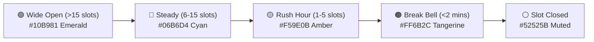
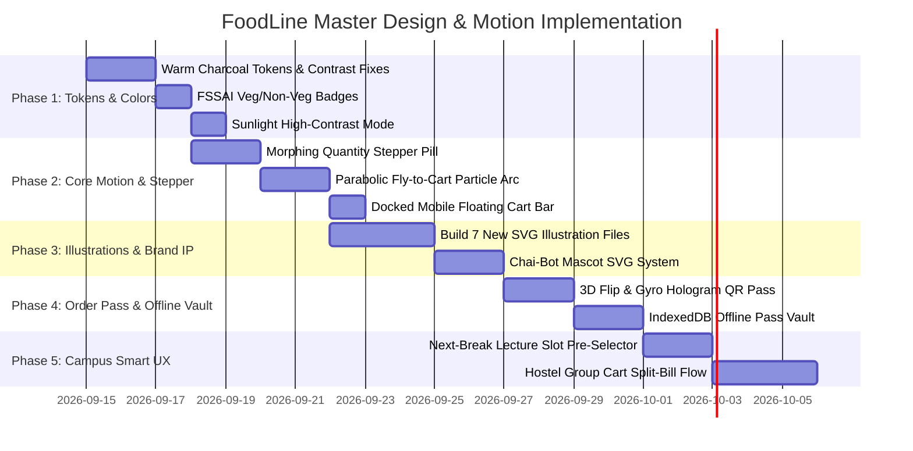

# 🎨 FoodLine Campus: Master Frontend Design, Motion, Color & UI/UX Plan

**Project:** FoodLine Campus Pre-Ordering & Express Dining Ecosystem  
**Target Pilot Campus:** Sanjivani University, Kopargaon (Cafe @7)  
**System Architecture:** Next.js 15 (App Router), Tailwind CSS v4, Motion (Framer Motion v12), Capacitor Android  
**Design Intelligence Standard:** `ui-ux-pro-max` Enterprise Grade · WCAG 2.2 AAA/AA Compliant  
**Document Type:** Strategic Design, Motion, Illustration & UI/UX Implementation Specification  

---

## 📑 Table of Contents
1. [Executive Summary & Design Philosophy](#1-executive-summary--design-philosophy)
2. [Color Palette & Semantic Token Architecture](#2-color-palette--semantic-token-architecture)
3. [Animation & Micro-Interaction Specifications](#3-animation--micro-interaction-specifications)
4. [Kinematics & Advanced Motion Physics](#4-kinematics--advanced-motion-physics)
5. [SVG Illustration System & Visual Assets](#5-svg-illustration-system--visual-assets)
6. [Illustrator & Vector Craftsmanship (Brand IP & Mascots)](#6-illustrator--vector-craftsmanship-brand-ip--mascots)
7. [UI/UX Architecture & Student Behavioral Ergonomics](#7-uiux-architecture--student-behavioral-ergonomics)
8. [Phased Step-by-Step Implementation Roadmap](#8-phased-step-by-step-implementation-roadmap)
9. [Pre-Delivery Quality Assurance & Verification Protocol](#9-pre-delivery-quality-assurance--verification-protocol)

---

## 1. Executive Summary & Design Philosophy

### The 15-Minute College Break Reality
At Sanjivani University, thousands of students pour out of lecture halls simultaneously for a strictly timed 15-minute break. In traditional canteens, 12 out of those 15 minutes are wasted standing in a crowded, noisy line just to purchase a paper token, leaving 3 minutes to inhale scalding food.

### The FoodLine Design Philosophy
FoodLine exists to make queueing obsolete. Every visual element, color choice, micro-interaction, and layout must adhere to three foundational tenets:

```
        ┌─────────────────────────────────────────────────────────┐
        │                 FOODLINE DESIGN TRIAD                   │
        ├────────────────────┬────────────────────┬───────────────┤
        │  1. SUB-30 SECONDS │ 2. ONE-HANDED RUN  │ 3. WARM BISTRO│
        │     ZERO-THINK     │    ERGONOMICS      │    APPETITE   │
        │ From open to paid  │ Navigable with one │ Culinary-rich │
        │ in under 3 actions │ thumb on crowded   │ dark palette  │
        │ during class bell  │ hallway walkways   │ that sparks   │
        │                    │                    │ hunger        │
        └────────────────────┴────────────────────┴───────────────┘
```

---

## 2. Color Palette & Semantic Token Architecture

### 2.1 The "Warm Roasted Charcoal" Shift
* **Problem:** Cold blue-blacks (`#07070B`, `#12121A`) resemble code editors and psychologically suppress appetite.
* **Solution:** Transition to warm cacao and roasted stone charcoal undertones that evoke freshly baked bread, brewed espresso, and roasted spices.

```css
/* ==========================================================
   GLOBAL DESIGN TOKENS (frontend/src/app/globals.css)
   ========================================================== */

:root {
  /* Canvas & Warm Bistro Surfaces */
  --bg-canvas: #0C0A09;          /* Stone 950: Warm roasted charcoal base */
  --bg-card: #191614;            /* Warm Obsidian: 4% amber-tinted surface */
  --bg-card-hover: #24201D;      /* Warm Roasted Cocoa: Interactive hover */
  --bg-card-active: #2F2A26;     /* Deep Molten Coffee: Active pressed state */
  --bg-glass: rgba(25, 22, 20, 0.75);
  --bg-glass-heavy: rgba(18, 16, 14, 0.92);

  /* Elevated Glass Borders */
  --border-glass: rgba(255, 255, 255, 0.09);
  --border-glass-hover: rgba(255, 255, 255, 0.22);
  --border-glass-active: rgba(255, 107, 44, 0.55);

  /* Primary Culinary Brand Tokens */
  --color-primary-brand: #FF6B2C;      /* Neon Tangerine: Primary CTAs & Cart */
  --color-primary-glow: rgba(255, 107, 44, 0.35);
  --color-secondary-brand: #FFB347;    /* Warm Amber: Bestsellers & Sizzle */
  --color-secondary-glow: rgba(255, 179, 71, 0.30);

  /* Authentic Indian FSSAI Dietary Standard Tokens */
  --diet-veg-border: #00C261;          /* FSSAI Standard Pure Green */
  --diet-veg-bg: rgba(0, 194, 97, 0.12);
  --diet-nonveg-border: #E11D48;       /* FSSAI Standard Crimson Red */
  --diet-nonveg-bg: rgba(225, 29, 72, 0.12);
  --diet-egg-border: #F59E0B;          /* Warm Yolk Amber */
  --diet-egg-bg: rgba(245, 158, 11, 0.12);

  /* WCAG 2.2 AAA Contrast-Tuned Typography */
  --text-primary: #FAF9F6;             /* Alabaster Warm White (14.2:1 contrast) */
  --text-secondary: #B4B4C0;           /* Soft Muted Lavender (8.2:1 contrast - AAA) */
  --text-muted: #8E8EA0;               /* Medium Slate (5.3:1 contrast - AA Pass) */
  --text-inverse: #0C0A09;             /* Inverted Dark Charcoal */
}
```

### 2.2 Sunlight Walkway High-Contrast Profile
For students glancing at their pickup pass while walking outside between university departments:

```css
/* Sunlight High-Contrast Override */
[data-contrast="sunlight"] {
  --bg-canvas: #000000 !important;
  --bg-card: #111111 !important;
  --border-glass: #FFFFFF !important;
  --text-primary: #FFFFFF !important;
  --text-secondary: #EDEDED !important;
  --color-primary-brand: #FF4500 !important; /* Solar Electric Orange */
}
```

### 2.3 Slot Urgency Semantic Colors


---

## 3. Animation & Micro-Interaction Specifications

### 3.1 Physics Configuration Reference (Motion v12)
All spring interactions must avoid artificial linear easing and use natural mass/stiffness profiles:

```typescript
// frontend/src/lib/animations/springs.ts

export const SPRINGS = {
  // Tactile buttons, chips, icons
  snappy: { type: "spring", stiffness: 450, damping: 26, mass: 0.75 },
  // Drawers, bottom-sheets, modal panels
  gentle: { type: "spring", stiffness: 220, damping: 28, mass: 1.0 },
  // Badges, success ticks, OTP reveals
  bouncy: { type: "spring", stiffness: 550, damping: 18, mass: 0.6 },
  // Smooth parabolic fly-to-cart
  parabolic: { duration: 0.55, ease: [0.22, 1, 0.36, 1] }
};
```

### 3.2 Parabolic "Fly-to-Cart" Particle Arc
* **Trigger:** User taps `[+ Add]` on any dish card.
* **Mechanism:**
  1. Capture source coordinates `(x1, y1)` of the tapped button via `getBoundingClientRect()`.
  2. Capture destination coordinates `(x2, y2)` of the floating cart icon.
  3. Spawn an ephemeral portal element containing a glowing food particle thumbnail.
  4. Animate along a curved Bezier trajectory (`y: [y1, y1 - 80, y2]`, `x: [x1, x2]`, `scale: [1, 1.2, 0.4]`).
  5. On collision, trigger the Floating Cart badge recoil: `scale: [1, 1.35, 0.9, 1.05, 1.0]`.

### 3.3 Morphing Stepper Pill (`[+ Add]` ➔ `[-] [ 2 ] [+]`)
* **Trigger:** Quantity changes on a menu card.
* **Motion Choreography:**
  * When `quantity === 0`: Render `<motion.button>` with `layoutId="add-btn-{id}"`.
  * When `quantity > 0`: Smoothly expand horizontally to `min-w-[110px]` with spring physics.
  * Number ticker: Wrapped in `<AnimatePresence mode="popLayout">`. When quantity increments, old digit exits `y: -12`, new digit enters `y: 12 ➔ 0` with opacity fade.

### 3.4 Interactive Time-Slot "Magnetic Selection"
* **Mechanism:**
  * Selected slot is highlighted by a glowing background capsule sharing `layoutId="active-slot-pill"`.
  * When switching between `11:15 AM` and `11:30 AM`, the capsule glides with liquid momentum across the carousel without unmounting.
  * Slots with `< 3 slots left` emit a continuous subtle warm amber breathing ring (`scale: [1, 1.02, 1]`, `opacity: [0.8, 1, 0.8]`, duration `2.5s`).

---

## 4. Kinematics & Advanced Motion Physics

### 4.1 The "Dynamic Island" Top Status Capsule
* **Context:** Keep students informed about their meal without trapping them on the tracking screen.
* **Choreography:**
  * Once payment is authorized, a sleek capsule morphs into the top navigation bar.
  * States:
    * 🟡 `Preparing: Misal Pav · ~4m left` (Gentle flame pulse icon)
    * 🟢 `Ready: Pick at Counter #2` (Continuous emerald radar beacon)
  * Tapping the capsule triggers a FLIP animation (`layoutId="live-order-island"`) expanding seamlessly into the full screen order pass.

### 4.2 Velocity-Aware Drag Bottom-Sheet
* **Physics Specifications:**
  * Bound to `motion.div` with `drag="y"`, `dragConstraints={{ top: 0 }}`, and `dragElastic={0.15}`.
  * **Snap Points:**
    * *Peek State (32vh):* Shows total bill, slot pill, and primary swipe button.
    * *Expanded State (88vh):* Full itemized dish breakdown, special instructions, and coupon chips.
  * **Fling-to-Dismiss:** If `info.velocity.y > 600`, cleanly drop below viewport with `SPRINGS.gentle`.

### 4.3 Gyroscopic Anti-Counterfeit Hologram Pass
* **Problem:** Students forging static screenshots of old orders.
* **Kinematic Solution:**
  * Listen to `DeviceOrientationEvent` (`gamma` & `beta` angles) on mobile or cursor `(x, y)` on desktop.
  * Shift a dynamic CSS gradient overlay across the QR Pass:
  ```css
  background: radial-gradient(
    circle at calc(50% + var(--tilt-x) * 1%) calc(50% + var(--tilt-y) * 1%),
    rgba(255, 255, 255, 0.18) 0%,
    rgba(255, 107, 44, 0.12) 35%,
    transparent 70%
  );
  ```
  * Canteen staff immediately recognizes an authentic live render versus a flat image.

---

## 5. SVG Illustration System & Visual Assets

### 5.1 Required Illustration Suite (`frontend/src/components/illustrations/`)

```
frontend/src/components/illustrations/
├── CampusExpressIllustration.tsx      (Existing)
├── ChefExpressIllustration.tsx        (Existing)
├── EmptyCartIllustration.tsx          (Existing)
├── EmptyMenuIllustration.tsx          (Existing)
├── SlotClockIllustration.tsx          (Existing)
├── OrderSuccessIllustration.tsx       ★ NEW: Pickup pass neon tray & steam
├── CanteenClosedIllustration.tsx      ★ NEW: Closed rolling shutter & moonlight
├── SlotFullIllustration.tsx           ★ NEW: Sizzling rush wok & speedometer
├── UPIWaitingIllustration.tsx         ★ NEW: Wireless payment terminal rings
├── NoOrdersIllustration.tsx           ★ NEW: Campus table & folded receipt
├── OfflineIllustration.tsx            ★ NEW: Cutting chai with Wi-Fi steam
└── StudentAuthIllustration.tsx        ★ NEW: Campus smart ID laser barcode scan
```

### 5.2 Visual Architecture for SVG Illustrations
Every custom illustration must follow strict vector construction standards:
1. **Double Ambient Glow:** Include an SVG `<defs>` with `<feGaussianBlur stdDeviation="6" />` for neon backlight.
2. **GPU Float Animation:** Enclose primary floating elements in CSS `animate-[float_4s_ease-in-out_infinite]`.
3. **No External Fonts in SVGs:** All typography inside SVGs must be converted to vector glyph paths to prevent layout shifts.
4. **Dark High-Contrast Theme Harmonization:** Base colors must match `--bg-card` (`#191614`) and highlight with `--color-primary-brand` (`#FF6B2C`).

---

## 6. Illustrator & Vector Craftsmanship (Brand IP & Mascots)

### 6.1 Brand Mascot IP: "Chai-Bot" (The Express Courier)
To turn FoodLine into an endearing campus brand, create a custom vector character:
* **Visual Identity:**
  * Retro-futuristic mini robot whose head resembles a transparent cutting-chai glass with warm amber tea and floating bubbles.
  * Wears a varsity bomber jacket in FoodLine tangerine (`#FF6B2C`) with a college ID lanyard.
* **Character Pose Library:**
  1. `ChaiBot_Welcome.svg` — Cheerful wave holding a smartphone with order status.
  2. `ChaiBot_Cooking.svg` — Chef hat on, feverishly tossing a samosa with spatula.
  3. `ChaiBot_Ready.svg` — Ringing a brass canteen bell with a green ticket flag.
  4. `ChaiBot_Sleeping.svg` — Sitting against an upside-down canteen stool under stars.
  5. `ChaiBot_Confused.svg` — Searching inside an empty bento box for empty states.

### 6.2 2.5D Isometric Campus Counter Map
* **Component:** `CampusCounterMap.tsx`
* **Features:**
  * Clean vector perspective drawing of Cafe @7 interior.
  * Marked vector beacons:
    * 🟢 **Counter 1:** Quick Beverages & Packed Items.
    * 🟠 **Counter 2 (Glowing):** **FoodLine Express Pickup Hub**.
    * 🟣 **Counter 3:** Thalis & Hot Lunch Plates.
  * Live walking time indicator dynamically calculated from the student's selected lecture hall.

### 6.3 College Die-Cut Sticker Badges
* Visual rewards unlocked on student profile:
  * ⚡ **"Bunk-the-Queue" Badge:** A clock broken in half with an electric lightning bolt.
  * ☕ **"Chai Commando" Badge:** 10 morning orders placed before 10:00 AM.
  * ⏱️ **"30-Second Legend" Badge:** Picked up meal within 45 seconds of break bell.

---

## 7. UI/UX Architecture & Student Behavioral Ergonomics

### 7.1 The One-Handed "Thumb Zone" Overhaul
Students navigate while walking, holding notebooks or tea in their other hand:

```
        ┌───────────────────────────────────────────┐
        │ [Top Bar]  Campus · Search   (Visual Only)│  <-- Hard to reach
        ├───────────────────────────────────────────┤
        │                                           │
        │             Dish Menu Grid                │  <-- Natural scroll
        │                                           │
        ├───────────────────────────────────────────┤
        │ [FLOATING DOCKED PILL]                    │  <-- PRIMARY THUMB ZONE
        │  🛒 2 items · ₹95   [ View Cart -> ]      │      (Bottom 35% viewport)
        ├───────────────────────────────────────────┤
        │ [Bottom Nav: Menu · Orders · Profile]     │  <-- Safe-area padded
        └───────────────────────────────────────────┘
```

### 7.2 Budget Quick-Filter System ("Hungry Under ₹50")
* One-touch filter pills placed below search:
  * `⚡ Under ₹30` (Chai, Bun Maska, Vada Pav)
  * `🔥 Quick Bites (₹30 - ₹60)` (Sandwiches, Misal, Poha)
  * `🍱 Full Thalis (₹70+)` (Mini Meal, Lunch Thali)
  * `🌱 100% Pure Veg Only` (Instant FSSAI filter)

### 7.3 Hostel Group Cart & Split-Bill Sharing
1. One student initiates order as **Host**.
2. Taps `[+ Group Order]` ➔ generates a 4-character code (`#CAFE`) and a WhatsApp share link.
3. Friends open link on their phones, selecting their own items.
4. Host's cart updates in real-time with grouped sections:
   * *Rohan (1x Egg Roll - ₹45)*
   * *Pooja (1x Cold Coffee - ₹35)*
5. Host pays single master UPI transaction; app provides 1-tap WhatsApp payment request links for friends to settle back via UPI.

### 7.4 "Spotty Campus Wi-Fi" Offline QR Vault
* Canteens often sit in concrete basements with poor cellular signal.
* **Solution:**
  * As soon as an order is verified, save `#Token-ID`, pickup details, and generated QR payload into browser **IndexedDB** & `localStorage`.
  * If network drops to 0 bars (`navigator.onLine === false`), the app immediately switches to **Offline Vault Mode**:
    * Displays cached QR code with high-contrast screen brightness.
    * Inscription: *"Verified Offline Pass — Show directly at Counter 2"*.

---

## 8. Phased Step-by-Step Implementation Roadmap



### Phase 1: Token Harmonization & Color System (Days 1–3)
- [ ] Update `globals.css` with Stone-950 Warm Bistro Palette (`--bg-canvas: #0C0A09`, `--bg-card: #191614`).
- [ ] Adjust `--text-secondary` to `#B4B4C0` and `--text-muted` to `#8E8EA0` for full WCAG AAA/AA conformance.
- [ ] Replace custom cyan badges with authentic FSSAI Green (`#00C261`) and Crimson (`#E11D48`).
- [ ] Implement `[data-contrast="sunlight"]` high-contrast solar mode toggle.

### Phase 2: Core Motion & Dish Card Ergonomics (Days 4–7)
- [ ] Implement `MorphingStepper.tsx` with smooth spring expansion and rolling digit tickers.
- [ ] Build `FlyToCartAnimation.tsx` with quadratic Bezier trajectory and cart recoil.
- [ ] Implement the Docked Mobile Bottom Cart Pill with backdrop blur and one-tap checkout trigger.

### Phase 3: SVG Illustration System & Mascot Craft (Days 8–12)
- [ ] Create all 7 missing SVG illustrations in `frontend/src/components/illustrations/`.
- [ ] Integrate Chai-Bot mascot states into Onboarding, Empty Cart, and Order Success.
- [ ] Design custom vector micro-icons for menu filter categories.

### Phase 4: QR Pickup Pass & Offline Token Vault (Days 13–16)
- [ ] Build 3D Card Flip (`rotateY: 180 ➔ 0`) for the active pickup pass on status change.
- [ ] Implement gyroscopic anti-counterfeit gradient shimmer using phone tilt orientation.
- [ ] Wire IndexedDB local caching so passes open instantly in zero-connectivity campus basements.

### Phase 5: Campus UX & Group Features (Days 17–21)
- [ ] Build "Hungry Under ₹50" and Hinglish phonetic fuzzy search filters.
- [ ] Introduce the smart "Next Break Bell" slot auto-selector based on student class schedules.
- [ ] Implement the Hostel Group Cart link-sharing workflow.

---

## 9. Pre-Delivery Quality Assurance & Verification Protocol

Before shipping any phase to production or presenting to the Sanjivani University administration:

| Criterion | Target Metric | Verification Method |
| :--- | :--- | :--- |
| **GPU Frame Rate** | Constant 60 FPS (zero layout thrashing) | Chrome DevTools Performance Profiler; verify only `transform` and `opacity` animate. |
| **Touch Ergonomics** | Min 44×44px hit targets | Mobile touch inspection; all primary actions within bottom 35% thumb zone. |
| **WCAG 2.2 Contrast** | Minimum 4.5:1 (AA), 7.0:1 for text (AAA) | Automated axe-core / Lighthouse Accessibility score ≥ 98. |
| **Offline Resilience** | Pass displays with zero cellular signal | Chrome DevTools Network Offline test; verify QR pass renders from IndexedDB. |
| **Android Safe-Areas** | Zero overlap with status bar or home bar | Test on physical Android build with Capacitor (`pb-safe` & `pt-safe` checks). |
| **Reduced Motion** | Graceful fallback for motion sensitivity | Verify `@media (prefers-reduced-motion: reduce)` disables spring oscillations. |

---

*Authored by Antigravity Design Intelligence Engine for FoodLine Campus.*  
*Reference Source: `.agents/skills/ui-ux-pro-max`, `motion-design-animations`, `tailwind-design-system`.*
