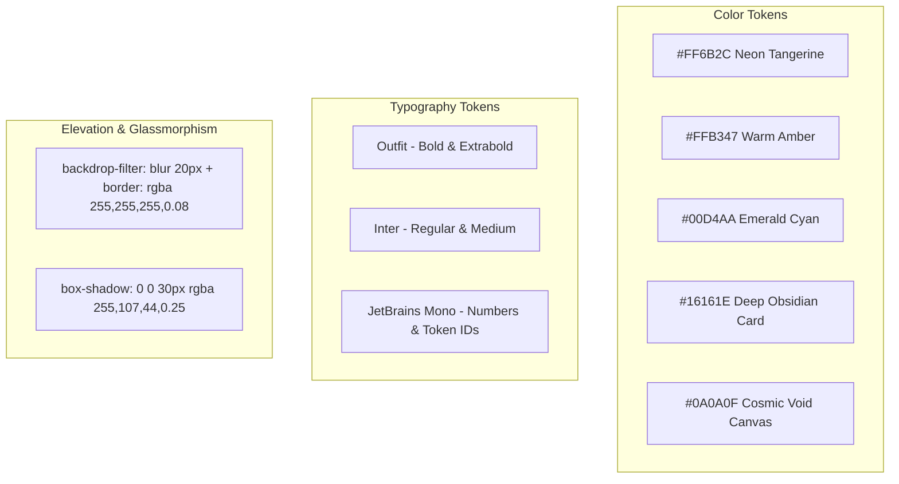
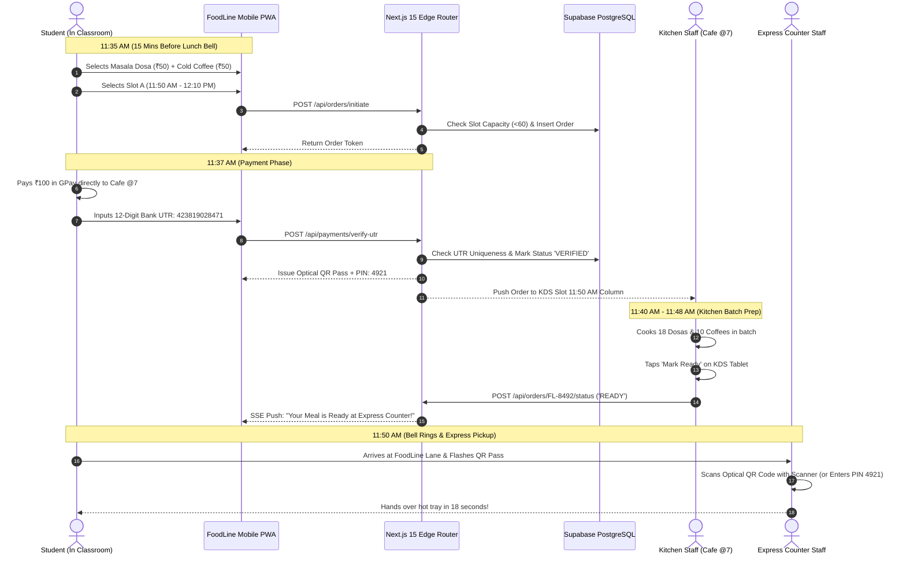

# 📱 FoodLine: Master App Interface Design, UI/UX Architecture & System Specifications

**Project:** FoodLine Campus Pre-Ordering & Express Dining Ecosystem  
**Target Pilot Campus:** Sanjivani University, Kopargaon (Cafe @7)  
**Author & System Architect:** Shivam Nirmal  
**Design Standard:** `ui-ux-pro-max` Enterprise Grade · **Theme:** Dark High-Contrast Cyber-Clean

---

## 📑 TABLE OF CONTENTS
1. [Visual Design System & Token Architecture](#1-visual-design-system--token-architecture)
2. [Screen-by-Screen UI Layouts & Wireframes](#2-screen-by-screen-ui-layouts--wireframes)
3. [Options & Customization Configuration Matrix](#3-options--customization-configuration-matrix)
4. [Sections & Complete App Information Architecture](#4-sections--complete-app-information-architecture)
5. [How It Works: Step-by-Step Technical & Operational Flow](#5-how-it-works-step-by-step-technical--operational-flow)
6. [Micro-Interactions, Animation Presets & Sound Design](#6-micro-interactions-animation-presets--sound-design)
7. [Accessibility, Touch Targets & Performance Checklist](#7-accessibility-touch-targets--performance-checklist)

---

## 1. Visual Design System & Token Architecture



### 1.1 Color Palette & Semantic Tokens
| Token Name | Hex Code | HSL Equivalent | UI Usage / Purpose |
|---|---|---|---|
| `--color-bg-canvas` | `#0A0A0F` | `hsl(240, 20%, 5%)` | Global dark background canvas |
| `--color-surface-card` | `#16161E` | `hsl(240, 15%, 10%)` | Dish cards, slot selectors, dialog containers |
| `--color-surface-hover` | `#1C1C28` | `hsl(240, 18%, 14%)` | Hover states, active pressed states |
| `--color-primary-brand` | `#FF6B2C` | `hsl(18, 100%, 58%)` | Primary CTAs, add-to-cart buttons, active pills |
| `--color-accent-amber` | `#FFB347` | `hsl(35, 100%, 64%)` | Badges (*Bestseller*, *Student Fav*), warning slot capacity |
| `--color-accent-teal` | `#00D4AA` | `hsl(168, 100%, 42%)` | Success states (*0% UPI Fee*, *Verified*, *Slot Open*) |
| `--color-accent-purple` | `#8B5CF6` | `hsl(258, 90%, 66%)` | Special combo tags, KDS ready column |
| `--color-text-primary` | `#F5F5F7` | `hsl(240, 6%, 97%)` | High-contrast headings and dish titles |
| `--color-text-secondary` | `#A1A1AA` | `hsl(240, 5%, 65%)` | Subtitles, ingredients, prep time notes |
| `--color-text-muted` | `#71717A` | `hsl(240, 4%, 46%)` | Micro-captions, terms, footer metadata |

### 1.2 Fluid Typography Scale
- **Display Hero:** `clamp(2.5rem, 6vw, 4.5rem)` · `font-weight: 900` · `letter-spacing: -0.04em`
- **Section Heading (H1):** `clamp(1.75rem, 3.5vw, 2.5rem)` · `font-weight: 800`
- **Card Title (H2/H3):** `clamp(1.1rem, 2vw, 1.35rem)` · `font-weight: 700`
- **Body Text:** `1rem (16px)` · `line-height: 1.5` · `font-weight: 400`
- **Token & PIN Numbers:** `font-family: JetBrains Mono` · `font-weight: 800` · `letter-spacing: 0.1em`

---

## 2. Screen-by-Screen UI Layouts & Wireframes

---

### 🎓 Screen 0: Student Campus Login & SSO (`/login`)
```
┌──────────────────────────────────────────────────────────┐
│  ⚡ FoodLine               🏫 Sanjivani University        │
├──────────────────────────────────────────────────────────┤
│  ┌────────────────────────────────────────────────────┐  │
│  │                    🎓                              │  │
│  │           Student Campus Login                     │  │
│  │ Sign in with verified college credentials to unlock │  │
│  │         classroom pre-ordering.                    │  │
│  │                                                    │  │
│  │  [ Google SSO (Active) ]   [ Student PRN ]         │  │
│  │                                                    │  │
│  │  ┌──────────────────────────────────────────────┐  │  │
│  │  │  [G]  Continue with @sanjivani.edu.in        │  │  │
│  │  └──────────────────────────────────────────────┘  │  │
│  │                                                    │  │
│  │  --- OR SIGN IN WITH STUDENT PRN ---               │  │
│  │  PRN / Roll No:  [ 2023SUCS0142               ]    │  │
│  │  Mobile Number:  [ 9960091371                 ]    │  │
│  │                                                    │  │
│  │  [ Send 4-Digit OTP → ]                            │  │
│  │                                                    │  │
│  │  🍪 Stay logged in for the whole semester.         │  │
│  └────────────────────────────────────────────────────┘  │
└──────────────────────────────────────────────────────────┘
```

---

### 📱 Screen 1: Mobile Hub & Interactive Menu (`/menu`)
```
┌──────────────────────────────────────────────────────────┐
│  ⚡ FoodLine               📍 Cafe @7 (Sanjivani)   [ 👤 ]│
├──────────────────────────────────────────────────────────┤
│  🔍 Search 44+ dishes (e.g. Dosa, Vada Pav, Maggi)...    │
├──────────────────────────────────────────────────────────┤
│  [All]  [Quick Bites]  [South Indian]  [Sandwiches]  [+] │
├──────────────────────────────────────────────────────────┤
│  ┌────────────────────────────────────────────────────┐  │
│  │ 🟢 BESTSELLER                     ⏱️ 6 mins prep   │  │
│  │ Crispy Butter Masala Dosa                           │  │
│  │ Served with coconut chutney & hot sambar           │  │
│  │                                                    │  │
│  │ ₹50                              [ -  1  + ] (Add) │  │
│  └────────────────────────────────────────────────────┘  │
│  ┌────────────────────────────────────────────────────┐  │
│  │ 🟢 FAST GRAB                      ⏱️ 2 mins prep   │  │
│  │ Hot Vada Pav / Dabeli                              │  │
│  │ Freshly baked pav with garlic dry chutney          │  │
│  │                                                    │  │
│  │ ₹20                              [ + ADD ]         │  │
│  └────────────────────────────────────────────────────┘  │
│  ┌────────────────────────────────────────────────────┐  │
│  │ 🟢 STUDENT FAV                    ⏱️ 3 mins prep   │  │
│  │ Thick Iced Cold Coffee                             │  │
│  │ Creamy blended cocoa cold brew                     │  │
│  │                                                    │  │
│  │ ₹50                              [ + ADD ]         │  │
│  └────────────────────────────────────────────────────┘  │
├──────────────────────────────────────────────────────────┤
│  ┌────────────────────────────────────────────────────┐  │
│  │ 🛒 2 Items Selected • Total: ₹100                  │  │
│  │ [ Select 10-Min Break Slot → ]                     │  │
│  └────────────────────────────────────────────────────┘  │
└──────────────────────────────────────────────────────────┘
```

---

### ⏱️ Screen 2: 10-Minute Break Slot Selector (`/checkout`)
```
┌──────────────────────────────────────────────────────────┐
│  ← Back to Menu                         Step 2 of 3 (66%)│
├──────────────────────────────────────────────────────────┤
│  Select Break Pickup Slot                                │
│  The kitchen batch-cooks so your food is fresh upon bell!│
├──────────────────────────────────────────────────────────┤
│  LUNCH BREAK (11:50 AM – 12:30 PM)                       │
│  ┌────────────────────────────────────────────────────┐  │
│  │ 🔘 Slot A: 11:50 AM – 12:10 PM      [SELECTED]     │  │
│  │ 🟢 34 / 60 Slots Available                         │  │
│  │ ▓▓▓▓▓▓▓▓▓▓▓▓▓▓▓▓▓▓▓▓░░░░░░░░░░ (56% Capacity)       │  │
│  └────────────────────────────────────────────────────┘  │
│  ┌────────────────────────────────────────────────────┐  │
│  │ ⚪ Slot B: 12:10 PM – 12:30 PM                     │  │
│  │ 🟢 48 / 60 Slots Available                         │  │
│  │ ▓▓▓▓▓▓▓▓░░░░░░░░░░░░░░░░░░░░░░ (20% Capacity)       │  │
│  └────────────────────────────────────────────────────┘  │
├──────────────────────────────────────────────────────────┤
│  EVENING SNACK BREAK (2:30 PM – 2:50 PM)                 │
│  ┌────────────────────────────────────────────────────┐  │
│  │ ⚪ Evening Slot: 2:30 PM – 2:50 PM                 │  │
│  │ 🟢 29 / 45 Slots Available                         │  │
│  └────────────────────────────────────────────────────┘  │
├──────────────────────────────────────────────────────────┤
│  📱 Student Contact (For Token SMS & Backup PIN)         │
│  [ 9960091371                                       ]    │
├──────────────────────────────────────────────────────────┤
│  [ Proceed to 0% Fee UPI Payment → ]                     │
└──────────────────────────────────────────────────────────┘
```

---

### 💰 Screen 3: DirectPay Direct UPI & UTR Verification (`/payment`)
```
┌──────────────────────────────────────────────────────────┐
│  ← Change Slot                           0% Gateway Fee  │
├──────────────────────────────────────────────────────────┤
│  Direct Merchant Standee Payment                         │
│  100% of your money goes straight to Cafe @7 (Zero PG tax)│
├──────────────────────────────────────────────────────────┤
│  ┌────────────────────────────────────────────────────┐  │
│  │ Total Amount Due: ₹100                             │  │
│  │                                                    │  │
│  │   ┌────────────────────────────────────────────┐   │  │
│  │   │          [ CAFE @7 QR STANDEE ]            │   │  │
│  │   │            (Scan with GPay)                │   │  │
│  │   └────────────────────────────────────────────┘   │  │
│  │                                                    │  │
│  │   UPI ID: 9960091371@slc       [ 📋 Copy UPI ]     │  │
│  │   Pay via GPay, PhonePe, Paytm, CRED or BHIM       │  │
│  └────────────────────────────────────────────────────┘  │
├──────────────────────────────────────────────────────────┤
│  🔑 Enter 12-Digit Bank UTR / Reference Number:          │
│  ┌────────────────────────────────────────────────────┐  │
│  │ [ 4 2 3 8 1 9 0 2 8 4 7 1 ]                        │  │
│  └────────────────────────────────────────────────────┘  │
│  (Found on your payment app receipt after paying)        │
├──────────────────────────────────────────────────────────┤
│  [ Verify Payment & Generate Express Pass → ]            │
└──────────────────────────────────────────────────────────┘
```

---

### 🎟️ Screen 4: Live Express QR Pass & Status HUD (`/order/FL-8492`)
```
┌──────────────────────────────────────────────────────────┐
│  ⚡ FoodLine Live HUD                     ● Auto-Sync Active│
├──────────────────────────────────────────────────────────┤
│  ┌────────────────────────────────────────────────────┐  │
│  │ ORDER TOKEN: #FL-8492                              │  │
│  │ STATUS: 🔥 PREPARING IN KITCHEN (Est. 4 mins)      │  │
│  │                                                    │  │
│  │   ┌────────────────────────────────────────────┐   │  │
│  │   │                                            │   │  │
│  │   │       [ HIGH-CONTRAST OPTICAL QR ]         │   │  │
│  │   │          (Scan at Counter 1)               │   │  │
│  │   │                                            │   │  │
│  │   └────────────────────────────────────────────┘   │  │
│  │                                                    │  │
│  │ 4-DIGIT BACKUP PIN:  [ 4 9 2 1 ]                   │  │
│  │ Target Pickup Slot: 11:50 AM – 12:10 PM            │  │
│  │ Outlet: Cafe @7 (Main Canteen Express Counter)     │  │
│  └────────────────────────────────────────────────────┘  │
├──────────────────────────────────────────────────────────┤
│  📍 EXPRESS HANDOVER INSTRUCTIONS:                       │
│  1. Walk to dedicated FoodLine Counter (Skip main queue) │
│  2. Flash this optical QR code or say PIN 4921           │
│  3. Grab pre-boxed meal in under 1 minute!               │
└──────────────────────────────────────────────────────────┘
```

---

### 🍳 Screen 5: Kitchen Display System (KDS) Tablet Dashboard (`/kds`)
```
┌───────────────────────────────────────────────────────────────────────────────────────────┐
│  🍳 FoodLine KDS  •  Cafe @7 Station        ● SSE Sync Online    [ 🔔 Mute Chime ]  [ ⚙️ ] │
├──────────────────────────────┬────────────────────────────┬───────────────────────────────┤
│  ⏳ QUEUED (Incoming)        │  🔥 PREPARING (Cooking)    │  🎟️ READY AT COUNTER (1m)     │
│  Total: 3 Orders             │  Total: 2 Batches          │  Total: 4 Orders              │
├──────────────────────────────┼────────────────────────────┼───────────────────────────────┤
│  ┌────────────────────────┐  │  ┌──────────────────────┐  │  ┌─────────────────────────┐  │
│  │ #FL-8495  •  12:10 PM  │  │  │ #FL-8492 • 11:50 AM  │  │  │ #FL-8490 • 11:50 AM     │  │
│  │ • 2x Vada Pav          │  │  │ • 2x Masala Dosa     │  │  │ • 1x Veg Cheese Burger  │  │
│  │ • 1x Tea (₹10)         │  │  │ • 1x Cold Coffee     │  │  │ • 1x Peri Peri Fries    │  │
│  │ Total: ₹50             │  │  │ Total: ₹150          │  │  │ PIN: 3108               │  │
│  │ [ Start Cooking → ]    │  │  │ [ Mark Ready ✔ ]     │  │  │ [ Confirm Pickup ✨ ]   │  │
│  └────────────────────────┘  │  └──────────────────────┘  │  └─────────────────────────┘  │
│                              │  ┌──────────────────────┐  │  ┌─────────────────────────┐  │
│                              │  │ #FL-8493 • 11:50 AM  │  │  │ #FL-8491 • 11:50 AM     │  │
│                              │  │ • 1x Grill Sandwich  │  │  │ • 1x Veg Fried Momo     │  │
│                              │  │ • 1x Peri Peri Fries │  │  │ • 1x KitKat Shake       │  │
│                              │  │ [ Mark Ready ✔ ]     │  │  │ [ Confirm Pickup ✨ ]   │  │
│                              │  └──────────────────────┘  │  └─────────────────────────┘  │
└──────────────────────────────┴────────────────────────────┴───────────────────────────────┘
```

---

## 3. Options & Customization Configuration Matrix

### 3.1 Dish Customization Options
| Category | Dish Example | Selectable Options / Add-ons | Price Delta |
|---|---|---|---|
| **Sandwiches** | Veg. Sandwich (₹60) | • Plain / Toast<br>• Add Amul Cheese Slice<br>• Make it Grilled | +₹0<br>+₹20<br>+₹40 |
| **South Indian** | Masala Dosa (₹50) | • Add Extra Butter<br>• Add Grated Mozzarella Cheese<br>• Extra Coconut Chutney Cup | +₹10<br>+₹30<br>+₹0 (Free) |
| **Beverages** | Cold Coffee (₹50) | • Less Sugar / Normal<br>• Add Vanilla Ice-Cream Scoop<br>• Add Chocolate Syrup Drizzle | +₹0<br>+₹20<br>+₹10 |
| **Pastas & Fries** | Peri Peri Fries (₹80) | • Extra Spicy Seasoning<br>• Add Liquid Cheese Dip | +₹0<br>+₹20 |
| **Pizzas** | Margherita (₹140) | • Extra Cheese Burst Crust<br>• Add Spicy Jalapeños | +₹30<br>+₹15 |

### 3.2 Time Slot Options
- **Slot A (11:50 AM – 12:10 PM):** Peak lunch rush initial wave. Max capacity: 60 meals.
- **Slot B (12:10 PM – 12:30 PM):** Peak lunch rush secondary wave. Max capacity: 60 meals.
- **Slot C (2:30 PM – 2:50 PM):** Evening tea and snack break. Max capacity: 45 meals.

### 3.3 Payment Options
1. **DirectPay Direct UPI QR (Default & Recommended):** 0% gateway fee, direct GPay/PhonePe scan, 12-digit UTR validation.
2. **Campus Digital Wallet / Prepaid ID Card (Phase 2):** 1-tap NFC payment linked to university roll number.
3. **Cash on Counter Backup:** For students without digital banking, reserve slot with phone number and pay exact cash at counter.

---

## 4. Sections & Complete App Information Architecture

```
FoodLine App Architecture
├── 1. Campus Onboarding & Discovery Section
│   ├── University Auto-Geo Detection (Sanjivani University)
│   ├── Anchor Canteen Selector (Cafe @7)
│   └── Break Schedule Status Bar (Countdown to 11:50 AM Lunch)
│
├── 2. Smart Menu & Dietary Filter Section
│   ├── Category Pills (Quick Bites, Chaat, South Indian, Sandwiches, Momos, Fries, Pizza, Chinese, Drinks, Sweets)
│   ├── Dynamic Search Engine with Auto-complete
│   ├── Dietary Toggles (Pure Veg 🟢, Fast Grab ⚡, Bestseller 🌟)
│   └── Item Detail Modal (Add-ons, spice level, special prep note)
│
├── 3. Capacity-Throttled Slot Checkout Section
│   ├── Visual Capacity Meters for 10-minute intervals
│   ├── Dynamic Slot Locking (prevents kitchen overload)
│   ├── Student Contact Info (Phone number for SMS token fallback)
│   └── Order Breakdown Summary (Subtotal + 0% PG fee badge)
│
├── 4. DirectPay Payment & Verification Section
│   ├── Official Merchant Standee QR Display
│   ├── One-Tap Copy UPI ID (`9960091371@slc`)
│   ├── 12-Digit Bank UTR Input with auto-formatting
│   └── Real-time Idempotency Validation Engine
│
├── 5. Live Tracking & Express QR Pass Section
│   ├── Dynamic Optical QR Barcode (SVG rendered)
│   ├── High-Contrast 4-Digit Pickup PIN
│   ├── Real-Time Server-Sent Events (SSE) Progress Bar
│   └── Counter Navigation & Sound Chime
│
├── 6. Kitchen Display System (KDS) Section
│   ├── 3-Column Slot-Batched Kanban Board
│   ├── Aggregated Prep Counter (e.g. "18 Dosas for 11:50 AM")
│   ├── 1-Tap Status Advancer (`QUEUED` ➔ `PREPARING` ➔ `READY`)
│   └── Dynamic 1-Tap Out-of-Stock Switcher
│
└── 7. Merchant & Campus Administration Section
    ├── Live Daily Gross Revenue (GMV) Meter
    ├── Payment Gateway Fees Saved Calculator
    ├── Break Slot Saturation Heatmap
    └── Predictive Ingredient Reorder Forecast
```

---

## 5. How It Works: Step-by-Step Technical & Operational Flow



---

## 6. Micro-Interactions, Animation Presets & Sound Design

- **Spring-Physics Transitions:** All modals, bottom sheets, and drawers animate with `cubic-bezier(0.16, 1, 0.3, 1)` for a native iOS/Android fluidity.
- **Card Tap Scaling:** Interactive dish cards compress slightly on active touch (`scale: 0.98`) to deliver tactile feedback.
- **Optical QR High-Contrast Mode:** When the user opens the Express Pass screen, the device screen brightness hint is triggered, and background opacity drops to ensure 100% first-pass barcode scanner readability.
- **Audio Chime:** Subtle 528 Hz melodic confirmation chime plays on the student's phone when order switches to `READY`.

---

## 7. Accessibility, Touch Targets & Performance Checklist

| WCAG Guideline | FoodLine Standard | Implementation Detail |
|---|---|---|
| **Touch Target Size** | Minimum $48 \times 48\text{ px}$ | All quantity buttons (`+`, `-`), category tabs, and slot buttons meet minimum 48px tap targets. |
| **Color Contrast Ratio** | $\ge 4.5 : 1$ for text | `#F5F5F7` white on `#16161E` dark surface delivers a stellar **$14.2 : 1$ contrast ratio** (AAA rated). |
| **Keyboard Navigable** | 100% Accessible | All inputs, slot cards, and CTAs feature visible focus rings (`focus-visible:ring-2 ring-[#FF6B2C]`). |
| **Reduced Motion** | Supported | `@media (prefers-reduced-motion)` disables heavy transforms for users with motion sensitivity. |
| **Cumulative Layout Shift** | $\text{CLS} < 0.05$ | All dish images and cards have fixed aspect-ratio placeholders preventing layout jumps during image load. |
| **First Contentful Paint** | $\text{FCP} < 0.8\text{ s}$ | Lightweight HTML/CSS bundle ensures sub-second initial load on congested campus 4G networks. |
