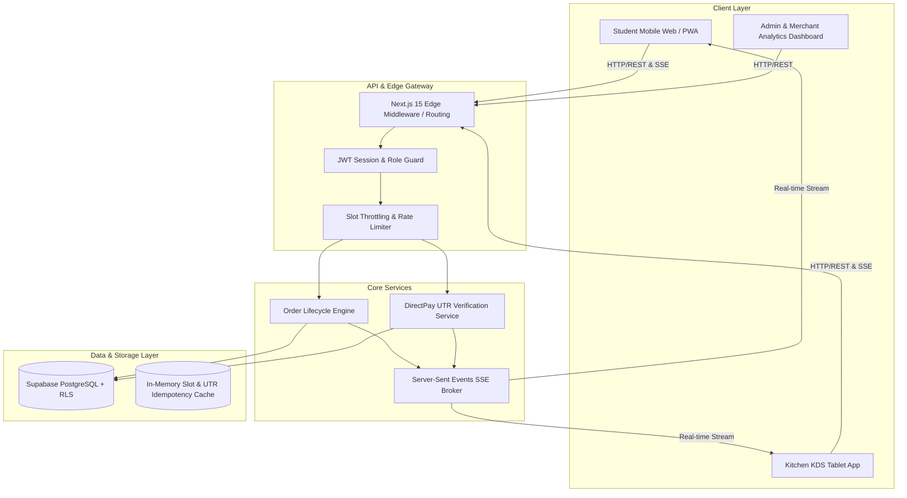
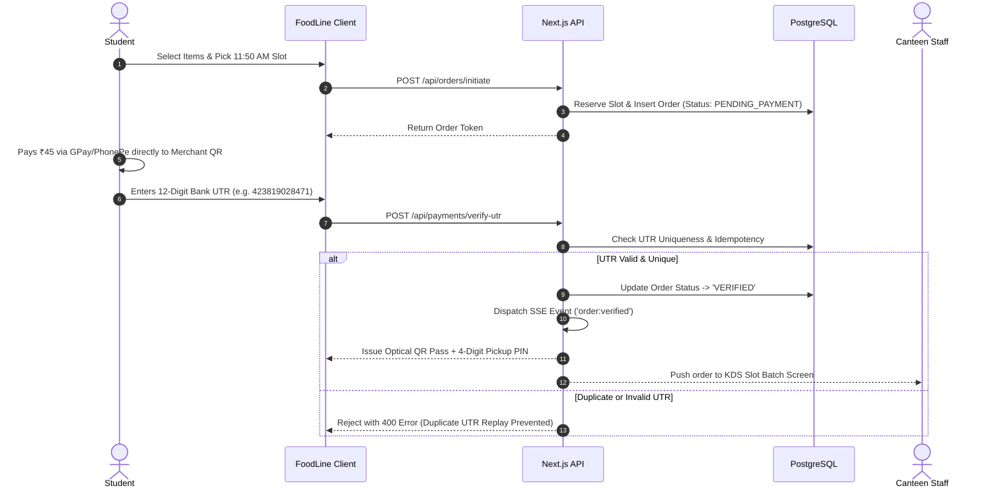

# 📐 FoodLine: System Design & Architecture Document
**Version:** 1.0.0 · **Target Stack:** Next.js 15 + React 19 + Supabase PostgreSQL + SSE  
**Author:** Shivam Nirmal (Founder & System Architect)

---

## 1. High-Level System Architecture

FoodLine is designed as an **event-driven, sub-second latency collegiate micro-service system** capable of handling sudden 10x traffic spikes when campus bells ring.



---

## 2. Database Schema (PostgreSQL DDL)

```sql
-- 1. CAMPUS OUTLETS
CREATE TABLE outlets (
    id UUID PRIMARY KEY DEFAULT gen_random_uuid(),
    university_name VARCHAR(100) NOT NULL,
    outlet_name VARCHAR(100) NOT NULL,
    upi_id VARCHAR(100) NOT NULL,
    qr_image_url TEXT NOT NULL,
    is_active BOOLEAN DEFAULT TRUE,
    created_at TIMESTAMPTZ DEFAULT NOW()
);

-- 2. BREAK SLOTS
CREATE TABLE break_slots (
    id UUID PRIMARY KEY DEFAULT gen_random_uuid(),
    outlet_id UUID REFERENCES outlets(id),
    slot_label VARCHAR(50) NOT NULL, -- e.g. "Lunch Slot A"
    start_time TIME NOT NULL,        -- 11:50:00
    end_time TIME NOT NULL,          -- 12:10:00
    max_order_capacity INT DEFAULT 60,
    current_booked_count INT DEFAULT 0,
    is_open BOOLEAN DEFAULT TRUE
);

-- 3. MENU ITEMS
CREATE TABLE menu_items (
    id UUID PRIMARY KEY DEFAULT gen_random_uuid(),
    outlet_id UUID REFERENCES outlets(id),
    name VARCHAR(100) NOT NULL,
    category VARCHAR(50) NOT NULL, -- "Fast Grab", "Bestseller", "Beverage"
    price DECIMAL(10,2) NOT NULL,
    prep_time_minutes INT DEFAULT 5,
    is_available BOOLEAN DEFAULT TRUE,
    image_url TEXT,
    created_at TIMESTAMPTZ DEFAULT NOW()
);

-- 4. ORDERS
CREATE TABLE orders (
    id UUID PRIMARY KEY DEFAULT gen_random_uuid(),
    order_token VARCHAR(20) UNIQUE NOT NULL, -- e.g. "FL-8492"
    pickup_pin VARCHAR(4) NOT NULL,          -- e.g. "4921"
    student_phone VARCHAR(15) NOT NULL,
    outlet_id UUID REFERENCES outlets(id),
    slot_id UUID REFERENCES break_slots(id),
    total_amount DECIMAL(10,2) NOT NULL,
    status VARCHAR(30) DEFAULT 'PENDING_PAYMENT', 
    -- 'PENDING_PAYMENT' | 'UTR_SUBMITTED' | 'VERIFIED' | 'PREPARING' | 'READY' | 'COLLECTED' | 'CANCELLED'
    created_at TIMESTAMPTZ DEFAULT NOW(),
    updated_at TIMESTAMPTZ DEFAULT NOW()
);

-- 5. ORDER LINE ITEMS
CREATE TABLE order_items (
    id UUID PRIMARY KEY DEFAULT gen_random_uuid(),
    order_id UUID REFERENCES orders(id) ON DELETE CASCADE,
    menu_item_id UUID REFERENCES menu_items(id),
    quantity INT NOT NULL CHECK (quantity > 0),
    unit_price DECIMAL(10,2) NOT NULL
);

-- 6. DIRECTPAY UTR TRANSACTIONS
CREATE TABLE utr_transactions (
    id UUID PRIMARY KEY DEFAULT gen_random_uuid(),
    order_id UUID REFERENCES orders(id),
    utr_number VARCHAR(12) UNIQUE NOT NULL,
    payer_upi_app VARCHAR(50),
    amount DECIMAL(10,2) NOT NULL,
    is_verified BOOLEAN DEFAULT FALSE,
    verified_at TIMESTAMPTZ,
    created_at TIMESTAMPTZ DEFAULT NOW()
);
```

---

## 3. DirectPay Payment & Idempotent Verification Sequence



---

## 4. Real-Time Communication Pipeline: Why SSE Over WebSockets?

For campus dining, **Server-Sent Events (SSE)** are superior to full WebSockets:
1. **Unidirectional Efficiency:** Status changes flow from Server ➔ Student (`PREPARING` ➔ `READY`).
2. **HTTP/2 Multiplexing:** Operates over standard HTTPS ports without firewall or proxy drops on campus Wi-Fi.
3. **Automatic Reconnection:** Built-in auto-retry with `Last-Event-ID` ensures students never miss a food-ready notification if they walk through a dead zone.
4. **Low Battery & Resource Footprint:** Eliminates client-side heartbeat overhead.

---

## 5. UI/UX Design System Tokens & Guidelines

Adhering to modern `ui-ux-pro-max` standards:
- **Color Palette (Dark High-Contrast):**
  - Background: `#0A0A0F` (95% neutral dark)
  - Card Surfaces: `#16161E` with subtle border `rgba(255, 255, 255, 0.06)`
  - Accent Primary: `#FF6B2C` (Electric Tangerine)
  - Accent Success / Teal: `#00D4AA` (Emerald Cyan)
  - Accent Secondary: `#8B5CF6` (Hyper Violet)
- **Fluid Typography:** `clamp(1rem, 2.5vw, 1.5rem)` ensuring legibility across 4.7" phones to 13" tablets.
- **Micro-Interactions:** Spring-physics eased transitions (`cubic-bezier(0.16, 1, 0.3, 1)`) with zero layout shift (CLS = 0).
