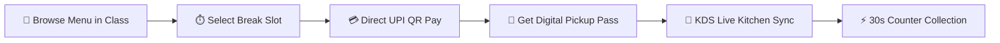
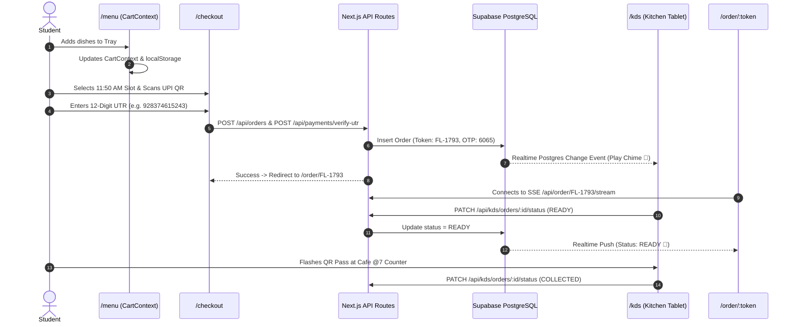

# 🎨 FoodLine: Master Frontend Design & UI/UX Architecture Plan

**Project:** FoodLine — Campus Pre-Ordering & Express Pickup Ecosystem  
**Target Pilot Campus:** Sanjivani University, Kopargaon (MH) — *Cafe @7*  
**Tech Stack:** Next.js 15 (App Router), Tailwind CSS, Vanilla Glassmorphism, Supabase SSR & Realtime  
**Design Standard:** `ui-ux-pro-max` Cyber-Clean Dark High-Contrast Framework  

---

## 📑 Table of Contents
1. [Executive UX Strategy & Design Vision](#1-executive-ux-strategy--design-vision)
2. [Design Tokens & Theme Architecture](#2-design-tokens--theme-architecture)
3. [Component Hierarchy & Information Architecture](#3-component-hierarchy--information-architecture)
4. [Screen-by-Screen UI/UX Specifications](#4-screen-by-screen-uiux-specifications)
5. [State Management & Data Synchronization Flow](#5-state-management--data-synchronization-flow)
6. [Micro-Interactions, Motion & Sound Design](#6-micro-interactions-motion--sound-design)
7. [Responsive Breakpoints & Accessibility (a11y) Standards](#7-responsive-breakpoints--accessibility-a11y-standards)
8. [Implementation Roadmap & Milestones](#8-implementation-roadmap--milestones)

---

## 1. Executive UX Strategy & Design Vision

### 🎯 Core Problem
Students at Sanjivani University lose **15–20 minutes of their 25-minute break** waiting in unorganized physical queues at Cafe @7.

### 💡 The Solution
A **mobile-first, 60-second ordering flow**:
- **Classroom Pre-Ordering:** Order before the bell rings from lecture halls.
- **Capacity Throttling:** 60 orders max per 10-minute slot to prevent kitchen bottlenecks.
- **Zero-Fee Direct UPI:** Instant QR scan with 12-digit UTR bank reference verification.
- **30-Second Express Grab:** Flash digital QR Pass with 4-digit OTP at counter.

---

## 2. Design Tokens & Theme Architecture

### 2.1 Color Palette (Dark High-Contrast Theme)

| Token Name | Hex Code | HSL / RGB | Usage & Semantic Purpose |
|---|---|---|---|
| `--bg-canvas` | `#0A0A0F` | `hsl(240, 20%, 5%)` | Deep cosmic canvas background |
| `--bg-card` | `#16161E` | `hsl(240, 15%, 10%)` | Glassmorphic containers, cards, modals |
| `--bg-card-hover` | `#1C1C28` | `hsl(240, 18%, 14%)` | Hover states, active interactive tiles |
| `--accent-brand` | `#FF6B2C` | `hsl(18, 100%, 58%)` | Primary CTAs, add-to-cart, brand accents |
| `--accent-amber` | `#FFB347` | `hsl(35, 100%, 64%)` | Badges, tags (*Bestseller*, *Student Fav*) |
| `--accent-mint` | `#00D4AA` | `hsl(168, 100%, 42%)` | Success states (*OTP*, *Ready for Pickup*) |
| `--accent-purple` | `#8B5CF6` | `hsl(258, 90%, 66%)` | Special categories, combos, analytics pills |
| `--text-primary` | `#F5F5F7` | `hsl(240, 6%, 97%)` | High-contrast headings and dish titles |
| `--text-secondary` | `#A1A1AA` | `hsl(240, 5%, 65%)` | Subtitles, ingredients, prep time notes |
| `--text-muted` | `#71717A` | `hsl(240, 4%, 46%)` | Metadata, captions, legal notices |

### 2.2 Typography Hierarchy
- **Brand & Display:** `Outfit` / `Inter`, 900 Black weight, `-0.04em` letter spacing.
- **Section Headers (H1–H3):** `Inter`, 800 ExtraBold & 700 Bold.
- **Body & Captions:** `Inter`, 400 Regular & 500 Medium, `1.5` line height.
- **Order Tokens, UTR & OTPs:** `JetBrains Mono` / Monospace, 900 Black weight, `0.1em` tracking.

### 2.3 Glassmorphic Elevation Tokens
- **Backdrop Blur:** `backdrop-filter: blur(20px)` with `rgba(22, 22, 30, 0.85)` background.
- **Border Rim:** `1px solid rgba(255, 255, 255, 0.10)`.
- **Active Glow:** `box-shadow: 0 0 30px rgba(255, 107, 44, 0.25)`.

---

## 3. Component Hierarchy & Information Architecture

```mermaid
graph TD
    App[FoodLine App Root] --> Providers[Providers: CartContext + Theme]
    Providers --> Nav[Navbar with Live Cart Counter]
    
    Providers --> Landing[Landing Hub /]
    Providers --> Menu[Interactive Menu /menu]
    Providers --> Checkout[Express Checkout /checkout]
    Providers --> Tracking[Live Order Tracker /order/:token]
    Providers --> KDS[Kitchen Display System /kds]
    Providers --> Admin[Merchant Analytics /admin]
    Providers --> Login[College SSO /login]

    Menu --> DishCard[Dish Card with Pure Veg & Tag Badges]
    Menu --> FilterPills[Horizontal Category Pills]
    Menu --> SearchBar[Instant Debounced Search]
    Menu --> CartBar[Floating Bottom Cart Tray]

    Checkout --> TrayReview[Order Summary Tray]
    Checkout --> SlotPicker[Capacity Throttle Meter]
    Checkout --> UpiQr[Dynamic UPI QR Standee Generator]
    Checkout --> UtrInput[12-Digit Bank UTR Validator]

    Tracking --> PassCard[Digital QR Pickup Pass + OTP]
    Tracking --> LiveStepper[Realtime Kitchen Status Stepper]
    Tracking --> Receipt[Itemized Receipt]

    KDS --> Kanban[4-Column Live Kanban Board]
    KDS --> StockoutModal[1-Tap Inventory Availability Manager]
    KDS --> AudioChime[Web Audio API Chime on New Order]
```

---

## 4. Screen-by-Screen UI/UX Specifications

### 📱 Screen 1: Discovery Landing Hub (`/`)
* **Hero Section:** High-impact value proposition (*"Skip the 25-Min Line. Grab Hot Food in 30s."*).
* **Campus Status Indicator:** Pulsing green badge (*"Sanjivani University • Cafe @7 Open"*).
* **4 Operational Pillars:**
  1. *Order in Class* (Pre-order 10 mins ahead).
  2. *60-Cap Break Slots* (Intelligent slot throttling).
  3. *0% Surcharge UPI* (Direct merchant QR).
  4. *30s Express Grab* (Instant digital pass).
* **Primary CTAs:** *"Browse Cafe @7 Menu"* and *"Kitchen KDS Station"*.

---

### 🍽️ Screen 2: Interactive Menu Catalog (`/menu`)
* **Category Pills:** Horizontal scroll with emoji badges (*All, Quick Bites, South Indian, Sandwiches, Burgers, Fries & Pasta, Pizzas, Chinese, Beverages*).
* **Instant Search:** Instant filtering across all 44 dishes with instant highlight.
* **Dish Card UI:**
  - Standard Green Square with Dot (**100% Pure Veg** identifier).
  - Price in INR (`₹XX`), prep time estimate, and category tag.
  - Interactive Quantity Controller (`- 1 +`) with direct sync to `CartContext`.
  - Sold-out overlay for items marked unavailable by the kitchen.
* **Floating Bottom Tray Bar:**
  - Renders when `totalCount > 0`.
  - Displays total items, total price, and a vibrant CTA to `/checkout`.

---

### 💳 Screen 3: Express Checkout & Slot Lock (`/checkout`)
* **Step 1 — Tray Summary:** Itemized review with individual quantity adjustment and deletion.
* **Step 2 — Campus Break Slot Selector:**
  - Real-time capacity bar (e.g. `Lunch Shift 1 (11:50 AM - 12:10 PM)`).
  - Color-coded availability: Green (<50%), Amber (50–80%), Red (>80%), Disabled (60/60 Full).
* **Step 3 — Direct UPI Scan & Pay:**
  - Auto-generates high-contrast QR code for `cafe7.sanjivani@upi` with exact pre-filled amount.
  - One-click copy for UPI ID.
* **Step 4 — 12-Digit UTR Bank Reference Input:**
  - Numeric-only input with auto-formatting and duplicate replay prevention.
  - *"Submit Payment & Get Pickup Pass"* triggers order creation and verification.

---

### 🎫 Screen 4: Live Order Tracking Pass (`/order/[token]`)
* **Express Pass Card:**
  - Large Order Token Header (`FL-XXXX`).
  - 4-Digit Pickup OTP Box (`6065`) in glowing Emerald Cyan.
  - Dynamic QR Pass for instant counter optical scanning.
* **Live Realtime Stepper:**
  - 4 Progressive Stages: `Order Confirmed` ➔ `Cooking in Kitchen` ➔ `Ready for Express Grab` ➔ `Collected`.
  - Realtime SSE heartbeat stream connection with live status synchronization.
* **Itemized Receipt Breakdown:** Subtotals, dish counts, and verified payment confirmation.

---

### 🍳 Screen 5: Kitchen Display System (`/kds`)
* **Tablet-Optimized Kanban Board:**
  - **Column 1:** *New Orders / Confirmed* (Waiting Cook).
  - **Column 2:** *Cooking Now* (In Wok / Grill / Fryer).
  - **Column 3:** *Ready at Counter* (Displaying OTP and Token).
  - **Column 4:** *Completed* (Archived log).
* **Sound Alerts:** Audio chime plays on new order arrival.
* **1-Tap Actions:** One-click progression buttons (*Start Cooking*, *Mark Ready*, *Handover Verified*).
* **1-Tap Live Stockout Manager:** Modal to toggle availability of any of the 44 dishes in real time.

---

### 📊 Screen 6: Merchant Analytics & Telemetry (`/admin`)
* **Summary Metric Cards:** Today's GMV, Total Pre-Orders, Avg. Handover Speed (22s SLA), Kitchen Throughput boost (3.2x).
* **Demand Curve:** Visual capacity chart across all campus break shifts.
* **Top Revenue Dishes:** Top-selling dishes by volume and GMV contribution.

---

### 🔑 Screen 7: College Single Sign-On (`/login`)
* **Sanjivani University Google SSO:** 1-Click login with `@sanjivani.edu.in`.
* **Student PRN & OTP Login:** Alternative login with Roll Number and mobile PIN.

---

## 5. State Management & Data Synchronization Flow

---

## 6. Micro-Interactions, Motion & Sound Design

1. **Card Hover Effects:** Subtle `translate-y-[-2px]` lift with glowing border gradient transition.
2. **Add to Cart Bounce:** Badge number triggers spring animation on count increment.
3. **Pulsing Stepper:** Active kitchen stage displays a glowing pulse indicator.
4. **Kitchen Order Chime:** Web Audio API sound alert on incoming orders for kitchen staff.
5. **Mobile Vibration:** Triggers device vibration API when order transitions to `READY`.

---

## 7. Responsive Breakpoints & Accessibility (a11y) Standards

| Device / Viewport | Width Range | Layout Strategy |
|---|---|---|
| **Mobile (Primary)** | `320px – 640px` | Single-column cards, bottom fixed tray bar, 48px minimum touch targets |
| **Tablet (KDS)** | `768px – 1024px` | 2-to-4 column Kanban board, large high-contrast fonts |
| **Desktop / Laptop** | `1024px+` | 3-column menu grid, split-pane checkout, full analytics dashboard |

### ♿ Accessibility (WCAG 2.2 AA)
- **Contrast Ratios:** Text-to-background contrast ratio > `7:1` for critical information (prices, tokens, OTPs).
- **Dietary Icons:** Color is never the sole indicator; pure veg includes both green color and distinct dot-in-square iconography.
- **Keyboard Navigation:** Full tab support and visible focus rings (`focus:ring-2 focus:ring-[#FF6B2C]`).

---

## 8. Implementation Roadmap & Milestones

- [x] **Phase 1: Token & Theme Foundations** — Color tokens, typography, dark mode CSS variables.
- [x] **Phase 2: Global State & Cart Engine** — `CartContext` with slot selection and local storage sync.
- [x] **Phase 3: Dynamic Menu & Search** — 44 dishes loaded from Supabase with instant category filters.
- [x] **Phase 4: Slot Throttling & UPI Checkout** — Dynamic QR standee with 12-digit UTR verification.
- [x] **Phase 5: Digital QR Pickup Pass & SSE Stream** — Live order tracker with Realtime WebSocket sync.
- [x] **Phase 6: Kitchen Display Station (KDS)** — 4-column tablet Kanban board with sound alerts and 1-tap stockout manager.
- [x] **Phase 7: Analytics & SSO Login** — Telemetry dashboard and Sanjivani University authentication.
