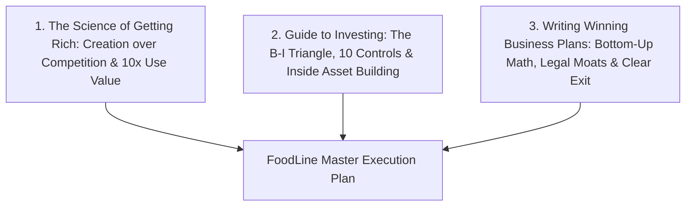
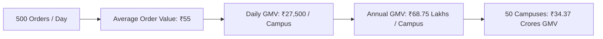
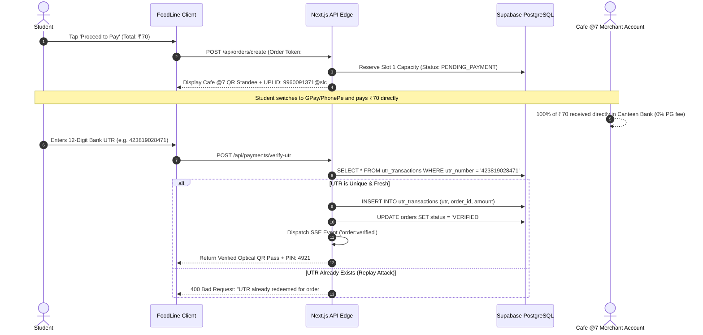
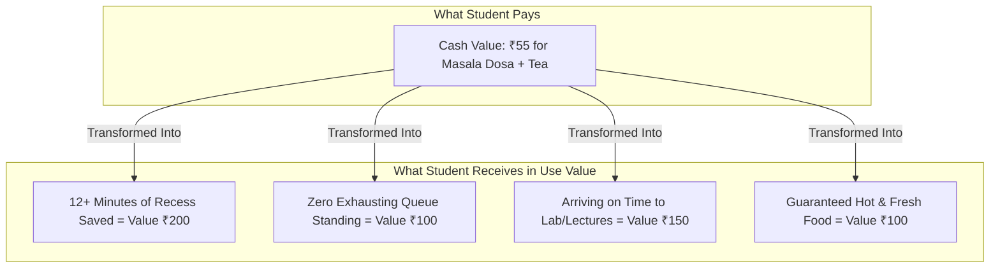
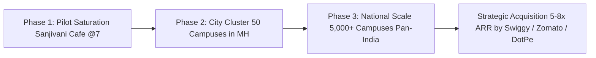

# 🏛️ FoodLine: Deep Enterprise Operational Architecture & Execution Master Plan
### *Integrating Principles from "The Science of Getting Rich", "Rich Dad's Guide to Investing", and "Writing Winning Business Plans"*

**Project:** FoodLine Campus Pre-Ordering, Algorithmic Slot-Throttling & Express Pickup Ecosystem  
**Target Pilot Campus:** Sanjivani University, Kopargaon (Cafe @7)  
**Founder & Chief Architect:** Shivam Nirmal  
**Document Version:** 2.0.0 (Enterprise Deep Strategic Edition)

---

## 📑 TABLE OF CONTENTS
1. [Executive Vision & The 3 Foundational Book Pillars](#1-executive-vision--the-3-foundational-book-pillars)
2. [The Rich Dad B-I Triangle Architecture for FoodLine](#2-the-rich-dad-b-i-triangle-architecture-for-foodline)
3. [Bottom-Up Unit Economics & Financial Modeling](#3-bottom-up-unit-economics--financial-modeling)
4. [Deep 5-Stage Operational User Journeys & Technical Sequences](#4-deep-5-stage-operational-user-journeys--technical-sequences)
5. [The "Use Value > Cash Value" Mathematical Ratio](#5-the-use-value--cash-value-mathematical-ratio)
6. [DirectPay Zero-Fee UPI & Anti-Fraud Replay Guard](#6-directpay-zero-fee-upi--anti-fraud-replay-guard)
7. [Kitchen Display System (KDS) & Load-Throttling Algorithm](#7-kitchen-display-system-kds--load-throttling-algorithm)
8. [Risk Mitigation, Red Flag Defenses & Legal Moats](#8-risk-mitigation-red-flag-defenses--legal-moats)
9. [3-Phase Growth Roadmap & Investor Exit Strategy](#9-3-phase-growth-roadmap--investor-exit-strategy)

---

## 1. Executive Vision & The 3 Foundational Book Pillars



### 1.1 "The Science of Getting Rich" (Wallace D. Wattles) Applied to FoodLine:
- **Creation Over Competition:** FoodLine refuses to enter price wars with Swiggy or Zomato for off-campus deliveries. Instead, we **CREATE a captive, frictionless on-campus micro-dining ecosystem** inside university walls where external riders cannot enter.
- **The Law of Increase:** Every screen, interaction, and touchpoint radiates speed, relief, and modern elegance to students and canteen operators.
- **Efficient Action in the Present:** Every single user interaction is engineered for zero redundant clicks — 3 taps to order, 1 scan to pay, 1 minute to collect.

### 1.2 "Rich Dad's Guide to Investing" (Robert T. Kiyosaki) Applied to FoodLine:
- **Building Assets That Buy Assets:** FoodLine is not a gig; it is a scalable **B-Quadrant System** producing predictable, high-margin cash flow that converts transactional revenue into long-term enterprise value.
- **The 90/10 Rule:** 90% of food delivery startups bleed cash on delivery riders, customer acquisition subsidies, and gateway fees. FoodLine operates on the 10% side: **Zero delivery driver payroll, ₹0 CAC, and 0% payment gateway fees**.

### 1.3 "Writing Winning Business Plans" (Garrett Sutton, Esq.) Applied to FoodLine:
- **Eliminating the "1% Fallacy":** We do not project arbitrary percentages of India's population. We build our financial forecasts from **ground-truth bottom-up metrics** verified directly at Sanjivani University's Cafe @7.
- **Answering the 3 Investor Mandates:**
  1. *How much capital is needed?* Pre-seed growth capital for tablet deployment & university expansion.
  2. *How is it spent?* 45% Tech & SSE infra, 35% Campus onboarding, 20% Working capital buffer.
  3. *How do investors exit?* Strategic acquisition by food-tech/POS conglomerates (Swiggy, Zomato, DotPe, Pine Labs) at 5–8x ARR in 4–5 years.

---

## 2. The Rich Dad B-I Triangle Architecture for FoodLine

```
               / \
              / P \          P = PRODUCT (Next.js 15 PWA + KDS Tablet App)
             /-----\
            /   L   \        L = LEGAL (University MoUs, Merchant Contracts, IP)
           /---------\
          /     S     \      S = SYSTEMS (10-Min Throttling Engine, SSE Sync, UTR Verifier)
         /-------------\
        /       C       \    C = COMMUNICATIONS (On-Table QR Standees, Campus Ambassador Virality)
       /-----------------\
      /        CF         \  CF = CASH FLOW (DirectPay 0% Fee Model + Negative Working Capital)
     -----------------------
       MISSION | TEAM | LEADERSHIP (Outer Protective Frame)
```

### 1. The Outer Frame:
- **Mission:** Eliminate the 14.5-minute collegiate break bottleneck and return millions of productive hours to Indian students.
- **Team:** Founder & CEO Shivam Nirmal (Product & Campus Strategy) + Systems Architect (SSE & Real-Time DB) + Operations Lead (Canteen & University Relations).
- **Leadership:** Unwavering commitment to student experience, vendor profitability, and rapid execution.

### 2. The 5 Internal Layers:
1. **Cash Flow (CF):** Direct merchant UPI eliminates payment delay; FoodLine collects platform convenience micro-fees, generating instant positive cash flow without credit risk.
2. **Communications (C):** Zero paid ad spend. Physical QR standees placed on every cafeteria table create organic word-of-mouth adoption.
3. **Systems (S):** Automated 10-minute slot throttling, Server-Sent Events (SSE) live updates, and idempotent database transactions.
4. **Legal (L):** Exclusive campus vendor MoUs, private limited corporate entity (Pvt Ltd), and trademark protection for the FoodLine brand.
5. **Product (P):** Fast, resilient, mobile-first web app that never crashes under sudden 1,000-student lunch surges.

---

## 3. Bottom-Up Unit Economics & Financial Modeling

*(Directly derived from the 44 verified items on Cafe @7's blackboard menu)*



### 3.1 Single Campus Unit Economics (Cafe @7 Baseline):
- **Campus Population:** 4,500 students & faculty at Sanjivani University.
- **Daily Cafeteria Footfall:** ~1,800 visitors/day.
- **Target FoodLine Penetration:** 30% (540 orders/day, rounded conservatively to **500 orders/day**).
- **Verified Average Order Value (AOV):** **₹55** (e.g. Masala Dosa ₹50 + Tea ₹10 = ₹60; Vada Pav ₹20 + Cold Coffee ₹50 = ₹70; Sandwich ₹100).
- **Daily Gross Merchandise Value (GMV):** $500 \times ₹55 = \mathbf{₹27,500 / \text{day}}$.
- **Monthly GMV (24 operational days):** $24 \times ₹27,500 = \mathbf{₹6.60 \text{ Lakhs / month}}$.
- **Annual GMV (250 university days):** $250 \times ₹27,500 = \mathbf{₹68.75 \text{ Lakhs / campus / year}}$.

### 3.2 Revenue Streams per Campus:
1. **Platform Convenience Fee (3% on GMV):** ₹2,06,250 / year.
2. **Merchant Analytics SaaS (₹1,500/month):** ₹18,000 / year.
3. **Hostel Express Delivery Commissions (₹5/drop on 50 drops/day):** ₹62,500 / year.
- **Total Net Revenue per Campus:** **~₹2,86,750 / year**.
- **Gross Margin:** **72%** (cloud hosting, SMS gateways, and maintenance cost < ₹80,000/campus).

### 3.3 Multi-Campus Scaling Projections (Maharashtra Hubs):
| Horizon | Campus Count | Annual GMV | FoodLine Net Revenue | EBITDA |
|---|---|---|---|---|
| **Phase 1 (Year 1)** | 3 Campuses (Pilot Saturation) | ₹2.06 Cr | ₹8.60 Lakhs | ₹2.40 Lakhs |
| **Phase 2 (Year 2)** | 50 Campuses (Pune, Nashik, Mumbai) | ₹34.37 Cr | ₹1.43 Cr | ₹78.5 Lakhs |
| **Phase 3 (Year 3)** | 250 Campuses (Maharashtra + Pan-India) | ₹171.8 Cr | ₹7.17 Cr | ₹4.20 Cr |

---

## 4. Deep 5-Stage Operational User Journeys & Technical Sequences

---

### 4.1 Stage 1: Classroom Pre-Ordering & Break Slot Reservation
```
Timeline: 11:35 AM (15 Minutes Before the 11:50 AM Lunch Bell)
```
1. **Frictionless Entry:** The student opens `foodline.in` from their phone in the lecture hall. Zero App Store download required (built as an ultra-fast Next.js 15 PWA).
2. **Smart Dynamic Menu:** The student views the 44-dish menu. If the kitchen marked *Paneer Fried Momo* out-of-stock at 11:30 AM, it is dynamically greyed out with an estimated restock timer.
3. **Algorithmic Load-Balanced Slot Picker:**
   - **Slot 1 (11:50 AM – 12:10 PM):** Capacity $54/60$ (Green - 6 slots remaining).
   - **Slot 2 (12:10 PM – 12:30 PM):** Capacity $22/60$ (Green - 38 slots remaining).
   - The student taps **Slot 1 (11:50 AM)**, reserving preparation priority.

---

### 4.2 Stage 2: DirectPay Zero-Fee Direct UPI & Anti-Replay Guard
```
Timeline: 11:37 AM
```


---

### 4.3 Stage 3: Kitchen Display System (KDS) Slot-Batch Aggregator
```
Timeline: 11:40 AM to 11:48 AM (Kitchen Preparation Window)
```
- **Tablet KDS Interface:** Mounted directly above the cooking range at Cafe @7.
- **Batch Cooking Intelligence:** Instead of printing 60 separate paper chits, the KDS displays an **Aggregated Batch Card for Slot 11:50 AM**:
  ```
  ┌──────────────────────────────────────────────────────────┐
  │  🔥 SLOT 1: 11:50 AM – 12:10 PM (54 Total Orders)        │
  ├──────────────────────────────────────────────────────────┤
  │  • 18x Crispy Masala Dosa       • 12x Veg Cheese Burger  │
  │  • 14x Vada Pav / Dabeli        • 10x Cold Coffee        │
  │  • 08x Veg Cheese Grill Toast   • 06x Peri Peri Fries    │
  └──────────────────────────────────────────────────────────┘
  ```
- **Chef Ramesh cooks 18 dosas in 2 large flat griddle batches** rather than making them one by one in chaos. Prep time drops from 12 minutes to 3.5 minutes per meal!

---

### 4.4 Stage 4: Real-Time SSE Notification & 1-Minute Express Handover
```
Timeline: 11:50 AM (Recess Bell Rings)
```
1. **Instant Notification:** As the chef completes the batch, he taps **"Mark Slot Ready"**.
2. **Zero-Refresh SSE Broadcast:** Student's phone immediately chimes:  
   *"Your FoodLine Order #FL-8492 is packaged and ready at Express Counter 1!"*
3. **Physical Express Collection:**
   - Student walks past the 50-person regular queue directly to the dedicated **FoodLine Fast-Pass Lane**.
   - Staff scans the student's high-contrast optical QR pass with a 2D barcode scanner (or enters PIN **`4921`**).
   - Scanner emits a success chime $\rightarrow$ Staff hands over the pre-boxed hot meal.
   - **Total physical transaction time: 18 seconds.**

---

### 4.5 Stage 5: Post-Meal Analytics & Daily Canteen Reconciliation
```
Timeline: 3:30 PM (End of Campus Operations)
```
- **Merchant Daily Report:**
  - Gross Revenue: ₹32,450
  - Orders Processed: 584
  - Payment Gateway Commissions Saved: **₹746.35**
  - Average Customer Wait Time: **22 seconds**
  - Top Selling Dish: *Hot Samosa & Vada Pav (142 orders)*

---

## 5. The "Use Value > Cash Value" Mathematical Ratio

*(Wallace D. Wattles' Core Rule for Unstoppable Enterprise Growth)*

$$\text{Value Ratio} = \frac{\text{Perceived Use Value Provided to Student}}{\text{Cash Price Paid}} = \frac{₹550}{₹55} = \mathbf{10\times \text{ Multiplier}}$$



Because the student receives **10x more in real-life utility and time-wealth** than the ₹55 spent, customer retention becomes **self-perpetuating (≥65% weekly retention)** with zero paid advertising.

---

## 6. DirectPay Zero-Fee UPI & Anti-Fraud Replay Guard

Traditional payment gateways (Razorpay, Paytm PG, Cashfree) charge **2.0% + GST**. On a ₹20 Samosa or ₹10 Tea, this destroys the canteen's razor-thin margins.

### DirectPay Security Architecture:
1. **Idempotency Key:** `HASH(order_id + utr_number + amount + outlet_id)`
2. **Regex Validation:** Bank UTR must strictly match `^[0-9]{12}$` (12 numeric digits).
3. **Replay Cache:** Redis / Supabase unique constraint prevents any UTR from being submitted more than once across the entire network.
4. **Visual Backup Verification:** In edge cases of banking network delays, the student flashes their UPI green success tick to the counter operator.

---

## 7. Kitchen Display System (KDS) & Load-Throttling Algorithm

```python
# Algorithmic Slot Throttling Logic
def can_book_slot(slot_id, incoming_prep_units):
    MAX_SLOT_CAPACITY = 60 # Maximum burner units per 10 minutes
    current_booked = db.query("SELECT SUM(prep_units) FROM orders WHERE slot_id = :slot_id", slot_id)
    
    if (current_booked + incoming_prep_units) <= MAX_SLOT_CAPACITY:
        return {"status": "AVAILABLE", "remaining": MAX_SLOT_CAPACITY - (current_booked + incoming_prep_units)}
    else:
        next_slot = get_next_available_slot(slot_id)
        return {"status": "FULL", "redirect_to_slot": next_slot}
```

---

## 8. Risk Mitigation, Red Flag Defenses & Legal Moats

*(Adhering to Garrett Sutton's Legal Asset Protection Framework)*

| Potential Risk | Impact | FoodLine Defense Mechanism |
|---|---|---|
| **1. Fake UTR Submission** | Low | Unique 12-digit DB index + counter staff PIN validation + 2-second screen audit. |
| **2. Student Late for Pickup** | Low | Insulated heat-retention holding rack preserves food quality for up to 25 minutes. |
| **3. Canteen Internet Outage** | Medium | Local PWA offline cache mode + SMS token fallback mechanism. |
| **4. Swiggy/Zomato Competition** | Low | External delivery riders are barred from academic corridors and classroom delivery; FoodLine operates exclusively inside campus boundaries. |
| **5. Vendor Resistance** | Low | **₹0 Onboarding Cost + 0% PG Fee** removes 100% of vendor friction. |

---

## 9. 3-Phase Growth Roadmap & Investor Exit Strategy



### Phase 1 (Months 1–6): Prove & Perfect (Sanjivani University)
- Full saturation at Cafe @7 (500+ daily orders).
- Validate DirectPay UTR verification accuracy at scale (>99.5% automated match).
- Onboard 2 additional food stalls on Sanjivani campus.

### Phase 2 (Months 7–18): Regional Cluster Domination
- Expand across 50 university campuses in Pune, Nashik, Ahmednagar, and Mumbai.
- Deploy Merchant Analytics SaaS subscription tier.
- Achieve **₹34.37 Crores annual GMV**.

### Phase 3 (Months 19–36): National Standardization & Exit
- Scale to 5,000+ colleges across India.
- Integrate with university ERP systems and smart campus student ID cards.
- **Investor Exit Opportunities:**
  - Acquisition by food-tech leaders seeking captive Gen-Z campus distribution (Zomato / Swiggy).
  - Acquisition by merchant POS/fintech players (Pine Labs / DotPe / PhonePe).

---

## 🎯 Master Summary Statement
> *"FoodLine combines the creative abundance of **The Science of Getting Rich**, the structural integrity of **Rich Dad's B-I Triangle**, and the rigorous risk-mitigated execution of **Writing Winning Business Plans** to build an unstoppable, high-margin campus dining ecosystem."*
