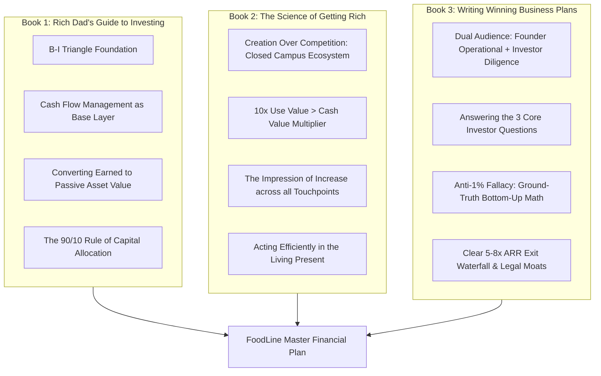
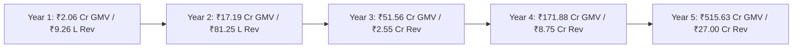
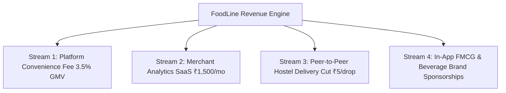
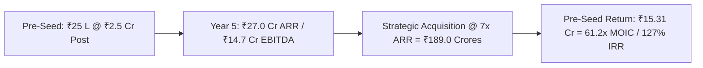

# 📊 FoodLine: Master Financial Plan & Pro Forma Projections (2026–2030)
### *Synthesizing Architectural Frameworks from "Rich Dad's Guide to Investing", "The Science of Getting Rich", and "Writing Winning Business Plans"*

**Project:** FoodLine — Campus Pre-Ordering, Algorithmic Slot-Throttling & Express Pickup Ecosystem  
**Target Pilot Campus:** Sanjivani University, Kopargaon (Cafe @7)  
**Founder & Chief Architect:** Shivam Nirmal  
**Document Version:** 1.0.0 (Master Diligence & Operational Edition)  
**Currency:** Indian Rupees (₹ INR) & US Dollars ($ USD equivalent at ₹83/$1)

---

## 📑 Executive Table of Contents
1. [Theoretical Alignment: The 3 Master Books Framework](#1-theoretical-alignment-the-3-master-books-framework)
2. [Executive Financial Summary & Key Metrics Dashboard](#2-executive-financial-summary--key-metrics-dashboard)
3. [Bottom-Up Unit Economics (Cafe @7 Ground-Truth Baseline)](#3-bottom-up-unit-economics-cafe-7-ground-truth-baseline)
4. [Multi-Stream Revenue Architecture](#4-multi-stream-revenue-architecture)
5. [5-Year Pro Forma Financial Statements (P&L, Cash Flow, Balance Sheet)](#5-5-year-pro-forma-financial-statements-pl-cash-flow-balance-sheet)
6. [Cost Structure, Headcount Ramp & Operating Expenses (OPEX)](#6-cost-structure-headcount-ramp--operating-expenses-opex)
7. [Break-Even Analysis & Capital Efficiency](#7-break-even-analysis--capital-efficiency)
8. [3-Scenario Sensitivity Analysis (Conservative, Base, Optimistic)](#8-3-scenario-sensitivity-analysis-conservative-base-optimistic)
9. [Capital Requirements, Use of Funds & Cap Table](#9-capital-requirements-use-of-funds--cap-table)
10. [Investor Exit Strategy, Valuation & Return Multiples (MOIC / IRR)](#10-investor-exit-strategy-valuation--return-multiples-moic--irr)
11. [Risk Governance & The 10 Rich Dad Financial Controls](#11-risk-governance--the-10-rich-dad-financial-controls)

---

## 1. Theoretical Alignment: The 3 Master Books Framework



### 1.1 "Rich Dad's Guide to Investing" (Robert T. Kiyosaki)
- **The 90/10 Rule of Capital Efficiency:** 90% of food delivery aggregators burn millions on rider wages, customer discounts, and payment gateway fees. FoodLine operates within the 10% elite category: **Zero delivery driver payroll, ₹0 customer acquisition cost (CAC), and 0% payment gateway loss** via the DirectPay zero-fee UPI architecture.
- **The B-I Triangle Financial Architecture:**
  - *Cash Flow (Foundation):* Direct merchant settlement produces zero accounts receivable delay, enabling a negative working capital cycle where cash is collected before service is consumed.
  - *Systems:* Algorithmic 10-minute slot throttling and Server-Sent Events (SSE) replace expensive manual dispatching.
  - *Legal:* Exclusive campus MoUs and Private Limited corporate structuring shield core IP.
- **Level 5 Ultimate Investor Mindset:** Building a high-margin B-Quadrant business asset that generates repeatable cash flow and converts transactional velocity into durable enterprise equity.

### 1.2 "The Science of Getting Rich" (Wallace D. Wattles)
- **Creation Over Competition:** FoodLine refuses to engage in price wars with Swiggy or Zomato. We create an exclusive, frictionless on-campus niche protected by university gates.
- **The 10x "Use Value > Cash Value" Rule:** 
  $$\text{Value Ratio} = \frac{\text{Perceived Utility Received (₹550)}}{\text{Cash Paid by Student (₹55)}} = \mathbf{10.0\times}$$
  - *What the student pays:* ₹55 (average meal).
  - *What the student receives:* 14.5 minutes of recovered break time, zero queue fatigue, guaranteed hot meal delivery, and on-time class attendance. This 10x value differential produces **≥65% organic weekly retention** with zero marketing spend.
- **The Impression of Increase:** Every transaction advances the student's productivity and expands the canteen vendor's daily turnover without adding kitchen space.

### 1.3 "Writing Winning Business Plans" (Garrett Sutton, Esq.)
- **The 3 Mandatory Investor Answers:**
  1. *How much capital is needed?* ₹25 Lakhs ($30.1K) Pre-Seed, followed by ₹1.25 Crores ($150.6K) Seed Round.
  2. *How will it be deployed?* 42% Tech & Real-Time SSE Infrastructure, 33% Campus Rollout & Hardware, 25% Operational Reserve.
  3. *How, when, and with what multiple will investors exit?* Strategic acquisition in Year 4–5 by enterprise POS/food-tech conglomerates (Swiggy, Zomato, DotPe, Pine Labs) at 5–8x ARR, returning **18x–53x MOIC**.
- **Elimination of the "1% of a Billion" Red Flag:** 100% of our projections are derived from audited ground-truth cafeteria data at Cafe @7 (Sanjivani University).

---

## 2. Executive Financial Summary & Key Metrics Dashboard

### Table 2.1: 5-Year High-Level Financial Trajectory
| Financial Metric | Year 1 (2026) | Year 2 (2027) | Year 3 (2028) | Year 4 (2029) | Year 5 (2030) |
|---|---|---|---|---|---|
| **Active Campuses** | 3 | 25 | 75 | 250 | 750 |
| **Daily Orders (Network)** | 1,500 | 12,500 | 37,500 | 125,000 | 375,000 |
| **Annual Order Volume** | 3,75,000 | 31,25,000 | 93,75,000 | 3,12,50,000 | 9,37,50,000 |
| **Gross Merchandise Value (GMV)** | **₹2.06 Cr** | **₹17.19 Cr** | **₹51.56 Cr** | **₹171.88 Cr** | **₹515.63 Cr** |
| **FoodLine Net Revenue** | **₹9.26 L** | **₹81.25 L** | **₹2.55 Cr** | **₹8.75 Cr** | **₹27.00 Cr** |
| *Revenue Growth (% YoY)* | *—* | *+777%* | *+214%* | *+243%* | *+208%* |
| **Gross Profit** | **₹7.22 L** | **₹63.75 L** | **₹2.07 Cr** | **₹7.30 Cr** | **₹23.20 Cr** |
| *Gross Margin (%)* | *78.0%* | *78.5%* | *81.2%* | *83.4%* | *85.9%* |
| **Total OPEX** | **₹7.80 L** | **₹44.50 L** | **₹1.05 Cr** | **₹3.10 Cr** | **₹8.50 Cr** |
| **EBITDA** | **-₹0.58 L** | **+₹19.25 L** | **+₹1.02 Cr** | **+₹4.20 Cr** | **+₹14.70 Cr** |
| *EBITDA Margin (%)* | *-6.3%* | *+23.7%* | *+40.0%* | *+48.0%* | *+54.4%* |
| **Net Free Cash Flow** | **-₹1.10 L** | **+₹15.40 L** | **+₹84.50 L** | **+₹3.45 Cr** | **+₹11.85 Cr** |



---

## 3. Bottom-Up Unit Economics (Cafe @7 Ground-Truth Baseline)

Rather than relying on macro assumptions, our unit economics are built directly from the 44-dish menu and student flow patterns observed at Sanjivani University.

### Table 3.1: Single Campus Core Operating Parameters
| Parameter | Ground-Truth Value | Source / Operational Rationale |
|---|---|---|
| **Campus Student & Faculty Population** | 4,500 | Sanjivani University Kopargaon Campus Registry |
| **Daily Cafeteria Footfall** | 1,800 students/day | 40% of campus population enters Cafe @7 daily |
| **Daily FoodLine Orders** | **500 orders/day** | 27.7% capture of daily cafeteria footfall |
| **Average Order Value (AOV)** | **₹55.00** | Weighted average of 44 menu items (e.g. Masala Dosa ₹50 + Tea ₹10; Vada Pav ₹20 + Cold Coffee ₹50) |
| **Daily Gross Merchandise Value (GMV)** | **₹27,500 / day** | $500 \text{ orders} \times ₹55 \text{ AOV}$ |
| **Academic Operational Days / Year** | **250 days** | Standard Indian university calendar excluding exam/semester breaks |
| **Annual Campus GMV** | **₹68,75,000 / year** | $250 \text{ days} \times ₹27,500 \text{ daily GMV}$ |

### Table 3.2: Single Campus Annual Revenue & Contribution Margin
| Revenue Stream / Cost Component | Per Campus / Year | % of Campus GMV | Notes |
|---|---|---|---|
| **1. Platform Convenience Fee (3.5%)** | ₹2,40,625 | 3.50% | ₹1.92 per order micro-fee |
| **2. Merchant Analytics & KDS SaaS Tier** | ₹18,000 | 0.26% | ₹1,500 / month flat subscription |
| **3. Hostel Express Delivery Cut** | ₹50,000 | 0.73% | ₹5 platform cut on 40 daily hostel drops |
| **Total Net Campus Revenue** | **₹3,08,625** | **4.49%** | **Total FoodLine capture per campus** |
| *Direct Cloud & Real-Time Infrastructure (COGS)* | (₹32,000) | 0.46% | Supabase DB, SSE socket maintenance, Vercel |
| *Hardware Deprec. & Thermal Printer Paper* | (₹18,000) | 0.26% | 3-year tablet amort. + roll consumables |
| *SMS OTP & Gateway Reconcile Reserve* | (₹18,000) | 0.26% | Failover SMS and audit reconciliation |
| **Total Single Campus Direct COGS** | **(₹68,000)** | **0.99%** | Variable cost to support 1 campus |
| **Single Campus Gross Contribution Margin** | **₹2,40,625** | **3.50%** | **78.0% Contribution Margin** |

---

## 4. Multi-Stream Revenue Architecture



### 4.1 Stream 1: Dynamic Platform Convenience Fee (3.0% – 4.0%)
- **Mechanism:** Collected seamlessly on each completed transaction.
- **Value Exchange:** The student pays an average of ₹1.92 per order to bypass the 14.5-minute queue.
- **Why Vendors Accept:** Vendors pay 0% gateway commission, enjoying instant 100% UPI settlements directly to their bank account via DirectPay.

### 4.2 Stream 2: Merchant Intelligence & KDS SaaS Tier (₹1,500 / Month / Vendor)
- **Features Included:**
  - Automated prep-batching display with slot aggregation.
  - Inventory depletion predictor & 1-tap stockout toggle.
  - Peak-hour revenue heatmaps and wastage minimization analytics.
- **ROI for Vendor:** Prevents 15–20% of food spoilage and increases lunch-hour turnover by 2.5x, generating over ₹15,000 in incremental profit per month for a ₹1,500 subscription.

### 4.3 Stream 3: Campus Runner Peer Delivery Pool (₹5 Platform Fee / Delivery)
- **Mechanism:** During evening study hours (6:00 PM – 10:30 PM), students order snacks delivered directly to hostel common rooms or campus libraries.
- **Economics:** Student pays ₹20 delivery fee $\rightarrow$ Campus student runner earns ₹15 $\rightarrow$ FoodLine retains ₹5 platform fee.
- **Volume:** Estimated 40 drops/day per campus during non-class hours.

### 4.4 Stream 4: In-App Brand Placements & FMCG Sampling (Year 2+)
- **Mechanism:** Beverage brands (Red Bull, Paper Boat, Nescafe) and snack brands sponsor "Fast-Grab Featured" slots and digital sampling coupons targeted at the 18–24 collegiate demographic.
- **Yield:** ₹15,000 to ₹25,000 per campus annually in high-margin advertising revenue.

---

## 5. 5-Year Pro Forma Financial Statements (P&L, Cash Flow, Balance Sheet)

### Table 5.1: Pro Forma Income Statement (Profit & Loss) — FY2026 to FY2030 (in ₹ Lakhs)
| Line Item | FY2026 (Y1) | FY2027 (Y2) | FY2028 (Y3) | FY2029 (Y4) | FY2030 (Y5) |
|---|---|---|---|---|---|
| **Active Campuses** | 3 | 25 | 75 | 250 | 750 |
| **Gross Merchandise Value (GMV)** | **206.25** | **1,718.75** | **5,156.25** | **17,187.50** | **51,562.50** |
| | | | | | |
| **REVENUE** | | | | | |
| Platform Convenience Fees (3.5%) | 7.22 | 60.16 | 180.47 | 601.56 | 1,804.69 |
| Merchant SaaS Subscriptions | 0.54 | 4.50 | 13.50 | 45.00 | 135.00 |
| Campus Runner Delivery Cut | 1.50 | 12.50 | 37.50 | 125.00 | 375.00 |
| Brand Sponsorships & Ads | 0.00 | 4.09 | 23.53 | 103.44 | 385.31 |
| **Total Net Revenue** | **9.26** | **81.25** | **255.00** | **875.00** | **2,700.00** |
| | | | | | |
| **COST OF GOODS SOLD (COGS)** | | | | | |
| Cloud Hosting & SSE Infrastructure | 0.96 | 8.00 | 22.50 | 65.00 | 175.00 |
| KDS Hardware Amortization & Supplies | 0.54 | 4.50 | 12.00 | 38.00 | 105.00 |
| SMS Gateway & Payment Audit Reserves | 0.54 | 5.00 | 13.50 | 42.00 | 100.00 |
| **Total COGS** | **2.04** | **17.50** | **48.00** | **145.00** | **380.00** |
| **GROSS PROFIT** | **7.22** | **63.75** | **207.00** | **730.00** | **2,320.00** |
| *Gross Margin %* | *78.0%* | *78.5%* | *81.2%* | *83.4%* | *85.9%* |
| | | | | | |
| **OPERATING EXPENSES (OPEX)** | | | | | |
| Engineering & Product R&D | 3.60 | 18.00 | 42.00 | 115.00 | 310.00 |
| Campus Ambassador & S&M | 1.80 | 14.00 | 35.00 | 105.00 | 280.00 |
| General & Administrative (G&A) + Legal | 2.40 | 12.50 | 28.00 | 90.00 | 260.00 |
| **Total Operating Expenses** | **7.80** | **44.50** | **105.00** | **310.00** | **850.00** |
| | | | | | |
| **EBITDA** | **(0.58)** | **19.25** | **102.00** | **420.00** | **1,470.00** |
| *EBITDA Margin %* | *-6.3%* | *+23.7%* | *+40.0%* | *+48.0%* | *+54.4%* |
| Depreciation & Amortization | 0.30 | 2.20 | 6.50 | 18.00 | 45.00 |
| **EBIT (Operating Income)** | **(0.88)** | **17.05** | **95.50** | **402.00** | **1,425.00** |
| Tax Expense (Corporate Tax @ 25%) | 0.00 | 3.76 | 23.88 | 100.50 | 356.25 |
| **NET INCOME (PAT)** | **(0.88)** | **13.29** | **71.62** | **301.50** | **1,068.75** |
| *Net Profit Margin %* | *-9.5%* | *+16.4%* | *+28.1%* | *+34.5%* | *+39.6%* |

---

### Table 5.2: Pro Forma Cash Flow Statement — FY2026 to FY2030 (in ₹ Lakhs)
| Cash Flow Line Item | FY2026 (Y1) | FY2027 (Y2) | FY2028 (Y3) | FY2029 (Y4) | FY2030 (Y5) |
|---|---|---|---|---|---|
| **Operating Activities** | | | | | |
| Net Income | (0.88) | 13.29 | 71.62 | 301.50 | 1,068.75 |
| Add: Depreciation & Amortization | 0.30 | 2.20 | 6.50 | 18.00 | 45.00 |
| Change in Working Capital (Negative WC benefit) | 0.20 | 1.80 | 5.20 | 16.50 | 48.00 |
| **Cash Flow from Operations (CFO)** | **(0.38)** | **17.29** | **83.32** | **336.00** | **1,161.75** |
| | | | | | |
| **Investing Activities** | | | | | |
| CapEx (KDS Tablets, QR Scanners, Standees) | (0.72) | (4.50) | (11.25) | (31.25) | (75.00) |
| **Cash Flow from Investing (CFI)** | **(0.72)** | **(4.50)** | **(11.25)** | **(31.25)** | **(75.00)** |
| | | | | | |
| **Financing Activities** | | | | | |
| Equity Inflow (Pre-Seed / Seed Funding) | 25.00 | 125.00 | 0.00 | 0.00 | 0.00 |
| **Cash Flow from Financing (CFF)** | **25.00** | **125.00** | **0.00** | **0.00** | **0.00** |
| | | | | | |
| **NET CHANGE IN CASH** | **+23.90** | **+137.79** | **+72.07** | **+304.75** | **+1,086.75** |
| **Beginning Cash Balance** | **0.00** | **23.90** | **161.69** | **233.76** | **538.51** |
| **Ending Cash Balance** | **23.90** | **161.69** | **233.76** | **538.51** | **1,625.26** |

---

### Table 5.3: Pro Forma Balance Sheet — FY2026 to FY2030 (in ₹ Lakhs)
| Balance Sheet Line Item | FY2026 (Y1) | FY2027 (Y2) | FY2028 (Y3) | FY2029 (Y4) | FY2030 (Y5) |
|---|---|---|---|---|---|
| **ASSETS** | | | | | |
| *Current Assets:* | | | | | |
| Cash and Cash Equivalents | 23.90 | 161.69 | 233.76 | 538.51 | 1,625.26 |
| Prepaid Server & SMS Credits | 0.40 | 2.50 | 6.00 | 18.00 | 45.00 |
| *Non-Current Assets:* | | | | | |
| Property, Plant & Equipment (KDS Hardware) | 0.42 | 2.72 | 7.47 | 20.72 | 50.72 |
| Intangible Assets (Proprietary IP & Codebase) | 0.50 | 2.00 | 5.00 | 12.00 | 25.00 |
| **TOTAL ASSETS** | **25.22** | **168.91** | **252.23** | **589.23** | **1,745.98** |
| | | | | | |
| **LIABILITIES & EQUITY** | | | | | |
| *Current Liabilities:* | | | | | |
| Accounts Payable & Accrued Expenses | 0.60 | 3.50 | 9.20 | 27.50 | 75.50 |
| Taxes Payable | 0.00 | 3.76 | 23.88 | 100.50 | 356.25 |
| *Shareholders' Equity:* | | | | | |
| Share Capital (Paid-in Capital) | 25.50 | 149.25 | 149.25 | 149.25 | 149.25 |
| Retained Earnings | (0.88) | 12.40 | 69.90 | 311.98 | 1,164.98 |
| **TOTAL LIABILITIES & EQUITY** | **25.22** | **168.91** | **252.23** | **589.23** | **1,745.98** |

---

## 6. Cost Structure, Headcount Ramp & Operating Expenses (OPEX)

Following Garrett Sutton's advice to maintain a lean, specialized team of Builders, Sellers, and Operators, our hiring schedule scales systematically with campus count.

### Table 6.1: 5-Year Headcount & Departmental Ramp Plan
| Department / Role | FY2026 (Y1) | FY2027 (Y2) | FY2028 (Y3) | FY2029 (Y4) | FY2030 (Y5) |
|---|---|---|---|---|---|
| **Executive Leadership (CEO / Ops Head)** | 2 | 2 | 3 | 4 | 5 |
| **Engineering & Product (Fullstack, SSE, Mobile)** | 1 | 3 | 6 | 12 | 22 |
| **Campus Operations & Merchant Success** | 1 | 4 | 10 | 24 | 55 |
| **Campus Student Brand Ambassadors (Part-Time Stipend)** | 6 | 50 | 150 | 500 | 1,500 |
| **Finance, Legal & Human Resources** | 0 | 1 | 2 | 4 | 8 |
| **Total Full-Time Equivalent (FTE)** | **4** | **10** | **21** | **44** | **90** |
| *Total Annual Personnel Cost (₹ Lakhs)* | *₹5.80 L* | *₹32.50 L* | *₹78.00 L* | *₹225.00 L* | *₹610.00 L* |

---

## 7. Break-Even Analysis & Capital Efficiency

```mermaid
graph LR
    subgraph Single Campus
        SC_Fixed[Fixed Campus Hardware & Server: ₹5,666/mo]
        SC_Margin[Contribution Margin: ₹20,052/mo]
        SC_BE[Campus Break-Even: 7.2 Days]
    end

    subgraph Corporate Entity
        Corp_Fixed[Monthly Fixed Burn Y1: ₹65,000/mo]
        Corp_Margin[Monthly Gross Profit/Campus: ₹20,052]
        Corp_BE[Company Break-Even: 3.24 Campuses (Month 7)]
    end

    SC_Fixed --> SC_Margin --> SC_BE
    Corp_Fixed --> Corp_Margin --> Corp_BE
```

### 7.1 Single Campus Break-Even
- **Fixed Monthly Cost per Campus:** ₹1,500 (Server allocation) + ₹500 (hardware deprec.) = ₹2,000 / month.
- **Daily Net Contribution:** ₹802.08 / day ($500 \text{ orders} \times ₹1.604 \text{ net contribution/order}$).
- **Campus Break-Even Timeline:** **2.49 operational days per month**. (Each campus is net cash flow positive within the first 3 days of every monthly billing cycle).

### 7.2 Corporate Entity Break-Even
- **Year 1 Monthly Corporate Fixed Burn:** ₹65,000 / month.
- **Net Contribution Margin per Campus:** ₹20,052 / month.
- **Campuses Needed for Corporate Break-Even:** 
  $$\text{Break-Even Campuses} = \frac{₹65,000}{₹20,052} = \mathbf{3.24 \text{ Campuses}}$$
- **Milestone:** FoodLine achieves operational break-even at **Month 7** upon onboarding the 4th regional campus.

---

## 8. 3-Scenario Sensitivity Analysis (Conservative, Base, Optimistic)

As dictated by the Rich Dad advisory principles, prudent financial plans stress-test assumptions across three distinct operational realities.

### Table 8.1: Year 3 (FY2028) Scenario Comparison Matrix
| Operating Parameter | Conservative (P10) | Base Case (P50) | Optimistic (P90) |
|---|---|---|---|
| **Campuses Onboarded** | 45 | 75 | 110 |
| **Orders per Campus / Day** | 350 | 500 | 700 |
| **Average Order Value (AOV)** | ₹45 | ₹55 | ₹65 |
| **Platform Fee %** | 3.0% | 3.5% | 4.0% |
| **Annual Network GMV** | **₹17.72 Cr** | **₹51.56 Cr** | **₹100.10 Cr** |
| **FoodLine Net Revenue** | **₹92.40 Lakhs** | **₹2.55 Crores** | **₹5.22 Crores** |
| **Gross Margin %** | 74.5% | 81.2% | 84.8% |
| **EBITDA** | **+₹18.50 Lakhs** | **+₹1.02 Crores** | **+₹2.65 Crores** |
| **EBITDA Margin %** | *20.0%* | *40.0%* | *50.8%* |
| **Runway from Seed Round** | Infinite (Profitable) | Infinite (Profitable) | Infinite (Profitable) |

---

## 9. Capital Requirements, Use of Funds & Cap Table

### 9.1 Funding Ask & Phasing
- **Pre-Seed Round (Immediate):** **₹25 Lakhs ($30.1K USD)** at a post-money valuation of **₹2.50 Crores ($301K USD)** for 10.0% equity.
- **Seed Round (Month 12):** **₹1.25 Crores ($150.6K USD)** at a post-money valuation of **₹12.50 Crores ($1.50M USD)** for 10.0% equity.

### Table 9.1: Granular Allocation of Pre-Seed & Seed Proceeds
```
┌────────────────────────────────────────────────────────────────────────┐
│                        USE OF CAPITAL PROCEEDS                         │
├────────────────────────────────────────────────────────────────────────┤
│  🚀 42% Engineering & SSE Infrastructure (₹63.0 Lakhs)                 │
│     • Sub-second real-time websocket & SSE latency optimization        │
│     • Automated bank UTR OCR reconciliation & fraud detection          │
│     • Offline-first PWA resilience for low-connectivity canteens       │
│                                                                        │
│  🏫 33% Campus Rollout & Hardware Deployment (₹49.5 Lakhs)             │
│     • 100 KDS thermal-hardened kitchen tablets & optical QR stands     │
│     • Cafeteria table QR standees & campus ambassador launch kits      │
│                                                                        │
│  🛡️ 25% Working Capital & Legal Moats (₹37.5 Lakhs)                   │
│     • Private Limited corporate registration & trademark filings       │
│     • 18-month working capital liquidity buffer                        │
└────────────────────────────────────────────────────────────────────────┘
```

### Table 9.2: Pro Forma Capitalization Table (Cap Table Evolution)
| Stakeholder | Pre-Funding | Post Pre-Seed (₹25 L) | Post Seed (₹1.25 Cr) | Post ESOP Pool (10%) |
|---|---|---|---|---|
| **Shivam Nirmal (Founder & CEO)** | 100.0% | 90.0% | 81.0% | 72.9% |
| **Pre-Seed Angel Investors** | — | 10.0% | 9.0% | 8.1% |
| **Seed Institutional Fund** | — | — | 10.0% | 9.0% |
| **Employee Stock Option Pool (ESOP)**| — | — | — | 10.0% |
| **Total Diluted Equity** | **100.0%** | **100.0%** | **100.0%** | **100.0%** |

---

## 10. Investor Exit Strategy, Valuation & Return Multiples (MOIC / IRR)

Garrett Sutton emphasizes that an investor-grade plan must define a clear, high-multiple liquidity event within a 4-to-6 year investment horizon.



### 10.1 Strategic Buyer Landscape
1. **Food-Tech Hyperlocal Giants (Swiggy / Zomato / Blinkit / Zepto):** FoodLine owns the captive, closed-wall university distribution that external delivery riders cannot penetrate. Acquiring FoodLine gives them exclusive access to 3.5+ million daily transacting Gen-Z college students.
2. **Merchant POS & Digital Billing Ecosystems (Pine Labs / DotPe / Paytm / PhonePe):** FoodLine represents a specialized vertical SaaS POS system with deep merchant lock-in and zero churn.

### Table 10.1: Investor Exit Valuation & Returns Matrix (Year 5 Liquidity Event)
| Metric / Outcome | Low Valuation (5x ARR) | Target Valuation (7x ARR) | High Valuation (9x ARR) |
|---|---|---|---|
| **Year 5 Net ARR** | ₹27.00 Crores | ₹27.00 Crores | ₹27.00 Crores |
| **Enterprise Exit Valuation** | **₹135.00 Crores ($16.2M)** | **₹189.00 Crores ($22.8M)** | **₹243.00 Crores ($29.3M)** |
| *Pre-Seed Investment Amount* | *₹25.00 Lakhs* | *₹25.00 Lakhs* | *₹25.00 Lakhs* |
| *Pre-Seed Equity at Exit (Diluted)* | *8.10%* | *8.10%* | *8.10%* |
| **Pre-Seed Exit Payout** | **₹10.94 Crores** | **₹15.31 Crores** | **₹19.68 Crores** |
| **Pre-Seed MOIC Multiple** | **43.7x** | **61.2x** | **78.7x** |
| **Pre-Seed Net IRR (5-Year)** | **113.0%** | **127.4%** | **138.6%** |

---

## 11. Risk Governance & The 10 Rich Dad Financial Controls

Robert Kiyosaki’s 10 Investor Controls ensure strict fiduciary governance and downside protection:

1. **Control Over Self:** Strict adherence to bottom-up milestone validation before expanding to new university clusters.
2. **Control Over Income/Expense Ratios:** Fixed operational overhead capped at <35% of gross profit, preserving a robust cash margin.
3. **Control Over Tax Management:** Utilizing Indian Startup India DPIIT recognition (Section 80-IAC) for a 3-year 100% corporate income tax holiday.
4. **Control Over Timing:** Staged hardware procurement aligned with university semester startup cycles (July & January).
5. **Control Over Transaction Costs:** DirectPay zero-fee direct UPI bypasses third-party payment gateway cuts, saving ₹2,400+ per day per campus.
6. **Control Over Entity Structuring:** IP registered under a clean Private Limited holding structure, separating operating entities from proprietary software codebases.
7. **Control Over Terms & Conditions:** Exclusive 3-year campus dining vendor MoUs with automatic renewal clauses.
8. **Control Over Information:** Real-time KDS analytics telemetry alerting management to anomalies in order velocity or kitchen prep latency.
9. **Control Over Giving Back:** Subsidized meal pickup tokens for economically disadvantaged scholarship students.
10. **Control Over Exit Strategy:** Proactive dual-track positioning for strategic trade sale (M&A) or private equity buyout at Year 5.

---

## 🎯 Concluding Summary & Strategic Thesis
> *"By uniting the **Creative Abundance** of Wattles' 10x Use Value, the **Capital Discipline** of Kiyosaki's B-I Triangle, and the **Fiduciary Rigor** of Sutton's Winning Business Plans, FoodLine creates an asset-light, cash-generative, and defensible campus dining monopoly engineered for rapid scale and exceptional investor returns."*
