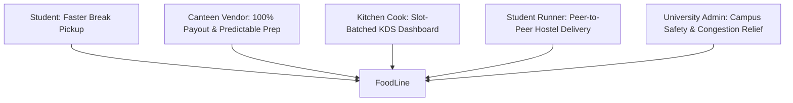
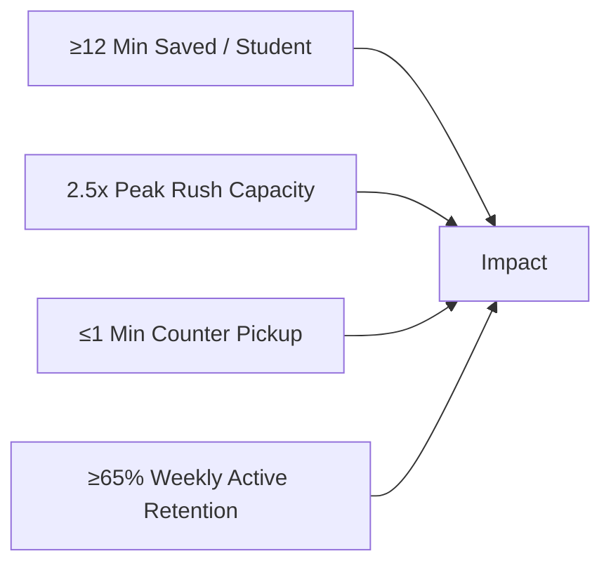

# 📄 FoodLine: Product Requirements Document (PRD)
**Version:** 1.0.0 · **Status:** Prototype / Target Launch · **Author:** Shivam Nirmal (Founder & CEO)  
**Target Pilot Campus:** Sanjivani University, Kopargaon (Cafe @7)

---

## 1. Executive Summary & Problem Framing
College lunch and snack breaks are structurally constrained (20–30 minutes), during which 1,000+ students descend simultaneously upon limited campus cafeterias. 

### The Collegiate Break Bottleneck:
1. **40% Break Lost in Line:** Average student spends **14.5 minutes in billing queues**, leaving <10 minutes to consume food.
2. **Kitchen Rush Chaos:** Canteens face uncoordinated batch demand surges without forward visibility into order queues.
3. **Payment & Cash Friction:** Cash change delays and high payment gateway fees (**2.0% + GST**) make digital micro-transactions (₹15–₹50) unviable for cafeteria vendors.

**FoodLine's Value Proposition:**  
*"Skip the Line, Not the Meal."* A digital pre-ordering, algorithmic slot-throttling, zero-fee direct UPI, and 1-minute express collection ecosystem purpose-built for Indian university campuses.

---

## 2. Target User Personas

| Persona | Core Goal | Primary Pain Point | FoodLine Solution |
|---|---|---|---|
| **1. The Student (Rohan, 20)** | Grab hot lunch in 5 mins and hang out with friends. | 15-min queue makes him late for 12:30 PM lab. | In-class pre-order + 10-min slot selection + 1-min express QR pickup. |
| **2. Canteen Owner (Cafe @7)** | Maximize lunch turnover without hiring extra staff. | Loses 35% of orders due to queue dropouts; hates 2% PG fees. | DirectPay 0% fee UPI payment directly to bank + automated digital billing. |
| **3. Kitchen Cook (Chef Ramesh)** | Cook food in organized batches without panic. | 100 students shouting orders across the counter simultaneously. | Tablet KDS with slot batching (*"Cook 15 Dosas for 11:50 AM"*). |
| **4. Student Runner (Hostel Peer)** | Earn pocket money during evening study hours. | Lack of flexible, on-campus micro-earning gigs. | Peer delivery pool for hostel & library drop zones (₹15-20 per drop). |
| **5. University Admin** | Eliminate cafeteria overcrowding and campus chaos. | Crowded dining spaces, unverified cash handling, littering. | Algorithmic load balancing, verified digital receipts, zero counter congestion. |

---

## 3. Core Product Features & Acceptance Criteria

### 3.1 Feature 1: In-Class Menu Browsing & Customization
- **Requirement:** Students can view real-time available menus, dietary tags (Fast Grab, Bestseller, Jain, Beverage), and customize item options.
- **Acceptance Criteria:**
  - Sub-second menu loading (<300ms) on low 4G/5G campus networks.
  - Live out-of-stock badge when an item is disabled by the kitchen.

### 3.2 Feature 2: Algorithmic Slot Throttling Engine
- **Requirement:** The system partitions lunch (11:50 AM – 12:30 PM) into dynamic 10-minute pickup slots (Slot A: 11:50–12:10, Slot B: 12:10–12:30).
- **Throttling Algorithm:**
  - Cap maximum concurrent meal preparations per 10-minute window based on kitchen burner capacity.
  - Automatically grey out full slots and dynamically recommend the next fastest available slot.

### 3.3 Feature 3: DirectPay — Zero-Fee UPI & Bank UTR Verification
- **Requirement:** Eliminate 2% payment gateway commissions on micro-transactions.
- **Workflow:**
  1. Display merchant QR standee and exact order rupee total in-app.
  2. Student pays via GPay, PhonePe, Paytm, or BHIM.
  3. Student submits the 12-digit bank UTR reference number.
  4. Backend verifies UTR structure, checks against duplicate replay cache, and confirms payment.
- **Acceptance Criteria:**
  - 100% merchant payout with ₹0 platform deduction.
  - Strict idempotent transaction validation preventing duplicate token generation.

### 3.4 Feature 4: Kitchen Display System (KDS) & Real-Time Sync
- **Requirement:** Kitchen staff tablet showing incoming orders grouped by target break slot.
- **Features:**
  - **Slot Aggregator:** Combines item counts (e.g. `12x Masala Dosa`, `8x Samosa Pav` for Slot 11:50 AM).
  - **1-Tap Status Switch:** `QUEUED` ➔ `PREPARING` ➔ `READY_FOR_PICKUP` ➔ `COMPLETED`.
  - **Server-Sent Events (SSE):** Push instant status changes to student UI without page reload.

### 3.5 Feature 5: 1-Minute Express Handover
- **Requirement:** High-contrast optical QR code pass and 4-digit PIN verification at the dedicated FoodLine counter.
- **Acceptance Criteria:**
  - Counter camera or tablet scans student screen in <500ms.
  - Instant audio confirmation chime upon successful token redemption.

---

## 4. Non-Functional Requirements (NFRs)

| Dimension | Target Specification |
|---|---|
| **Latency** | < 100ms API response time; < 50ms SSE broadcast latency. |
| **Concurrency** | Handles 2,500 simultaneous active users during peak 11:45 AM lunch rush. |
| **Mobile Responsiveness** | 100% responsive fluid layout optimized for viewport widths from 320px to 4K displays. |
| **Security & Privacy** | HTTPS everywhere, JWT session validation, role-based access control (RBAC), and sanitization against XSS/SQLi. |
| **Uptime** | 99.9% availability during university operational hours (7:30 AM – 9:30 PM). |

---

## 5. Success Metrics & KPIs

- **Student Time Recovery:** > 12 minutes saved per dining cycle.
- **Vendor Capacity Expansion:** 2.5× higher order throughput during peak 30-minute rush.
- **Express Handover Speed:** Counter pickup under 1 minute.
- **Organic Retention:** ≥ 65% weekly active student retention.
- **Merchant NPS:** ≥ +70 due to 0% payment commissions and zero queue stress.
