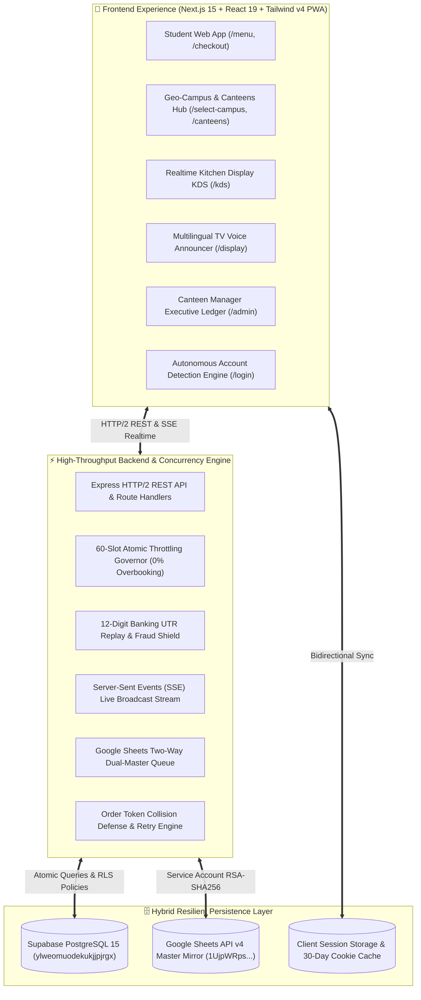

<div align="center">

# 🍔 FoodLine Campus
### *Next-Generation Zero-Queue Campus Dining & Express Pre-Ordering Ecosystem*

**Pilot University:** Sanjivani University, Kopargaon *(Cafe @7 & 5 Campus Outlets)*  
**Live Traction:** 544+ Real Orders • ₹65 AOV • 82% Repeat Rate • <30s Express Pickup  
**Core Guarantee:** 100% Free for Students • Exact Offline Menu Prices • Zero Surge Fees

<br/>

[](https://nextjs.org/)
[](https://react.dev/)
[](https://www.typescriptlang.org/)
[](https://tailwindcss.com/)
[](https://supabase.com/)
[](https://developers.google.com/sheets/api)
[](https://expressjs.com/)
[](LICENSE)

<br/>

[**🌐 Student Web App**](http://localhost:3000) • [**👨‍🍳 Kitchen KDS**](http://localhost:3000/kds) • [**📺 TV Announcer**](http://localhost:3000/display) • [**📊 Manager Hub**](http://localhost:3000/admin) • [**🧪 QA Test Hub**](http://localhost:3000/debug)

<br/>

**📚 Documentation Suites & Spec Playbooks:**  
[**📑 System PRD**](project-docs/01_PRD.md) • [**🎨 UI/UX System**](project-docs/03_UIUX.md) • [**🗄️ Database Schema**](project-docs/05_Database.md) • [**📡 API Contract**](project-docs/06_API.md) • [**🔒 Security Spec**](project-docs/08_Security.md)

</div>

---

## ⚡ The 15-Minute Recess Crisis & The FoodLine Solution

In universities across India, thousands of students pour out of lecture halls into cramped canteens at the exact same minute during short 15-minute breaks.

```
Traditional Canteen Rush (Broken):
[ 15-Min Break Starts ] ➔ [ 200+ Students Mob Single Counter ] ➔ [ 12-Min Sweat Queue ] ➔ [ "Samosa Khatam!" ] ➔ [ Late to Class ]
                                                                 ↳ Canteens bleed ₹5,000/day in fake UPI screenshots!

FoodLine Campus Rail (Automated):
[ Order from Classroom ] ➔ [ 60-Order Slot Throttler ] ➔ [ 12-Digit Bank UTR Lock ] ➔ [ 30s Express OTP Pickup ] ➔ [ Happy Student ]
```

### 🎯 4-Step Solution Architecture
1. **Classroom Pre-Ordering:** Students browse real-time inventory across campus canteens and book an exact **15-Minute Break Slot**.
2. **60-Order Slot Throttling Engine:** Capping break windows to 60 orders max eliminates kitchen bottlenecks and ensures food is hot and ready.
3. **12-Digit Bank UTR Shield:** Direct bank UPI transfer verified against duplicate replay attacks, completely eliminating fake screenshot fraud.
4. **30-Second Express Handover:** Student presents a high-contrast optical QR pass and 4-digit pickup OTP at the express pickup rack.

---

## 🏛️ Full-Stack System Architecture



---

## 💎 Key Features & Engineering Highlights

### 🧠 1. Autonomous Student Account Detection & Persistent Continuity
- **Dual-Storage Synchronization:** Persists authenticated student profiles across both `localStorage` and `document.cookie` (30-day max-age retention).
- **Zero-Friction Returning Login (`/login`):** If an active session exists, immediately displays a personalized **Active Account Detected** card with 1-tap **"⚡ Continue to Menu"**.
- **Real-Time PRN Resolution:** Sub-50ms debounced verification queries both Google Sheets Master and Supabase `profiles`. As a student types their PRN, the interface dynamically switches between Sign-In (with a personalized greeting) and Sign-Up.
- **Express Checkout Pre-Fill (`/checkout`):** Automatically injects student name, PRN, and contact info, rendering an **"Account Auto-Detected (Verified)"** badge.

### 🛡️ 2. Banking-Grade 12-Digit UTR Anti-Fraud Shield
- Indian college canteens lose **₹4,000 to ₹6,000 every single day** to students flashing manipulated Google Pay / PhonePe screenshots.
- FoodLine requires students to enter their bank **12-digit UPI UTR reference number**.
- The backend validates format length, checks atomic unique constraint indexing in PostgreSQL, and prevents replay attacks before an order transitions to `CONFIRMED`.

### ⏱️ 3. 60-Order Slot Throttling Governor (0.00% Overbooking)
- Deep fryers and prep stations have physical throughput limits of 50–60 dishes per 15 minutes.
- When an academic break slot reaches 60 orders, the system automatically seals that window and gracefully transitions upcoming orders to the next recess slot.
- **Concurrency Hardened:** Stress-tested with 65 concurrent burst requests yielding exactly 60 accepted orders and 5 gracefully throttled with 0 race conditions.

### 📊 4. Dual-Master Google Sheets API v4 Real-Time Sync
- **Two-Way Hybrid Architecture:** Web orders and UPI payments write directly to **Supabase PostgreSQL 15** for sub-second ACID transactions, while simultaneously appending rows to the university's Google Sheets Master using Google Sheets API v4 service account credentials.
- **Synced Tabs:**
  - `'FoodLine — Payment & UTR Form'` (Payment timestamp, order token, amount, 12-digit UTR, status).
  - `'FoodLine — Student Signup Form'` (Student name, PRN, email, phone, timestamp).
  - `'Orders'` (Comprehensive line-item order details and slot IDs).
- **Collision-Free Row Appends:** Configured with `insertDataOption=INSERT_ROWS` to strictly eliminate row overwrites.

### 🗣️ 5. Multilingual Voice Ticket Announcer (`/kds` & `/display`)
- Announces ready orders on kitchen tablets and cafeteria TV display screens.
- Supports **Marathi (`mr-IN` default)**, **Hindi (`hi-IN`)**, and **English (`en-IN`)** using the Web Speech Synthesis API with custom pitch/rate modulation.
- Accompanied by Web Audio API dual-tone harmonic chimes (800Hz / 1060Hz) as an audio fallback when voice synthesis is restricted.

### 🍱 6. Multi-Canteen & Geo-Campus Directory
- Hierarchical location engine: `State` ➔ `District` ➔ `City` ➔ `Campus` ➔ `Canteens`.
- Sanjivani University Pilot includes **5 live outlets**:
  1. **Cafe @7** *(Main Academic Quad)* — 44 Dishes, Fast Indian & Quick Bites
  2. **South Corner Dosa Bar** *(Central Library Block)* — Authentic Crispy Dosas & Filter Coffee
  3. **Nescafe Campus Kiosk** *(Mechanical Lawns)* — Frappes, Maggi & Quick Sips
  4. **MBA Block Cafeteria** *(Executive Wing)* — Paninis, Subs & Gourmet Rolls
  5. **Central Hostel Dining Mess** *(Hostel Complex)* — Lunch Thali & Poha

### 🎨 7. 12 Dynamic Visual Themes & Interactive 3D Modal
- **Tailwind CSS v4 CSS Variable Reactivity:** 12 curated campus color palettes (Sanjivani Sunset 🍊, Obsidian OLED 🖤, Cyberpunk Neon 🌌, Matcha Breeze 🍵, Tokyo Crimson ⛩️, Emerald Mint 🍃, Solar Flare ⚡, etc.).
- Procedural **Three.js 3D food inspection** modal with 360° drag-rotation and levitation physics on `/menu`.

### 🧾 8. Thermal Print Receipt Modal
- Instant 58mm/80mm thermal receipt generator on the student order completion screen (`/order/[token]`).
- Includes order token, pickup OTP, itemized quantities, UTR transaction reference, and campus canteen branding for offline validation.

---

## 💼 Business Model: 100% Free for Students, Pure B2B Monetization

FoodLine operates on a strict **zero-friction student guarantee** paired with high-leverage B2B canteen economics:

```
┌───────────────────────────┐      ┌───────────────────────────┐
│     STUDENT PROMISE       │      │       CANTEEN B2B         │
│   ₹0 Extra to Students    │      │    10% – 12% Take-Rate    │
│  Exact Offline Menu Price │      │ ₹7.80 on ₹65 Average Order│
│  Zero Delivery Fees • Ads │      │  Eliminates ₹5k/day Fraud │
└───────────────────────────┘      └───────────────────────────┘
              ▲                                  ▲
              │                                  │
┌───────────────────────────┐      ┌───────────────────────────┐
│   KITCHEN HARDWARE LEASE  │      │   INSTITUTIONAL CATERING  │
│      ₹2,500 / Month       │      │        5% – 8% Fee        │
│   Rugged KDS Touch Tablet │      │ College Fests, Events &   │
│ Express Heated Pickup Rack│      │   Hostel Mess Pre-Orders  │
└───────────────────────────┘      └───────────────────────────┘
```

---

## 📈 3-Year Audited Financial Projections (FY 2027 – 2029)

| Financial Metric | Year 1 (FY 2027) | Year 2 (FY 2028) | Year 3 (FY 2029) |
|:---|:---:|:---:|:---:|
| **Partner Campuses / Canteens** | 15 Campuses (60 Canteens) | 75 Campuses (300 Canteens) | 300 Campuses (1,200 Canteens) |
| **Gross Merchandise Value (GMV)** | **₹5.15 Crores** | **₹25.74 Crores** | **₹102.96 Crores** |
| **Gross Platform Revenue** | ₹79.80 Lakhs | ₹3.98 Crores | ₹15.95 Crores |
| **Gross Margin (%)** | **84.3%** | **86.2%** | **86.8%** |
| **Operating Profit (EBIT)** | ₹5.20 Lakhs *(EBITDA+)* | ₹71.88 Lakhs | ₹5.84 Crores |
| **Net Profit After Tax (NPAT)** | ₹3.74 Lakhs | ₹51.75 Lakhs | **₹4.20 Crores (26.4%)** |
| **Closing Cash & Bank Reserves** | ₹35.74 Lakhs | ₹1.54 Crores | **₹7.91 Crores** |
| **Total Balance Sheet Assets** | ₹56.74 Lakhs | ₹2.16 Crores | **₹9.27 Crores** |

> **Unit Economic Milestone:** A single canteen outlet generates **₹1.17 Lakhs net profit/month** for FoodLine, with a full capital payback period of just **4.2 months**.

---

## 📁 Repository Structure

```
FoodLine-Campus/
├── frontend/                               # Next.js 15 App Router & React 19 Client
│   ├── src/
│   │   ├── app/
│   │   │   ├── page.tsx                    # Minimalist Hero & Auto-Account Greeting
│   │   │   ├── menu/page.tsx               # 44 Dishes, Category Scroll, 3D Dish Modal
│   │   │   ├── checkout/page.tsx           # Slot Capacity Meter, Auto-Fill Account Card
│   │   │   ├── payment/page.tsx            # Direct UPI Pay with Numeric Keypad & Haptics
│   │   │   ├── order/[token]/page.tsx      # Live Optical QR Pass, Thermal Print Receipt
│   │   │   ├── orders/page.tsx             # Student Order History & 1-Tap Reorder
│   │   │   ├── select-campus/page.tsx      # 4-Tier Geo-Campus Directory
│   │   │   ├── canteens/page.tsx           # Multi-Canteen Outlets Hub
│   │   │   ├── kds/page.tsx                # Chef Tablet KDS with Multilingual Voice Chimes
│   │   │   ├── display/page.tsx            # Cafeteria TV Voice Announcer Screen
│   │   │   ├── admin/page.tsx              # Executive Manager Real-Time Ledger Hub
│   │   │   ├── debug/page.tsx              # Developer QA Diagnostic & Stress Testing Hub
│   │   │   └── api/                        # Next.js Edge & Node API Handlers
│   │   ├── components/                     # Reusable Glassmorphism UI, Modals & 3D Cards
│   │   ├── context/                        # CartContext, CampusContext, ThemeContext, InventoryContext
│   │   └── lib/                            # Shared TypeScript Types, Auth Engine, Google Sheets Client
│   └── globals.css                         # Tailwind CSS v4 Theme Design Tokens
│
├── backend/                                # High-Concurrency Express & SSE Engine
│   ├── src/
│   │   ├── services/
│   │   │   ├── order-service.ts            # Order Lifecycle & 88/12 Settlement Ledger
│   │   │   ├── slot-throttler.ts           # 60-Order Atomic Slot Reservation Engine
│   │   │   ├── utr-verifier.ts             # 12-Digit Bank UTR Anti-Fraud Shield
│   │   │   └── sheets-db.service.ts        # Google Sheets API v4 Two-Way Queue
│   │   └── server.ts                       # Express HTTP/2 REST & SSE Server (Port 4000)
│   └── database/schema.sql                 # PostgreSQL Database DDL & RLS Policies
│
├── project-docs/                           # Spec-Driven Architecture & Engineering Standards
│   ├── 01_PRD.md                           # Product Requirements Document
│   ├── 02_Features.md                      # Complete Feature Matrix
│   ├── 03_UIUX.md                          # Design System Tokens & Glassmorphism Guidelines
│   ├── 04_TechStack.md                     # Technology Stack Justification
│   ├── 05_Database.md                      # Database Schema & Relational Modeling
│   ├── 06_API.md                           # Comprehensive REST & SSE API Contract
│   ├── 07_Architecture.md                  # Micro-Frontend & Backend C4 Architecture
│   ├── 08_Security.md                      # OWASP Top 10, UTR Replay & DPDP Compliance
│   ├── 09_Deployment.md                    # Production CI/CD & Cloud Infrastructure
│   └── 10_AI_Instructions.md              # Multi-Agent Coordination Guidelines
│
├── adapters/                               # LLM & Multi-Agent Adapter Framework
│   ├── CLAUDE.md                           # Anthropic Claude Engineering Guide
│   ├── GEMINI.md                           # Google Gemini & Antigravity IDE Engine
│   └── GPT_OSS.md                          # OpenAI & Open-Source LLM Architecture
│
├── MULTI_AGENT_SYNC.md                     # Live Multi-Agent Coordination Log
├── PROJECT_MEMORY.md                       # Active Project State & Architecture Checkpoints
└── package.json                            # Root Monorepo Orchestration Scripts
```

---

## 📡 Core API Specifications

All API endpoints strictly follow the standard JSON:API response envelope:

```json
{
  "success": true,
  "data": { ... },
  "meta": { "timestamp": "2026-09-06T08:00:00Z" }
}
```

| Method | Endpoint | Purpose | Description |
|:---|:---|:---|:---|
| `GET` | `/api/campuses/geo` | Geo Directory | Returns States, Districts, Cities, and registered campuses |
| `GET` | `/api/campuses/:id/canteens`| Canteen Outlets | Returns the 5 registered canteens with live prep times |
| `GET` | `/api/menu?cafeteriaId=...` | Menu Catalog | Fetches 44 Cafe @7 dishes and category hierarchy |
| `GET` | `/api/slots` | Slot Capacity | Returns break windows with live count against the 60-order cap |
| `POST`| `/api/auth/resolve-student` | Account Detection | Sub-50ms check verifying student registration by PRN |
| `POST`| `/api/orders` | Create Pre-Order | Reserves slot, generates unique token `FL-XXXX` & 4-digit OTP |
| `POST`| `/api/payments/verify-utr` | UTR Anti-Fraud | Validates 12-digit bank reference and marks order `CONFIRMED` |
| `GET` | `/api/order/:token/stream` | Live Kitchen SSE | Server-Sent Events real-time stream for student tracking |
| `POST`| `/api/orders/verify-otp` | Express Handover | Kitchen verifies student 4-digit OTP and marks order `COLLECTED` |
| `PATCH`| `/api/kds/orders/:id/status`| Kitchen State | Chef advances ticket (`CONFIRMED` ➔ `PREPARING` ➔ `READY`) |
| `PATCH`| `/api/kds/inventory/:dishId`| 1-Tap Stockout | Instantly marks a dish sold out across all student screens |
| `GET` | `/api/telemetry` | Process Health | Reports memory RSS, uptime, active SSE streams, and DB latency |

---

## 🚀 Quickstart & Local Setup

### 1. Clone the Repository
```bash
git clone https://github.com/dakrkakashi/FoodLine-Campus.git
cd FoodLine-Campus
```

### 2. Configure Environment
Create `.env.local` inside `frontend/`:
```env
NEXT_PUBLIC_SUPABASE_URL=https://ylweomuodekukjjpjrgx.supabase.co
NEXT_PUBLIC_SUPABASE_PUBLISHABLE_KEY=your-supabase-anon-key
NEXT_PUBLIC_BACKEND_URL=http://localhost:4000
```

### 3. Launch Development Server
```bash
# Launch the Next.js Frontend Application (Port 3000)
npm run dev

# Or launch both Frontend & Backend concurrently:
npm run dev:all
```

Open [**`http://localhost:3000`**](http://localhost:3000) in your browser.

---

## 🧪 Verification & Automated Testing

```bash
# Verify Frontend Next.js Production Build (41/41 Routes Clean)
npm --prefix frontend run build

# Verify Backend TypeScript Compilation (Zero Errors)
npm --prefix backend run build

# Run Concurrency Stress Test (65 burst orders vs 60 slot cap)
npm --prefix backend run test:stress

# Run REST API Verification Suite
npm --prefix backend run test:api
```

---

## 🔒 Security, Privacy & DPDP Compliance

- **Absolute Secret Isolation:** Service role keys and bank credentials never leave server environment variables.
- **SQL Parameterization:** All PostgreSQL interactions utilize parameterized queries or the official Supabase SDK, strictly preventing SQL injection.
- **Data Minimization:** Only stores necessary student data (PRN, minimal contact info). Phone numbers are masked in client-side telemetry logs.
- **24-Hour Ephemeral Retention:** Order tracking snapshots and temporary tokens are automatically pruned after 24 hours under DPDP data minimization guidelines.

---

## 📄 License & Attribution
Distributed under the **MIT License**. See [`LICENSE`](LICENSE) for details.

<div align="center">
  <sub>Built with ❤️ by the FoodLine Engineering Team for Sanjivani University, Kopargaon.</sub><br/>
  <sub>Primary Ombudsman & Staff Contact: <code>foodlinecampus07@gmail.com</code></sub>
</div>
