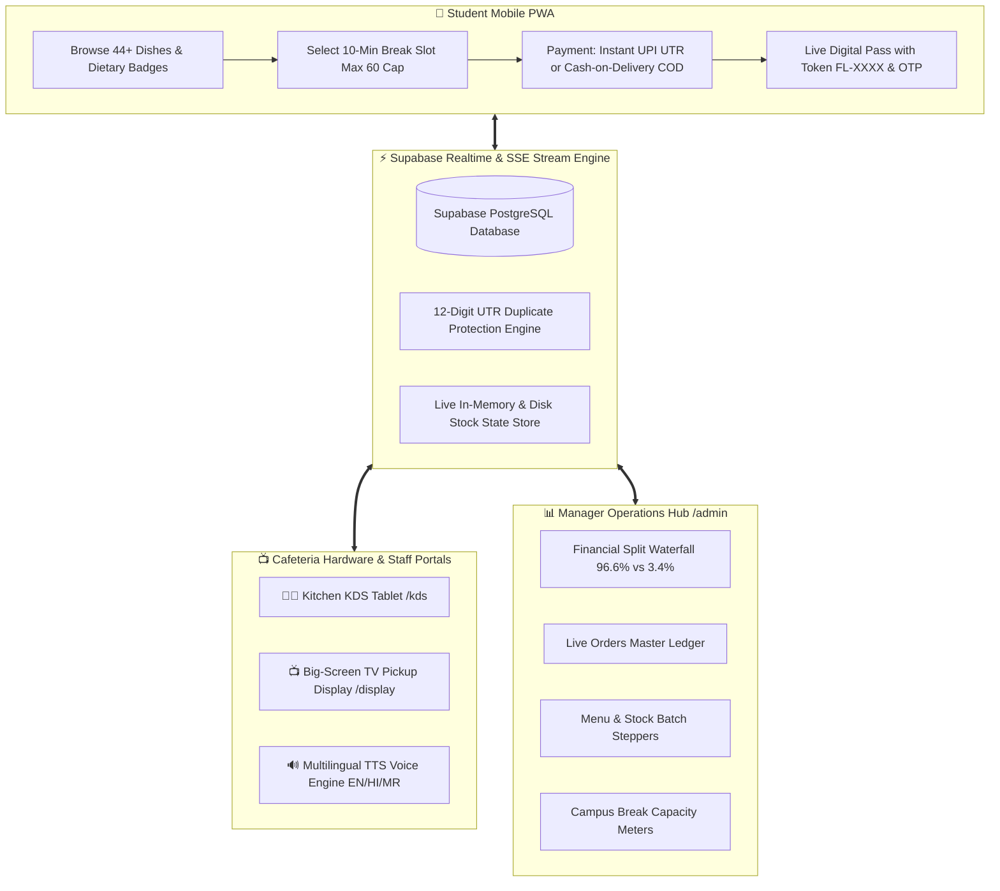

<div align="center">

# 🍔 FoodLine — Campus Pre-Ordering & Express Pickup Ecosystem
### *Transforming College Canteen Rush into Zero-Queue, 60-Second Express Pickups*

[](https://nextjs.org/)
[](https://react.dev/)
[](https://www.typescriptlang.org/)
[](https://tailwindcss.com/)
[](https://supabase.io/)
[](https://vercel.com/)

**Target Pilot:** Sanjivani University, Kopargaon *(Cafe @7 Pilot Ecosystem)*  
**Official Contact:** [`foodlinecampus@gmail.com`](mailto:foodlinecampus@gmail.com)

---

</div>

## 📌 Executive Summary

During standard 10-to-15-minute college lecture breaks, hundreds of students rush to campus cafeterias simultaneously. This creates massive 20-minute physical queues, order mismanagement, delayed classes, and lost canteen revenue.

**FoodLine** solves campus congestion through an end-to-end synchronized ecosystem:
1. **Students** pre-order meals from classrooms and reserve precise 10-minute break pickup slots (strictly capped at 60 orders/slot to prevent congestion).
2. **Kitchen Staff** batch-cook in sync with shift slot counters and manage live inventory with 1-tap stock/price steppers.
3. **Cafeteria TV Displays** intelligently route ready orders to Counter 1 *(Cooked & COD Cash Collections)* and Counter 2 *(Express Beverages & Desserts)* with multilingual voice announcements in English, Hindi, and Marathi.
4. **Canteen Managers & Founders** monitor automated revenue split waterfalls (96.6% Canteen Payout + 3.4% Fast-Pass Tech Surcharge) in real-time.

---

## 🏛️ Ecosystem Architecture



---

## 🚀 Key Modules & Capabilities

### 1. 📱 Student Pre-Ordering & Digital Passes (`/menu`, `/checkout`, `/order/[token]`)
* **Dynamic Menu Matrix**: 44+ Cafe @7 dishes categorized across Chaat, South Indian, Rolls, Burgers, Pizza, Hot Snacks, Beverages, and Desserts.
* **Campus Break Slot Throttling**: Live progress bars displaying remaining capacity out of 60 orders per break.
* **Dual Payment Modes**:
  * `⚡ UPI Direct`: Dynamic QR code generation with 12-digit UTR bank reference verification and anti-replay fraud protection.
  * `💵 Cash on Delivery (COD)`: Dedicated token generation routing directly to Counter 1 cash desk.
* **Live Digital Pass**: Real-time status tracker (`CONFIRMED` $\rightarrow$ `PREPARING` $\rightarrow$ `READY` $\rightarrow$ `COLLECTED`), visual QR code, 4-digit pickup OTP, and live countdown timer.

---

### 2. 📺 Ultra-Cinematic TV Pickup Display (`/display`)
* **Split Counter Routing**:
  * **Counter 1**: Cooked & Hot items (Dosa, Burgers, Vada Pav, Pizza) + **ALL Cash-on-Delivery (COD) orders** for counter settlement.
  * **Counter 2**: Express Drinks, Thick Shakes, and packaged desserts.
* **Payment Badges**: Clearly displays `💵 COD` in glowing amber and `⚡ PAID` in emerald.
* **Multilingual Web Audio TTS Announcer**:
  * Custom voice announcements triggered the moment an order transitions to `READY`.
  * Multi-language support: **English (`en-IN`)**, **Hindi (`hi-IN`)**, and **Marathi (`mr-IN`)**.
  * Custom COD phrasing: *"Order FL-1042 ready at Counter 1. Please pay ₹50 cash at counter."* / *"ऑर्डर FL-1042 काउंटर 1 वर तयार आहे. कृपया काउंटरवर ₹50 रोख जमा करा."*

---

### 3. 👨‍🍳 Kitchen Display System & Live Stockout Manager (`/kds`)
* **Real-time Order Queue**: Kanban-style cards showing item lists, special cooking instructions, student tokens, and OTP codes.
* **Live Stockout & Menu Editor**:
  * **1-Tap Quick Price Stepper**: `[-₹5]` `₹XX` `[+₹5]` to adjust pricing instantaneously across student menus.
  * **Live Stock Quantity Steppers**: `[-5]` `[-1]` `📦 XX left` `[+1]` `[+5]` to log freshly cooked batches in seconds.
  * **Auto-Sold Out Guard**: Dropping stock to `0` automatically disables ordering and marks items `SOLD OUT`.
  * **Inline Dish Details Editor**: Edit Name, Price, Tag/Badge, Category, and Prep Time in 0ms.
  * **`+ Add Dish` Drawer**: Publish new dishes to Cafe @7 on the fly.

---

### 4. 📊 Executive Manager & Admin Data Hub (`/admin`)
* **5 Comprehensive Data Views**:
  1. **📊 Financial & Revenue Waterfall**: Real-time separation of Canteen Food Sales (96.6% subtotal payout) vs Founder Fast-Pass Convenience Fee (3.4% GMV take). Includes hourly order volume area charts and top performers ranking.
  2. **📑 Live Orders Master Ledger**: Chronological table of all orders with token search, multi-filter dropdowns (Status, Payment, Shift Slot), itemized drawer, and 1-tap status override buttons.
  3. **📦 Menu & Live Stock Master**: Complete catalog management with real-time price, stock quantity, and availability controls.
  4. **⏰ Campus Break Shift Capacity**: Live booking load and revenue generated per 10-minute break slot.
  5. **💳 Settlement & UTR Audit Ledger**: Full bank UTR reference numbers and cash drawer logs for end-of-day financial reconciliation.

---

## 🛠️ Technology Stack

| Layer | Technology |
|---|---|
| **Framework** | Next.js 15.5 (App Router, Server Components & Route Handlers) |
| **Frontend UI** | React 19, Tailwind CSS, Lucide Icons, Framer Motion |
| **Design Aesthetics** | Ultra-Dark Glassmorphism, Cinematic Spotlights, Dynamic Micro-animations |
| **Backend & APIs** | Next.js Route Handlers (`/api/*`), Server-Sent Events (`/api/order/[token]/stream`) |
| **Database** | Supabase PostgreSQL with Realtime Channel Subscriptions |
| **Audio Engine** | Web Audio API + SpeechSynthesis Multilingual TTS (`en-IN`, `hi-IN`, `mr-IN`) |
| **Deployment** | Vercel (Production Cloud CDN with Zero-Config Next.js pipeline) |

---

## 📂 Project Directory Structure

```
FoodLine-Campus/
├── frontend/                     # Next.js 15 Full-Stack Application
│   ├── src/
│   │   ├── app/
│   │   │   ├── page.tsx          # Cinematic Campus Landing Page & Order Mode Selector
│   │   │   ├── menu/page.tsx     # Student Dish Catalog, Filters & Quantity Clamp
│   │   │   ├── checkout/page.tsx # Slot Capacity Selector & Dual Payment Gateway
│   │   │   ├── order/[token]/    # Real-time Live Digital Pass & SSE Tracking
│   │   │   ├── display/page.tsx  # TV Pickup Display & Voice Announcer Engine
│   │   │   ├── kds/page.tsx      # Kitchen Display & Live Menu/Stock Manager
│   │   │   ├── admin/page.tsx    # Executive Manager & Operations Data Hub
│   │   │   └── api/              # REST Endpoints & Real-time Webhook Handlers
│   │   ├── components/           # Reusable UI Components (Navbar, Cards, Badges)
│   │   ├── context/              # Global Cart, Audio FX, & Inventory Contexts
│   │   └── lib/                  # Stock Store, Voice Announcer, & TypeScript Types
│   ├── public/                   # Sound FX, SVG Logos, & Media Assets
│   └── package.json
├── backend/                      # Express/Node.js API Route Handlers & Database Seeds
│   └── database/schema.sql       # PostgreSQL DDL, Tables, RLS, & Trigger Definitions
├── FoodLine_Pitch_Deck/          # Interactive Investor & College Admin Presentation Deck
├── foodline_legal_and_compliance.html # IT Rules, Grievance Ombudsman, & Terms
├── README.md
└── AGENTS.md                     # Multi-Agent Architecture & Interoperability Guide
```

---

## ⚙️ Quick Start & Local Setup

### 1. Clone Repository
```bash
git clone https://github.com/dakrkakashi/FoodLine-Campus.git
cd FoodLine-Campus
```

### 2. Configure Environment Variables
Create `frontend/.env.local`:
```env
NEXT_PUBLIC_SUPABASE_URL=https://ylweomuodekukjjpjrgx.supabase.co
NEXT_PUBLIC_SUPABASE_PUBLISHABLE_KEY=your_supabase_anon_key
NEXT_PUBLIC_SUPABASE_ANON_KEY=your_supabase_anon_key
NEXT_PUBLIC_MERCHANT_UPI=sanjivanicafe7@okaxis
```

### 3. Install & Start Local Server
```bash
# Install dependencies
npm --prefix frontend install

# Run production build validation
npm --prefix frontend run build

# Start Next.js development server
npm run dev
```

Open **`http://localhost:3000`** in your browser:
* 🍔 **Student Menu**: `http://localhost:3000/menu`
* 📺 **TV Display**: `http://localhost:3000/display`
* 👨‍🍳 **Kitchen KDS**: `http://localhost:3000/kds`
* 📊 **Manager Data Hub**: `http://localhost:3000/admin`

---

## 🚀 Deploying to Vercel

1. Import **`dakrkakashi/FoodLine-Campus`** on [Vercel](https://vercel.com/new).
2. Set **Root Directory** to `frontend`.
3. Add `NEXT_PUBLIC_SUPABASE_URL` and `NEXT_PUBLIC_SUPABASE_PUBLISHABLE_KEY` under **Environment Variables**.
4. Click **Deploy**.

---

## 📜 Compliance & Official Contacts

* **Founder & Developer**: FoodLine Technical Operations
* **Pilot Location**: Sanjivani University, Kopargaon (Cafe @7)
* **Official Inquiries & Support**: [`foodlinecampus@gmail.com`](mailto:foodlinecampus@gmail.com)
* **Legal Ombudsman & Terms**: See [`foodline_legal_and_compliance.html`](./foodline_legal_and_compliance.html)

---

<div align="center">
  <sub>Built with ❤️ for Indian College Campuses • Powered by FoodLine Next.js 15 Ecosystem</sub>
</div>
