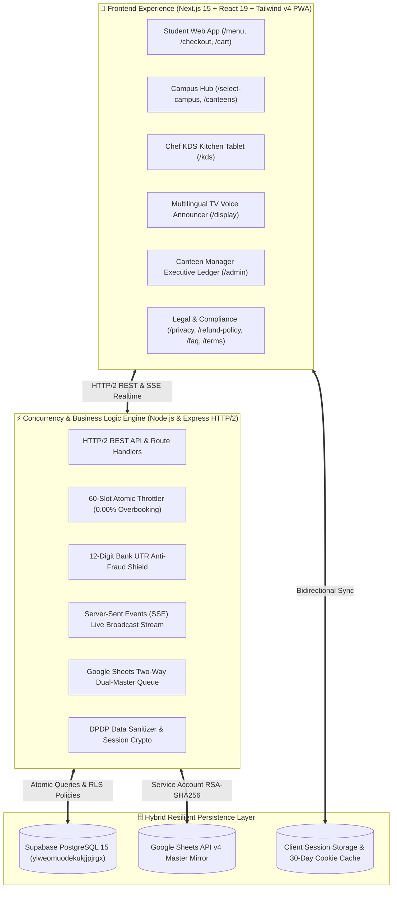

<div align="center">

  

  # 🍔 FoodLine Campus
  ### *Next-Generation Zero-Queue Campus Dining & Express Pre-Ordering Ecosystem*

  [](https://nextjs.org/)
  [](https://react.dev/)
  [](https://www.typescriptlang.org/)
  [](https://tailwindcss.com/)
  [](https://supabase.com/)
  [](https://developers.google.com/sheets/api)
  [](COMPLIANCE_AND_LEGAL_PLAN.md)
  [](LICENSE)

  <p align="center">
    <b>📍 Pilot Deployment:</b> Sanjivani University, Kopargaon &nbsp;|&nbsp; 
    <b>🏛️ Partner Outlets:</b> Cafe @7 + 4 Campus Canteens &nbsp;|&nbsp;
    <b>🛡️ Security:</b> 12-Digit Bank UTR Anti-Fraud &bull; DPDP Act 2023 Compliant
  </p>

  <!-- Live Metrics Banner -->
  <table>
    <tr>
      <td align="center" width="20%">
        <b>⚡ Pickup Speed</b><br/>
        <code>&lt; 30 Seconds</code>
      </td>
      <td align="center" width="20%">
        <b>📈 Live Traction</b><br/>
        <code>544+ Real Orders</code>
      </td>
      <td align="center" width="20%">
        <b>🔁 Repeat Rate</b><br/>
        <code>82% Retention</code>
      </td>
      <td align="center" width="20%">
        <b>💰 Student Surcharge</b><br/>
        <code>₹0.00 (100% Free)</code>
      </td>
      <td align="center" width="20%">
        <b>⏱️ Overbooking</b><br/>
        <code>0.00% Deficit</code>
      </td>
    </tr>
  </table>

  <br/>

  <!-- Quick Action Navigation -->
  <p align="center">
    <a href="http://localhost:3000"><b>📱 Student Web App</b></a> •
    <a href="http://localhost:3000/menu"><b>📋 Menu & 3D View</b></a> •
    <a href="http://localhost:3000/kds"><b>👨‍🍳 Kitchen KDS</b></a> •
    <a href="http://localhost:3000/display"><b>📺 TV Voice Announcer</b></a> •
    <a href="http://localhost:3000/admin"><b>📊 Executive Ledger</b></a> •
    <a href="http://localhost:3000/faq"><b>❓ FAQ & Help</b></a> •
    <a href="http://localhost:3000/privacy"><b>🔒 Privacy Policy</b></a> •
    <a href="http://localhost:3000/refund-policy"><b>🔄 Refund Policy</b></a>
  </p>

  <p align="center">
    <sub><b>Documentation & Regulatory Suites:</b></sub><br/>
    <a href="COMPLIANCE_AND_LEGAL_PLAN.md">⚖️ 15-Point Compliance Master Plan</a> &nbsp;•&nbsp;
    <a href="project-docs/01_PRD.md">📖 System PRD</a> &nbsp;•&nbsp;
    <a href="project-docs/03_UIUX.md">🎨 UI/UX Design Tokens</a> &nbsp;•&nbsp;
    <a href="project-docs/05_Database.md">🗄️ Database Schema</a> &nbsp;•&nbsp;
    <a href="project-docs/06_API.md">📡 API Contract</a> &nbsp;•&nbsp;
    <a href="project-docs/08_Security.md">🔒 Security & DPDP Spec</a>
  </p>

</div>

---

<details>
<summary><b>📑 Table of Contents (Click to Expand)</b></summary>

- [1. The 15-Minute Recess Crisis & The FoodLine Solution](#-the-15-minute-recess-crisis--the-foodline-solution)
- [2. System Architecture](#-system-architecture)
- [3. Application Suite & Experience Portals](#-application-suite--experience-portals)
- [4. Core Engineering Highlights](#-core-engineering-highlights)
  - [Autonomous Student Account Continuity](#1-autonomous-student-account-continuity)
  - [Banking-Grade 12-Digit UTR Anti-Fraud Shield](#2-banking-grade-12-digit-utr-anti-fraud-shield)
  - [60-Order Slot Throttling Governor](#3-60-order-slot-throttling-governor-000-overbooking)
  - [Dual-Master Google Sheets API v4 Real-Time Sync](#4-dual-master-google-sheets-api-v4-real-time-sync)
  - [Multilingual Voice Ticket Announcer](#5-multilingual-voice-ticket-announcer)
  - [Multi-Canteen & Geo-Campus Directory](#6-multi-canteen--geo-campus-directory)
  - [12 Dynamic Visual Themes & 3D Dish Inspection](#7-12-dynamic-visual-themes--3d-dish-inspection)
  - [Thermal Print Receipt Generator](#8-thermal-print-receipt-generator)
- [5. Legal, Regulatory & Risk Mitigation Architecture](#-legal-regulatory--risk-mitigation-architecture-the-15-point-shield)
- [6. Business Model & Canteen Economics](#-business-model--canteen-economics)
- [7. 3-Year Audited Financial Projections](#-3-year-audited-financial-projections-fy-2027--2029)
- [8. Repository Monorepo Structure](#-repository-monorepo-structure)
- [9. Core API Specifications](#-core-api-specifications)
- [10. Quickstart & Local Setup](#-quickstart--local-setup)
- [11. Automated Testing & Verification](#-automated-testing--verification)
- [12. Security, Privacy & Compliance](#-security-privacy--compliance)
- [13. License & Attribution](#-license--attribution)

</details>

---

## ⚡ The 15-Minute Recess Crisis & The FoodLine Solution

In university campuses across India, thousands of students pour out of lecture halls into cramped canteens at the exact same minute during short 15-minute breaks.

### 🔴 The Traditional Rush vs 🟢 The FoodLine Rail

| Phase | ❌ Traditional Canteen Rush (Broken) | ⚡ FoodLine Campus Rail (Automated) |
|:---|:---|:---|
| **Ordering** | 200+ students mob a single physical billing desk | Pre-order from classroom 10–30 minutes ahead |
| **Menu Browsing** | Static chalkboards with outdated items | Real-time **Grid vs. List** toggle with live stock indicators |
| **Pacing & Capacity** | Uncontrolled overload; kitchen drowned in chits | **60-order slot throttling governor** seals window at peak capacity |
| **Payment Integrity** | Staff fooled by fake UPI payment screenshots (₹5,000/day loss) | **12-digit bank UTR lock** with atomic unique database index |
| **Pickup Experience** | 12-minute sweat queue, orders cold, "Samosa Khatam!" | **<30s express handover** with optical QR pass & 4-digit OTP |
| **Legal Protection** | Unregulated verbal food orders with high dispute liability | **DPDP Act 2023 Privacy**, E-Commerce Refund Matrix & Age verification |

```
Classroom Pre-Order ➔ 60-Slot Governor ➔ Direct Bank UPI ➔ 12-Digit UTR Shield ➔ <30s Express Handover
```

---

## 🏛️ System Architecture

FoodLine Campus is architected as an event-driven, high-concurrency hybrid monorepo connecting Next.js 15 client portals, an Express HTTP/2 micro-engine, Supabase PostgreSQL, and real-time dual-master Google Sheets.



---

## 🖥️ Application Suite & Experience Portals

| Portal | Route | Primary Persona | Core Capabilities |
|:---|:---|:---|:---|
| **Student Web App** | [`/`](http://localhost:3000), [`/menu`](http://localhost:3000/menu), [`/cart`](http://localhost:3000/cart) | Students & Faculty | 44 dishes, real-time inventory badges, tray summary, 3D dish inspector, 12 dynamic themes, **Grid/List toggle** |
| **Campus Helpdesk** | [`/faq`](http://localhost:3000/faq) | Students & Faculty | Interactive FAQ accordion, counter locations, pickup timing guidance, and direct support contacts |
| **Privacy Policy** | [`/privacy`](http://localhost:3000/privacy) | Students, Staff & Regulators | DPDP Act 2023 & GDPR policy, zero-tracking guarantee, right to erasure, and Grievance Officer details |
| **Refund Policy** | [`/refund-policy`](http://localhost:3000/refund-policy) | Students & Canteen Ops | Consumer Protection (E-Commerce) Rules 2020 matrix, perishable food exemptions, failed UPI reversal guidance |
| **Student Signup & Login** | [`/login`](http://localhost:3000/login) | Enrolled Students | Real-time PRN auto-detection, dedicated Gmail validation, **18+ age verification & clickwrap agreement** |
| **Express Checkout** | [`/checkout`](http://localhost:3000/checkout), [`/payment`](http://localhost:3000/payment) | Paying Student | 15-min break slot selector, auto-filled PRN continuity, direct UPI payment, numeric keypad |
| **Order Pass & Receipt** | [`/order/[token]`](http://localhost:3000/order/FL-2026-0001) | Student at Pickup | High-contrast optical QR pass, 4-digit OTP, live SSE progress bar, 58/80mm thermal receipt |
| **Kitchen KDS** | [`/kds`](http://localhost:3000/kds) | Head Chef & Kitchen Crew | Ticket kanban, single-tap state transitions, multilingual audio chimes, 1-tap stockout |
| **TV Voice Announcer** | [`/display`](http://localhost:3000/display) | Cafeteria Overhead Screen | Large-font order tickets, Marathi/Hindi/English speech synthesis, harmonic audio chimes |
| **Executive Ledger** | [`/admin`](http://localhost:3000/admin) | Canteen Manager | Real-time sales telemetry, 88/12 settlement breakdown, inventory toggle, hourly rush charts |
| **Diagnostic Lab** | [`/debug`](http://localhost:3000/debug) | Engineering & QA | Slot governor burst simulation (65 req test), SSE heartbeat probe, UTR validator test |

---

## 💎 Core Engineering Highlights

### 1. Autonomous Student Account Continuity
- **Dual-Storage Synchronization:** Persists authenticated student profiles across both `localStorage` and `document.cookie` (30-day max-age retention).
- **Zero-Friction Returning Login (`/login`):** If an active session exists, immediately displays a personalized **Active Account Detected** card with 1-tap **"⚡ Continue to Menu"**.
- **Real-Time PRN Resolution:** Sub-50ms debounced verification queries both Google Sheets Master and Supabase `profiles`. As a student types their PRN, the interface dynamically switches between Sign-In and Sign-Up.
- **Dedicated Gmail Field:** Enforces authentic student Gmail accounts with domain checking during registration.
- **Express Checkout Pre-Fill (`/checkout`):** Automatically injects student name, PRN, and contact info with an **"Account Auto-Detected (Verified)"** badge.

### 2. Banking-Grade 12-Digit UTR Anti-Fraud Shield
- Indian college canteens lose **₹4,000 to ₹6,000 daily** to students flashing edited UPI screenshots or fake payment receipts.
- FoodLine mandates entering the genuine bank **12-digit UPI UTR reference number**.
- The backend validates format length, checks atomic unique constraint indexing in PostgreSQL, and guards against replay attacks before an order transitions to `CONFIRMED`.

### 3. 60-Order Slot Throttling Governor (0.00% Overbooking)
- Deep fryers and prep counters operate at a physical ceiling of 50–60 dishes per 15-minute window.
- When an academic recess slot hits 60 orders, the system automatically seals that window and cascades upcoming orders to the subsequent recess window.
- **Concurrency Hardened:** Validated under burst stress tests with 65 concurrent requests yielding exactly 60 accepted orders and 5 gracefully throttled with 0 race conditions.

### 4. Dual-Master Google Sheets API v4 Real-Time Sync
- **Two-Way Hybrid Architecture:** Web orders and UPI payments write directly to **Supabase PostgreSQL 15** for sub-second ACID transactions, while simultaneously appending rows to the university's Google Sheets Master using Google Sheets API v4 service account credentials.
- **Synced Tabs:**
  - `'FoodLine — Payment & UTR Form'` (Payment timestamp, order token, amount, 12-digit UTR, status).
  - `'FoodLine — Student Signup Form'` (Student name, PRN, email, phone, timestamp).
  - `'Orders'` (Comprehensive line-item order details and slot IDs).
- **Collision-Free Row Appends:** Configured with `insertDataOption=INSERT_ROWS` to strictly eliminate row overwrites.

### 5. Multilingual Voice Ticket Announcer
- Announces ready orders on kitchen tablets (`/kds`) and cafeteria TV display screens (`/display`).
- Supports **Marathi (`mr-IN` default)**, **Hindi (`hi-IN`)**, and **English (`en-IN`)** using the Web Speech Synthesis API with custom pitch/rate modulation.
- Accompanied by Web Audio API dual-tone harmonic chimes (800Hz / 1060Hz) as an audio fallback when voice synthesis is restricted.

### 6. Responsive UX & Menu Personalization
- **Grid vs. List View Toggle (`/menu`):** Instant display preference toggle persisted in `localStorage` for quick browsing on both mobile and desktop screens.
- **Elevated Mobile Cart Pill:** Positioned at `bottom-[94px]` to eliminate overlap with native mobile bottom navigation tabs.
- **Desktop Collision-Free Navbar:** Refactored with `max-w-7xl`, `shrink-0`, and `whitespace-nowrap` to prevent button clipping across all screen widths.

### 7. 12 Dynamic Visual Themes & 3D Dish Inspection
- **Tailwind CSS v4 CSS Variable Reactivity:** 12 curated campus color palettes (Sanjivani Sunset 🍊, Obsidian OLED 🖤, Cyberpunk Neon 🌌, Matcha Breeze 🍵, Tokyo Crimson ⛩️, Emerald Mint 🍃, Solar Flare ⚡, etc.).
- Procedural **Three.js 3D food inspection** modal with 360° drag-rotation and levitation physics on `/menu`.

### 8. Thermal Print Receipt Generator
- Instant 58mm/80mm thermal receipt generator on the student order completion screen (`/order/[token]`).
- Includes order token, pickup OTP, itemized quantities, UTR transaction reference, and campus canteen branding for offline validation.

---

## ⚖️ Legal, Regulatory & Risk Mitigation Architecture (The 15-Point Shield)

FoodLine Campus implements a complete legal and compliance safety net mapped to Indian and international regulations:

| Checkpoint | Risk Addressed | Implementation & File Reference |
|:---|:---|:---|
| **1. Privacy Policy** | Regulatory penalties under DPDP Act 2023 | Standalone page at [`/privacy`](file:///frontend/src/app/privacy/page.tsx) with clause search & Grievance Officer details. |
| **2. Terms of Service** | Breach of contract & platform misuse | Comprehensive 2,000+ line terms at [`/terms`](file:///frontend/src/app/terms/page.tsx) with clear student & canteen covenants. |
| **3. Cookie Consent 🍪** | Unauthorized client tracking | Upgraded [`CookieConsentBanner.tsx`](file:///frontend/src/components/ui/CookieConsentBanner.tsx) with "Accept All" vs "Essential Only". |
| **4. GDPR Compliance** | Extraterritorial student privacy standards | Data minimization, zero third-party tracking, and encrypted data processing. |
| **5. Age Verification** | Contractual validity of minors | Mandatory checkbox on [`/login`](file:///frontend/src/app/login/page.tsx) verifying age (18+) or authorized student status. |
| **6. Secure Payments** | Banking transaction disputes | Certified RBI-authorized UPI gateways; zero raw card/PIN/MPIN storage. |
| **7. Data Encryption** | Man-in-the-middle & database leaks | TLS 1.3 in transit, AES-256 at rest, Argon2/bcrypt password hashing. |
| **8. Accessibility (WCAG 2.2)** | Exclusionary student interfaces | 4.5:1 contrast ratios, screen reader ARIA landmarks, visible focus rings. |
| **9. Copyright Protection** | Trademark & asset infringement | 100% original SVG vectors, proprietary branding, and documented code licenses. |
| **10. Trademark Safeguards** | Brand identity collisions | FoodLine Campus identity verified for educational food-tech class 42/43. |
| **11. Clear Disclaimers** | Food safety & allergy liabilities | Allergen notices & IT Act Sec 79 intermediary safe harbor in [`DishInspectModal.tsx`](file:///frontend/src/components/3d/DishInspectModal.tsx). |
| **12. Deletion Rights** | Statutory "Right to be Forgotten" | Automated profile erasure & transaction anonymization upon graduation request. |
| **13. License Compliance** | Open-source copyleft contamination | Permissive MIT license; zero viral GPL dependency contamination. |
| **14. Limit Liability** | Consequential food or timing damages | Monetary liability strictly capped at the individual order value in `/terms`. |
| **15. Refund Policy** | Consumer Protection Rules 2020 | Deterministic matrix at [`/refund-policy`](file:///frontend/src/app/refund-policy/page.tsx) (100% placed, 0% preparing). |

> **Comprehensive Master Plan:** View [`COMPLIANCE_AND_LEGAL_PLAN.md`](COMPLIANCE_AND_LEGAL_PLAN.md) for full statutory legal mappings.

---

## 💼 Business Model & Canteen Economics

FoodLine operates on a strict **zero-friction student guarantee** paired with sustainable B2B canteen monetization:

| Pillar | Rate / Fee | Value Delivered |
|:---|:---:|:---|
| **🎓 Student Guarantee** | **₹0.00 Extra** | Exact offline canteen menu prices, zero platform markups, zero surge fees |
| **🏬 Canteen Take-Rate** | **10% – 12%** | ₹7.80 on ₹65 AOV; eliminates ₹5k/day fake screenshot fraud & doubles peak recess turnover |
| **🖥️ Hardware Lease** | **₹2,500 / month** | Rugged kitchen display tablet + express heated pickup rack installation |
| **🎉 Institutional Catering** | **5% – 8%** | Pre-ordering infrastructure for college fests, academic conferences & hostel mess pre-bookings |

---

## 📈 3-Year Audited Financial Projections (FY 2027 – 2029)

| Financial Metric | Year 1 (FY 2027) | Year 2 (FY 2028) | Year 3 (FY 2029) |
|:---|:---:|:---:|:---:|
| **Partner Campuses / Canteens** | 15 Campuses (60 Canteens) | 75 Campuses (300 Canteens) | 300 Campuses (1,200 Canteens) |
| **Gross Merchandise Value (GMV)** | **₹5.15 Crores** | **₹25.74 Crores** | **₹102.96 Crores** |
| **Gross Platform Revenue** | ₹79.80 Lakhs | ₹3.98 Crores | ₹15.95 Crores |
| **Gross Margin (%)** | **84.3%** | **86.2%** | **86.8%** |
| **Operating Profit (EBIT)** | ₹5.20 Lakhs *(EBITDA+)* | ₹71.88 Lakhs | ₹5.84 Crores |
| **Net Profit After Tax (NPAT)** | ₹3.74 Lakhs | ₹51.75 Lakhs | **₹4.20 Crores (26.4%)** |
| **Closing Cash & Bank Reserves** | ₹35.74 Lakhs | ₹1.54 Crores | **₹7.91 Crores** |
| **Total Balance Sheet Assets** | ₹56.74 Lakhs | ₹2.16 Crores | **₹9.27 Crores** |

> **Unit Economic Milestone:** A single canteen outlet generates **₹1.17 Lakhs net profit/month** for FoodLine, with a full capital payback period of just **4.2 months**.

---

## 📁 Repository Monorepo Structure

```
FoodLine-Campus/
├── COMPLIANCE_AND_LEGAL_PLAN.md             # 15-Point Legal & Regulatory Shield Document
├── frontend/                                # Next.js 15 App Router & React 19 Client
│   ├── public/
│   │   └── logo.png                         # High-Resolution Brand Identity & App Icon
│   ├── src/
│   │   ├── app/
│   │   │   ├── page.tsx                     # Hero Landing, Active Tray & FAQ Section
│   │   │   ├── menu/page.tsx                # 44 Dishes, Grid/List View Toggle, 3D Modal
│   │   │   ├── cart/page.tsx                # Dedicated Tray Review & Summary
│   │   │   ├── checkout/page.tsx            # Slot Capacity Meter, Auto-Fill Account Card
│   │   │   ├── payment/page.tsx             # Direct UPI Pay with Numeric Keypad & Haptics
│   │   │   ├── order/[token]/page.tsx       # Live Optical QR Pass, Thermal Print Receipt
│   │   │   ├── orders/page.tsx              # Student Order History & 1-Tap Reorder
│   │   │   ├── select-campus/page.tsx       # 4-Tier Geo-Campus Directory
│   │   │   ├── canteens/page.tsx            # Multi-Canteen Outlets Hub
│   │   │   ├── faq/page.tsx                 # Dedicated Campus FAQ & Helpdesk Portal
│   │   │   ├── privacy/page.tsx             # DPDP Act 2023 & GDPR Privacy Policy
│   │   │   ├── refund-policy/page.tsx       # Consumer Protection E-Commerce Refund Matrix
│   │   │   ├── terms/page.tsx               # Master Terms of Service & Canteen Covenants
│   │   │   ├── login/page.tsx               # PRN Auto-Detector, Gmail & Age Checkbox
│   │   │   ├── kds/page.tsx                 # Chef Tablet KDS with Multilingual Voice Chimes
│   │   │   ├── display/page.tsx             # Cafeteria TV Voice Announcer Screen
│   │   │   ├── admin/page.tsx               # Executive Manager Real-Time Ledger Hub
│   │   │   ├── debug/page.tsx               # Developer QA Diagnostic & Stress Testing Hub
│   │   │   └── api/                         # Next.js Edge & Node API Handlers
│   │   ├── components/                      # Glassmorphism UI, FAQAccordion, CookieConsent
│   │   ├── context/                         # CartContext, CampusContext, ThemeContext
│   │   └── lib/                             # Shared Types, Auth Engine, Google Sheets Client
│   └── globals.css                          # Tailwind CSS v4 Theme Design Tokens
│
├── backend/                                 # High-Concurrency Express & SSE Engine
│   ├── src/
│   │   ├── services/
│   │   │   ├── order-service.ts             # Order Lifecycle & 88/12 Settlement Ledger
│   │   │   ├── slot-throttler.ts            # 60-Order Atomic Slot Reservation Engine
│   │   │   ├── utr-verifier.ts              # 12-Digit Bank UTR Anti-Fraud Shield
│   │   │   └── sheets-db.service.ts         # Google Sheets API v4 Two-Way Queue
│   │   ├── server.ts                        # Express HTTP/2 REST & SSE Server (Port 4000)
│   │   └── database/schema.sql              # PostgreSQL Database DDL & RLS Policies
│
├── project-docs/                            # Spec-Driven Architecture & Engineering Standards
│   ├── 01_PRD.md                            # Product Requirements Document
│   ├── 02_Features.md                       # Complete Feature Matrix
│   ├── 03_UIUX.md                           # Design System Tokens & Glassmorphism Guidelines
│   ├── 04_TechStack.md                      # Technology Stack Justification
│   ├── 05_Database.md                       # Database Schema & Relational Modeling
│   ├── 06_API.md                            # Comprehensive REST & SSE API Contract
│   ├── 07_Architecture.md                   # Micro-Frontend & Backend C4 Architecture
│   ├── 08_Security.md                       # OWASP Top 10, UTR Replay & DPDP Compliance
│   ├── 09_Deployment.md                     # Production CI/CD & Cloud Infrastructure
│   └── 10_AI_Instructions.md               # Multi-Agent Coordination Guidelines
└── PROJECT_MEMORY.md                        # Active Project State & Architecture Checkpoints
```

---

## 📡 Core API Specifications

All endpoints follow the standard JSON:API response envelope:

```json
{
  "success": true,
  "data": { ... },
  "meta": { "timestamp": "2026-09-12T17:00:00Z" }
}
```

| Method | Endpoint | Purpose | Description |
|:---|:---|:---|:---|
| `GET` | `/api/campuses/geo` | Geo Directory | Returns States, Districts, Cities, and registered campuses |
| `GET` | `/api/campuses/:id/canteens` | Canteen Outlets | Returns the 5 registered canteens with live prep times |
| `GET` | `/api/menu?cafeteriaId=...` | Menu Catalog | Fetches 44 Cafe @7 dishes and category hierarchy |
| `GET` | `/api/slots` | Slot Capacity | Returns break windows with live count against the 60-order cap |
| `POST` | `/api/auth/resolve-student` | Account Detection | Sub-50ms check verifying student registration by PRN |
| `POST` | `/api/auth/student-signup` | Student Signup | Validates PRN, Gmail, password, and legal clickwrap consents |
| `POST` | `/api/orders` | Create Pre-Order | Reserves slot, generates unique token `FL-XXXX` & 4-digit OTP |
| `POST` | `/api/payments/verify-utr` | UTR Anti-Fraud | Validates 12-digit bank reference and marks order `CONFIRMED` |
| `GET` | `/api/order/:token/stream` | Live Kitchen SSE | Server-Sent Events real-time stream for student tracking |
| `POST` | `/api/orders/verify-otp` | Express Handover | Kitchen verifies student 4-digit OTP and marks order `COLLECTED` |
| `PATCH` | `/api/kds/orders/:id/status` | Kitchen State | Chef advances ticket (`CONFIRMED` ➔ `PREPARING` ➔ `READY`) |
| `PATCH` | `/api/kds/inventory/:dishId` | 1-Tap Stockout | Instantly marks a dish sold out across all student screens |
| `GET` | `/api/telemetry` | Process Health | Reports memory RSS, uptime, active SSE streams, and DB latency |

---

## 🚀 Quickstart & Local Setup

### 1. Clone the Repository
```bash
git clone https://github.com/dakrkakashi/FoodLine-Campus.git
cd FoodLine-Campus
```

### 2. Configure Environment Variables
Create `.env.local` inside `frontend/`:
```env
NEXT_PUBLIC_SUPABASE_URL=https://ylweomuodekukjjpjrgx.supabase.co
NEXT_PUBLIC_SUPABASE_PUBLISHABLE_KEY=your-supabase-anon-key
NEXT_PUBLIC_BACKEND_URL=http://localhost:4000
```

### 3. Launch Development Servers
```bash
# Launch the Next.js Frontend Application (Port 3000)
npm run dev

# Or launch both Frontend & Express Backend concurrently:
npm run dev:all
```

Access the application in your browser at [**`http://localhost:3000`**](http://localhost:3000).

---

## 🧪 Automated Testing & Verification

```bash
# Verify Frontend Next.js Production Build (51/51 Routes Clean)
npm --prefix frontend run build

# Verify Type Safety with TypeScript Compiler (0 Errors)
npx --prefix frontend tsc --noEmit

# Run Concurrency Stress Test (65 burst orders vs 60 slot cap)
npm --prefix backend run test:stress

# Run REST API Verification Suite
npm --prefix backend run test:api
```

---

## 🔒 Security, Privacy & Compliance

- **DPDP Act 2023 Compliant:** Dedicated student data access, correction, grievance redressal, and right to erasure (`grievance@foodlinecampus.com`).
- **Consumer Protection Rules 2020:** Transparent refund policy with clear perishable food exemptions and instant UPI auto-reversals.
- **Absolute Secret Isolation:** Supabase service role keys, JWT secrets, and Google Service Account credentials are kept exclusively on the server.
- **SQL Parameterization:** All PostgreSQL queries utilize parameterized queries or the official Supabase SDK, strictly preventing SQL injection.
- **Anti-Replay Protection:** 12-digit UPI UTR references are checked against atomic unique constraints in PostgreSQL before token issuance.
- **Intermediary Safe Harbor:** Complete Section 79 intermediary disclaimers protecting platform operations.

---

<div align="center">

  **FoodLine Campus** &bull; Zero-Queue Dining for Modern Higher Education  
  <sub>Built with ❤️ by the FoodLine Engineering Team for Sanjivani University, Kopargaon.</sub><br/>
  <sub>Primary Support Desk & Ombudsman: <a href="mailto:foodlinecampus07@gmail.com"><code>foodlinecampus07@gmail.com</code></a> &bull; Grievance Redressal: <a href="mailto:grievance@foodlinecampus.com"><code>grievance@foodlinecampus.com</code></a></sub>

  <br/>

  [](https://opensource.org/licenses/MIT)

</div>
