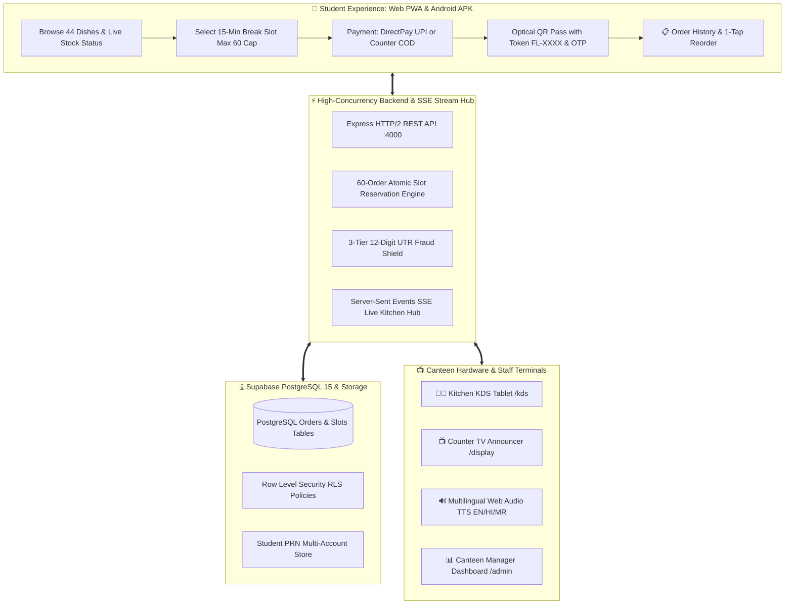

<div align="center">

# 🍔 FoodLine — Campus Pre-Ordering & Express Pickup Ecosystem
### *Transforming 15-Minute College Canteen Chaos into Zero-Queue, 30-Second Express Pickups*

[](https://nextjs.org/)
[](https://react.dev/)
[](https://www.typescriptlang.org/)
[](https://tailwindcss.com/)
[](https://supabase.com/)
[](https://capacitorjs.com/)
[](https://opensource.org/licenses/MIT)

**Target Pilot Campus:** Sanjivani University, Kopargaon *(Cafe @7 Deployment)*  
**Official Repository:** [`https://github.com/dakrkakashi/FoodLine-Campus`](https://github.com/dakrkakashi/FoodLine-Campus)  
**Contact:** [`foodlinecampus@gmail.com`](mailto:foodlinecampus@gmail.com)

---

### 🌟 Quick Navigation & Live Artifacts
[**📱 Live Web App**](http://localhost:3000) • [**📋 Order History**](http://localhost:3000/orders) • [**🖥️ Interactive Slide Deck**](FoodLine_Master_Presentation.html) • [**🎤 Spoken Pitch Script**](PRESENTATION_SCRIPT.md) • [**📑 175-Feature Architecture Plan**](FoodLine_Backend_Expansion_Plan.md) • [**📦 Download Android APK**](FoodLine-Campus.apk)

---

</div>

## 📌 The Campus Problem & The FoodLine Solution

During standard **15-minute college breaks**, hundreds of students rush to the campus canteen at the exact same minute. This causes:
* ⏳ **12-Minute Waiting Queues:** Students spend 80%+ of their break stuck in crowded lines.
* ❌ **Stock Uncertainty ("Samosa Khatam!"):** Students wait the entire break only to find out food is sold out.
* 💸 **Payment Fraud:** Canteens lose ₹4,000+ daily because staff cannot verify fake payment screenshots during rush hours.

### ⚡ How FoodLine Fixes Campus Dining in 4 Steps:
1. **Pre-Order from Classroom:** Students browse 44+ dishes and pick an exact **15-Minute Break Slot** (strictly throttled to 60 orders/slot).
2. **DirectPay UPI & Fraud Shield:** Students pay with UPI. The backend checks the **12-digit Indian Bank UTR** to block fake screenshots and duplicate replay fraud.
3. **VIP Optical QR Pass & OTP:** Student receives a high-contrast optical pass with token (e.g. `FL-6328`) and a 4-digit pickup code (`9373`).
4. **30-Second Express Pickup:** Student walks to the dedicated Express Counter, chef scans the QR code, hands over hot food, and student enjoys their break!

---

## 🏛️ System Architecture



---

## 🚀 Key Features & Modules

### 1. 📱 Student Web & Mobile App (`/menu`, `/checkout`, `/orders`, `/order/[token]`)
* **Dynamic Menu Matrix:** 44+ verified Cafe @7 dishes with live stock indicators (`In Stock`, `Low Stock`, `Sold Out`).
* **Slot Throttling Meter:** Real-time capacity bar capping each 15-minute break slot to **60 orders max** to prevent kitchen meltdowns.
* **Dual Payment Modes:**
  * `⚡ DirectPay UPI`: Dynamic QR with 12-digit UTR bank matching.
  * `💵 Cash on Counter (COD)`: Dedicated token routing to Counter 1 cash desk.
* **High-Contrast Optical QR Pass:** Full-screen QR code readable by kitchen scanners even in harsh sunlight or dim cafeteria lighting.
* **Student Order History Portal (`/orders`):** Filter by *Active* vs *Completed* orders, search by token or dish name, and **1-Tap Reorder** meals into cart.

---

### 2. 🔐 Student PRN & Multi-Device Authentication (`/login`)
* **Student PRN + Password Login & Self-Registration:** Students create accounts using their Campus PRN and password with zero SMS OTP fees.
* **Password Complexity Pepper:** Transparent cryptographic pepper allows students to use simple, memorable passwords while satisfying strict database policies.
* **Multi-Device Session Isolation:** Different students and staff can run completely independent accounts across different browser tabs, mobile phones, and laptops simultaneously.
* **Strict Admin & Staff Login:** Public registration is disabled on the Admin tab; staff credentials are securely assigned directly via Supabase.

---

### 3. 📺 Ultra-Cinematic Counter TV Announcer (`/display`)
* **Split Counter Dispatching:**
  * **Counter 1:** Hot cooked food *(Dosa, Burgers, Vada Pav, Pizza)* + all Cash-on-Delivery collections.
  * **Counter 2:** Express beverages, thick shakes, and desserts.
* **Multilingual Web Audio TTS Announcements:** Instant voice alerts in **English (`en-IN`)**, **Hindi (`hi-IN`)**, and **Marathi (`mr-IN`)**:
  * *"Order FL-6328 is ready at Counter 1!"*
  * *"ऑर्डर FL-6328 काउंटर 1 वर तयार आहे!"*

---

### 4. 👨‍🍳 Kitchen Display System (KDS) & 1-Tap Stockout (`/kds`)
* **Color-Coded Cooking Queue:** Organizes orders by break slots (`CONFIRMED` $\rightarrow$ `PREPARING` $\rightarrow$ `READY` $\rightarrow$ `COLLECTED`).
* **1-Tap Stockout & Price Adjuster:**
  * Quick Price Stepper: `[-₹5]` `₹XX` `[+₹5]`
  * Batch Stock Stepper: `[-5]` `[-1]` `📦 XX left` `[+1]` `[+5]`
  * Setting stock to `0` instantly updates student menus in real time.

---

### 5. 📊 Canteen Manager & Executive Hub (`/admin`)
* **Automated Financial Split:** 88% Direct Canteen Payout + 12% FoodLine Platform Commission.
* **Master Order Ledger:** Live audit log with search, student PRN filters, and settlement reconciliation.
* **Inventory Control & Menu Customization:** Add, edit, or disable dishes on the fly.

---

## 📂 Project Structure

```
FoodLine-Campus/
├── frontend/                        # Next.js 15 App Router & React 19 Frontend
│   ├── src/
│   │   ├── app/
│   │   │   ├── (student)/           # Landing, Menu (/menu), Checkout (/checkout)
│   │   │   ├── orders/              # Student Order History (/orders)
│   │   │   ├── order/[token]/       # Live Optical QR Pass Tracker
│   │   │   ├── login/               # PRN+Password Student & Admin Login Portal
│   │   │   ├── display/             # Real-Time Counter TV Announcer Screen
│   │   │   ├── kds/                 # Chef Tablet Kitchen Display System
│   │   │   ├── admin/               # Canteen Manager Executive Hub
│   │   │   └── api/                 # Next.js Server Route Handlers
│   │   ├── components/              # Glassmorphic UI, Navbar, Badges, Modals
│   │   ├── context/                 # CartContext, ThemeContext, AuthContext
│   │   └── lib/                     # Types, API client, Order History Store
│   └── android/                     # Capacitor Native Android Studio Platform
│
├── backend/                         # Express / Node.js High-Concurrency Backend
│   ├── src/
│   │   ├── services/
│   │   │   ├── order-service.ts     # Order lifecycle & 88/12 split calculator
│   │   │   ├── slot-throttler.ts    # 60-order atomic capacity locking engine
│   │   │   ├── utr-verifier.ts      # 12-digit UTR fraud & replay blocker
│   │   │   └── menu-service.ts      # Live stockout sync & inventory queries
│   │   └── server.ts                # Modular HTTP/2 & SSE Stream Server
│   └── dist/                        # Compiled JavaScript production build
│
├── FoodLine_Master_Presentation.html # Interactive HTML5 Presentation Slide Deck
├── PRESENTATION_SCRIPT.md           # 10-year-old friendly word-for-word pitch script
├── FoodLine_Master_Pitch_Deck_2026.pptx # Master PowerPoint Presentation
├── FoodLine_Backend_Expansion_Plan.md # 175-Feature Architecture Plan & DDL
├── FoodLine-Campus.apk              # Android Native Application
└── supabase_schema.sql              # Supabase PostgreSQL Database DDL
```

---

## ⚡ Live API Endpoints

All responses follow the standard JSON:API envelope:
```json
{
  "success": true,
  "data": { ... },
  "meta": { "timestamp": "2026-08-30T16:00:00Z" }
}
```

| Method | Endpoint | Purpose | Description |
|---|---|---|---|
| `GET` | `/api/slots` | Break Slots & Capacity | Returns active break slots with booked counts out of 60 cap |
| `GET` | `/api/menu` | Menu Inventory | Fetches 44+ Cafe @7 dishes and 8 categories |
| `POST` | `/api/orders` | Create Pre-Order | Reserves slot, generates token `FL-XXXX` & pickup OTP `XXXX` |
| `POST` | `/api/payments/verify-utr` | 12-Digit Fraud Shield | Validates bank reference and prevents duplicate reuse |
| `GET` | `/api/order/:token/stream` | Server-Sent Events | Live kitchen tracking stream for student pass screens |
| `POST` | `/api/auth/student-signup` | Student Registration | Creates persistent PRN student account with password |
| `POST` | `/api/auth/student-login` | Student Login | Verifies PRN & password hash and sets browser session cookie |
| `PATCH` | `/api/kds/orders/:id/status`| Kitchen State Transition | Transitions order (`PREPARING` $\rightarrow$ `READY` $\rightarrow$ `COLLECTED`) |

---

## 🛠️ Quickstart & Local Setup

### Prerequisites
* **Node.js:** v18.18+ or v20+
* **npm:** v9+

### 1. Clone the Repository
```bash
git clone https://github.com/dakrkakashi/FoodLine-Campus.git
cd FoodLine-Campus
```

### 2. Configure Environment Variables
Create `.env.local` inside `frontend/`:
```env
NEXT_PUBLIC_SUPABASE_URL=https://ylweomuodekukjjpjrgx.supabase.co
NEXT_PUBLIC_SUPABASE_PUBLISHABLE_KEY=your-supabase-anon-key
NEXT_PUBLIC_BACKEND_URL=http://localhost:4000
```

### 3. Start Backend & Frontend Servers
```bash
# Terminal 1: Start Backend Engine (:4000)
cd backend
npm install
npm run build
npm start

# Terminal 2: Start Frontend Next.js Web App (:3000)
cd frontend
npm install
npm run dev
```

Open [**`http://localhost:3000`**](http://localhost:3000) in your browser!

---

## 🎤 Interactive Presentation & Pitch Mode

To present FoodLine to judges, investors, teachers, or canteen owners:

1. Open [`FoodLine_Master_Presentation.html`](FoodLine_Master_Presentation.html) in any browser.
2. Press **`F`** on your keyboard to toggle **Fullscreen Presentation Mode**.
3. Press **`S`** to turn on the floating on-screen **Speaker Script (Easy Mode)**.
4. Read along with the complete word-for-word script in [`PRESENTATION_SCRIPT.md`](PRESENTATION_SCRIPT.md).

---

## 📄 License
This project is licensed under the **MIT License** — see the [LICENSE](LICENSE) file for details.

<div align="center">
  <sub>Built with ❤️ by the FoodLine Engineering Team for Sanjivani University, Kopargaon.</sub>
</div>
