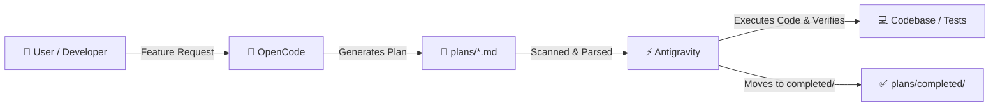

# 📋 Antigravity ⚡ OpenCode Planning & Execution Hub

Welcome to the bridge between **OpenCode** (The Planner & Architect) and **Antigravity** (The Coder & Executor).

---

## 🔄 The Autonomous Workflow Loop



### 1. Planning Phase (OpenCode)
- OpenCode receives the feature/bug requirement from the user.
- OpenCode reads the project context (architecture, types, database schema).
- OpenCode drafts a clear, actionable plan following [PLAN_TEMPLATE.md](./PLAN_TEMPLATE.md).
- OpenCode saves the plan as `plans/<FEATURE_NAME>_PLAN.md` (or in `plans/`).

### 2. Execution Phase (Antigravity)
- When prompted, Antigravity scans `plans/` for pending plans.
- Antigravity marks the plan status as `IN_PROGRESS` (or moves it to `plans/active/`).
- Antigravity follows the tasks sequentially:
  - Edits/creates frontend, backend, or database files.
  - Ensures no regression and adheres strictly to TypeScript interfaces and database schemas.
  - Runs validation commands (e.g., `npm run build`, lint, unit tests).
- Once all acceptance criteria pass:
  - Antigravity checks off all task items `[x]`.
  - Antigravity appends the execution log and moves the plan to `plans/completed/`.

---

## 📂 Directory Layout

```
plans/
├── README.md                  # This guide
├── PLAN_TEMPLATE.md           # Template for OpenCode to follow
├── OPENCODE_PROMPT.md         # System prompt / instructions to copy into OpenCode
├── active/                    # Plans currently being executed by Antigravity
├── completed/                 # Successfully executed and verified plans
└── <NAME>_PLAN.md             # New plans dropped by OpenCode waiting to be executed
```

---

## 🚀 How to Trigger Antigravity Execution

Simply prompt Antigravity:
> *"Scan `plans/` and execute the pending plan."*
or
> *"Execute the plan in `plans/<FILENAME>.md`."*

Antigravity will automatically parse the file, write the required code, run the build checks, and report the outcome!
