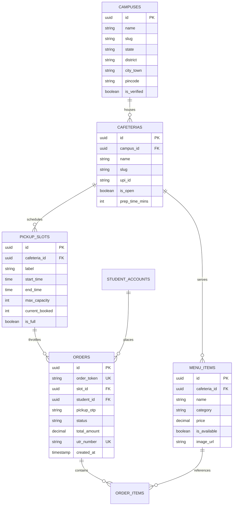

# 🗄️ 05 • Database Schema & Hybrid Persistence Architecture
**Project Name:** FoodLine Campus  
**Primary Engine:** Supabase PostgreSQL 15  
**Mirror & Audit Engine:** Google Sheets API v4 (Master Spreadsheet: `Foodline Campus Master`)  
**Zero-Mock Guarantee:** 100% real database tables. Zero fake JSON mock files.

---

## 1. Relational Entity Relationship Diagram (ERD)



---

## 2. Table Specifications & DDL Reference (`backend/database/schema.sql`)

### 1. `campuses`
Represents an accredited educational institution with geographic hierarchy for scaling.
- `id` (UUID, Primary Key, `gen_random_uuid()`)
- `name` (TEXT, e.g. "Sanjivani University")
- `slug` (TEXT UNIQUE, e.g. "sanjivani")
- `state` (TEXT, e.g. "Maharashtra")
- `district` (TEXT, e.g. "Ahmednagar")
- `city_town` (TEXT, e.g. "Kopargaon")
- `pincode` (TEXT, e.g. "423603")
- `is_verified` (BOOLEAN, default `true`)
- **Indexes:** `CREATE INDEX idx_campuses_geo ON campuses(state, district, city_town);`

### 2. `cafeterias`
Represents physical dining facilities located on a specific campus.
- `id` (UUID, Primary Key)
- `campus_id` (UUID, Foreign Key `REFERENCES campuses(id) ON DELETE CASCADE`)
- `name` (TEXT, e.g. "Cafe @7")
- `slug` (TEXT, e.g. "cafe7")
- `tagline` (TEXT, e.g. "Main Academic Canteen")
- `location` (TEXT, e.g. "Ground Floor, Main Academic Quad")
- `upi_id` (TEXT, e.g. "9960091371@slc")
- `is_open` (BOOLEAN, default `true`)
- `prep_time_mins` (INTEGER, default `5`)

### 3. `menu_items`
Represents dishes prepared by a specific cafeteria.
- `id` (UUID, Primary Key)
- `cafeteria_id` (UUID, Foreign Key `REFERENCES cafeterias(id) ON DELETE CASCADE`)
- `name` (TEXT, e.g. "Special Vada Pav")
- `category` (TEXT, e.g. "Snacks", "Beverages", "South Indian")
- `price` (NUMERIC(8, 2), e.g. `20.00`)
- `is_available` (BOOLEAN, default `true`)
- `image_url` (TEXT, e.g. "/images/dishes/vada-pav.webp")
- **Indexes:** `CREATE INDEX idx_menu_cafeteria ON menu_items(cafeteria_id, is_available);`

### 4. `pickup_slots`
Enforces the 60-order physical kitchen throttling governor.
- `id` (UUID, Primary Key)
- `cafeteria_id` (UUID, Foreign Key `REFERENCES cafeterias(id)`)
- `label` (TEXT, e.g. "10:45 AM – 11:00 AM")
- `start_time` (TIME, `10:45:00`)
- `end_time` (TIME, `11:00:00`)
- `max_capacity` (INTEGER, default `60`)
- `current_booked` (INTEGER, default `0`)
- `is_full` (BOOLEAN, default `false`)
- **Constraints:** `CONSTRAINT check_capacity CHECK (current_booked <= max_capacity)`

### 5. `orders`
The master transaction ledger for student pre-orders.
- `id` (UUID, Primary Key)
- `order_token` (TEXT UNIQUE, e.g. "FL-1793")
- `slot_id` (UUID, Foreign Key `REFERENCES pickup_slots(id)`)
- `student_prn` (TEXT, student university roll number)
- `pickup_otp` (VARCHAR(4), e.g. "6065")
- `status` (VARCHAR(20), Enum: `PENDING_PAYMENT`, `CONFIRMED`, `PREPARING`, `READY`, `COLLECTED`, `CANCELLED`)
- `total_amount` (NUMERIC(8, 2), e.g. `65.00`)
- `utr_number` (VARCHAR(12) UNIQUE, nullable until payment confirmed)
- `created_at` (TIMESTAMPTZ, default `NOW()`)
- **Indexes:**
  - `CREATE UNIQUE INDEX idx_orders_token ON orders(order_token);`
  - `CREATE UNIQUE INDEX idx_orders_utr ON orders(utr_number) WHERE utr_number IS NOT NULL;`

---

## 3. Google Sheets API v4 Real-Time Persistence Hub

To enable non-technical university deans and canteen managers to audit orders without logging into Supabase, FoodLine maintains an **asynchronous real-time mirror into Google Sheets** (`Foodline Campus Master` spreadsheet):

```
Spreadsheet ID: 1UjpWRpsDuBx6aCsZLREx__zSapeEdICM3o7WosWZCW8
Authentication: RSA-SHA256 Service Account
                (foodline-backend@foodline-campus-07.iam.gserviceaccount.com)
```

### The 4 Master Tabs:
1. **`Orders`:** Real-time log of every order (`Order Token`, `PRN`, `Items`, `Amount`, `Slot`, `Status`, `UTR`, `Timestamp`).
2. **`FoodLine — Student Signup Form`:** Master student database (`PRN`, `Name`, `Department`, `Year`, `Phone`, `Campus`).
3. **`FoodLine — Payment & UTR Form`:** Reconciled bank transactions (`Token`, `UTR`, `Amount`, `Timestamp`).
4. **`Inventory`:** Live stock levels and price adjustments synced from `/kds`.

### Rate-Limit Defense & In-Memory Batching:
- Google enforces a strict quota of **60 write requests per minute**.
- During break rushes, 50 orders can arrive in 20 seconds.
- **Solution:** `SheetsDbService` uses an **asynchronous in-memory write buffer queue** (`pendingOrdersQueue`):
  - Debounced by **1200ms**.
  - Threshold trigger: flushes immediately if queue reaches **≥25 orders**.
  - Flushes up to **50 rows in a single batch append API call**, strictly eliminating Google API quota exhaustion errors.
