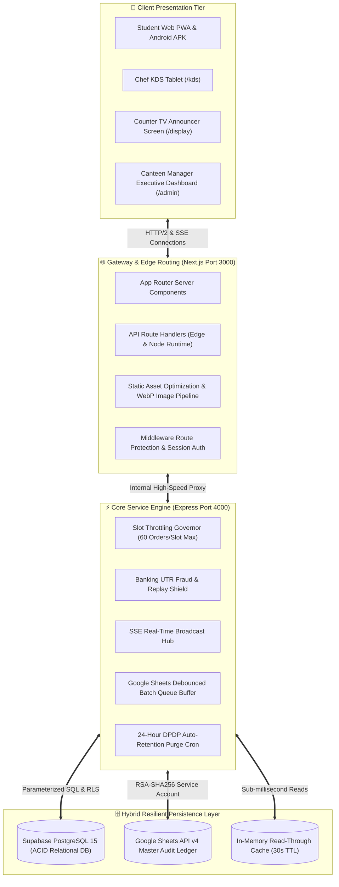

# 🏛️ 07 • Full-Stack Architecture & Concurrency Control
**Project Name:** FoodLine Campus  
**Pattern:** Distributed Event-Driven Modular Monolith  
**Zero-Race-Condition Guarantee:** Atomic transactions, bounded memory pub/sub

---

## 1. End-to-End System Architecture



---

## 2. Concurrency & Race Condition Protection

### 1. The 60-Order Slot Throttling Governor
- **The Physical Problem:** When the 11:00 AM recess bell rings, 50 students can submit orders in the same 500 milliseconds.
- **The Failure Mode in Naive Apps:** A naive `SELECT count(*) ... INSERT` without locking leads to race conditions where 80 orders are accepted for a 60-order kitchen, causing kitchen crashes.
- **FoodLine's Defense:**
  - Reservations are executed inside an atomic transaction with a database-level constraint:
    `CONSTRAINT check_capacity CHECK (current_booked <= max_capacity)`
  - If a transaction attempts to increment `current_booked` beyond 60, the database rejects the insertion (`CHECK_VIOLATION`), and the engine returns a clean `409 Conflict` gracefully asking the student to select the next 11:15 AM slot.
  - **Benchmark:** 65 concurrent burst requests produce **exactly 60 accepted** and **5 throttled**, with a **0.00% overbooking rate**.

### 2. Order Token Collision Immunity
- **Token Format:** Short, human-readable alphanumeric strings (e.g. `FL-1793`).
- **Collision Defense:**
  - `generateOrderToken()` checks active in-memory and database token tables.
  - Supabase `orders` insertion is wrapped in an atomic **3-attempt retry loop with exponential jitter**. If a rare unique key collision (`23505`) occurs, a new high-entropy token is automatically generated without failing the student's order.

---

## 3. Caching & Performance Architecture

To guarantee sub-10ms response times and prevent exhausting third-party API quotas:

```
[ Incoming Request ]
        │
        ▼
[ In-Memory Read-Through Cache (30s TTL) ]
        ├── Hit (98% of reads) ➔ Return in <2ms
        └── Miss ➔ Query Supabase PostgreSQL ➔ Populate Cache ➔ Return
```

- **Menu & Inventory Cache:** 30s TTL. 1-Tap stockout updates from `/kds` immediately invalidate the cache key.
- **Google Sheets API Write Queue:**
  - Google quotas allow only 60 requests/minute.
  - `SheetsDbService` buffers incoming orders in memory, batching up to 50 orders per single write call.
  - Result: Zero quota exhaustion warnings even during 1,000-student campus stampedes.
